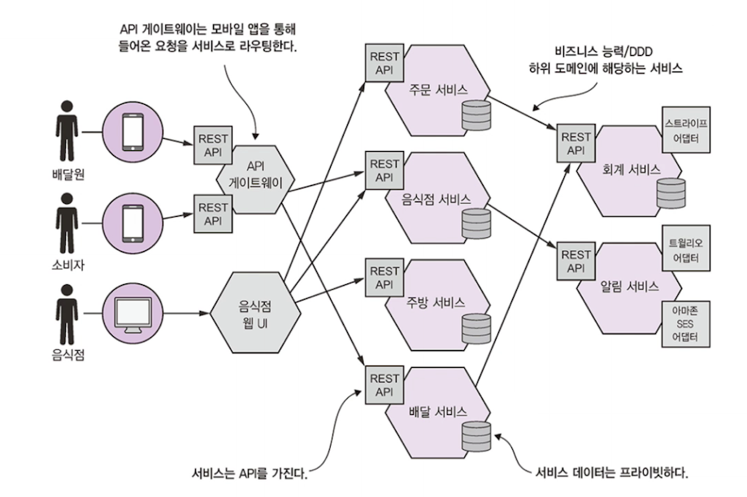
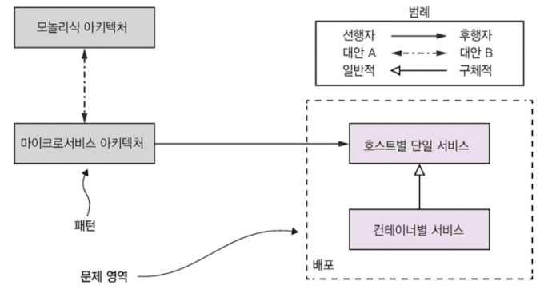

# 1장. 모놀리식 지옥에서 벗어나라

## 1.1 서서히 모놀리식 지옥에 빠져들다

FTGO 라는 온라인 음식 배달 업계를 선도하는 회사로 예를 들어보자.

시간이 갈 수록 애플리케이션 복잡도 상승 -> 소프트웨어 전달 페이스 느려지기 시작, 한물간 프레임워크를 사용하여 애플리케이션을 개발하게 되면서 상황 안좋아진다!

### 1.1.1 FTGO 애플리케이션 아키텍처

외부 시스템과 연계하는 어댑터가 여러 개 달려있고, 
**논리적으로는 모듈화된 아키텍처임에도 애플리케이션은 WAR 파일 하나로 패키징한다.**

### 1.1.2 모놀리식 아키텍처의 장점

- 개발이 간단
- 애플리케이션 쉽게 변경 가능
- 테스트 쉬움
- 배포 쉬움
- 확장 쉬움

**그러나, 시간이 흐를수록 어려워짐!**

### 1.1.3 모놀리식 지옥의 실상

코드베이스, 관리 오버헤드 증가.

소규모 팀이 기능별로 특화된 스크럼 팀의 수도 증가...

- **너무 복잡해서 힘들다!**

- **개발이 더딤**
  - 하나의 앱이 너무 커져 IDE 실행 속도는 물론 빌드시간도 오래 걸림
- **커밋부터 배포까지 힘들다**
  - 지속적 배포를 도입하는 것이 사실상 불가능
- **확장하기 어려움**
  - 앱의 모듈마다 리소스 요건이 맞지 않아 확장하기 어렵다
    - 데이터 용량이 큰 음식점 데이터는 인 메모리 DB -> 메모리 칩 많이 필요
    - 이미지 처리 모듈 -> CPU 코어 수 중요
    - 즉, 리소스 요건이 서로 다르다!
- **모놀리스는 확실하게 전달하기 어렵다**
  - 신뢰성이 부족
  - 테스트가 부족하면? production 에서 버그..
- 한물간 기술 스택에 발목 잡힘

## 1.2 이 책의 대상 독자

### 사전 지식

- 3계층 아키텍처
- 웹 애플리케이션 설계
- 객체 지향 설계를 응용한 비즈니스 로직 개발
- RDBMS 사용법 : SQL과 ACID 트랜잭션
- 메시지 브로커와 REST API를 활용한 IPC
- 인증/인가 등 보안 개념

## 1.3 이 책의 학습 내용

- 마이크로서비스의 주요 특성과 장단점, 사용 시점
- 분산 데이터 관리 패턴
- 효과적인 마이크로서비스 테스트 전략
- 마이크로 서비스 배포 옵션
- 모놀리식 아키텍처를 마이크로 서비스 아키텍처로 리팩터링하는 전략

## 1.4 마이크로서비스 아키텍처가 답이다

위에서 언급한 모놀리식 FTGO 는 앱의 몸집이 커지면서 
**소프트웨어 전달속도(관리성, 확장성, 테스트성) 가 가장 큰 영향을 받았다.**

모놀리식 지옥을 벗어나기 위해 반드시 마이크로서비스로 갈아타야 한다!

### 1.4.1 확장 큐브와 마이크로 서비스

### X축 확장 : 다중 인스턴스에 고루 요청 분산

로드밸런서 뒷면에 인스턴스를 여러 개 띄워놓고, 요청을 인스턴스에 분배한다.

- 애플리케이션 능력과 가용성 개선!

### Z축 확장 : 요청 속성별 라우팅

**인스턴스별로 주어진 하위 집합만 처리**

인스턴스 앞의 **라우터**가 요청의 속성에 알맞는 인스턴스로 요청을 라우팅한다.

- 애플리케이션 확장해서 증가하는 트랜잭션 및 데이터 볼륨 처리하기 좋음

### Y축 확장 : 기능에 따라 애플리케이션을 서비스로 분해

x, z축 확장으로 앱 능력 + 가용성 개선, but 복잡도는 낮추지 못함!
**Y축은 확장, 즉 기능 분해가 필요!**

**마이크로서비스 아키텍처 : 하나의 애플리케이션을 여러 서비스로 기능 분해하는 아키텍처 스타일**

### 1.4.2 마이크로서비스는 모듈성을 갖고 있다

**서비스를 모듈성의 단위로 사용!**

- 각 서비스는 API 경계를 통해 타 서비스의 API를 우회하여 그 내부 클래스에 마음대로 들어올 수 없기에 모듈성을 유지하기 훨씬 수월
- 서비스를  빌딩 블록처럼 사용하여 독립적으로 배포/확장할 수 있는 부가적인 장점

### 1.4.3 서비스마다 DB가 따로 있다

> 신기.. DB가 하나의 서비스 단위로 빠져있을 줄 알았는데...!

느슨하게 결합된 각 서비스는 자체 DB를 가지고 있다. 따라서 다른 서비스와 협의하지 않고도 담당 서비스 스키마 변경이 가능하다!
다른 서비스가 DB 락을 획득해 자신의 서비스를 블로킹하는 일은 아예 없다.

### 1.4.4 FTGO 마이크로 서비스 아키텍처

**각 서비스를 독립적으로 개발, 테스트, 배포, 확장 가능!**

타 서비스 API 우회하여 내부 요소에 직접 접근 불가 -> 모듈성 유지 차원에서도 적합!

### 1.4.5 마이크로 서비스 아키텍처와 SOA

SOA : Service Oriented Architecture

| 구분          | SOA                                                          | 마이크로서비스                                               |
| ------------- | ------------------------------------------------------------ | ------------------------------------------------------------ |
| 서비스간 통신 | SOAP 및 WS 표준 등 무거운 기술 사용 서비스를 통합하는 비즈니스와 메시지 처리로직이 포함된 ESB 스마트 파이프 활용 | 메시지 브로거, REST, gRPC 같은 가벼운 프로토콜 위주 덤 파이프 통해 통신 |
| 데이터        | 전역 데이터 모델 및 공유 DB                                  | 서비스 개별 데이터 모델 및 DB                                |
| 사례          | 대규모 모놀리식 애플리케이션                                 | 소규모 서비스                                                |

## 1.5 마이크로서비스 아키텍처의 장단점

### 1.5.1 마이크로서비스의 장점

- **지속 전달/배포**

  3가지 방법으로 실현

  - 테스트성
    - 자동화 테스트
  - 배포성
    - 독립적 배포 가능
  - 자율성, 느슨한 결합
    - 작은 팀이 여럿 결합된 기술 조직을 꾸릴 수 있다

  

- **서비스 규모가 작아 관리하기 쉬움**

  - 개발자 코드 이해도 쉽고, IDE가 느려지지 않아 생산성도 오른다

- **서비스 독립적으로 배포/확장**

  - 독립적으로 X축(복제), Z축(파티셔닝) 확장을 할 수 있고, 리소스 요건 맞추어 적합한 하드웨어에 배포 가능

- **팀이 자율적으로 움직임**

- **결함 격리가 잘 됨**
  - 특정 서비스가 결함이 있어도 해당 서비스만 장애. 나머지 서비스는 정상 작동
- **새로운 기술을 실험하고 도입하기 쉬움**
  - 특정 기술 스택을 연구하느라 오래 시간 쓸 필요 없음
  - 언제든지, 더 나은 언어와 기술로 스택 변경 가능

### 1.5.2 마이크로서비스의 단점

- 적합한 서비스 찾기 어려움
  - 시스템을 잘못 분해할 경우, 모놀리식/마이크로 서비스의 단점만 각각 갖게되는 분산 모놀리스를 구축
- 분산 시스템은 복잡
  - 서비스 간 통신 필수인 IPC 복잡하며 사용 불능 또는 지연시간이 긴 원격 서비스 등 처리할 수 있도록 설계해야 한다.
  - 서비스마다 DB 있기에, 다중 DB 접속 및 조회, 트랜잭션 구현
    - 사가 패턴으로 일관성 유지
    - 단순 쿼리로는 조회 불가, API 조합하거나 CQRS 뷰로 쿼리
- 여러 서비스 걸친 공통 기능은 배포 시 잘 살펴야한다
- 도입 시기 결정의 어려움
  - 초기 버전을 개발할 때는 오히려 속도면에서 더딜 수 있다.
  - 복잡도를 다루는 문제가 중요해지는 시점에 전환!

## 1.6 마이크로서비스 아키텍처 패턴 언어

다양한 아키텍처와 설계 옵션을 기술하고 더 나은 결정을 내리는 좋은 방법은 패턴 언어를 사용하는 것.

패턴과 패턴 언어가 필요한 이유를 살펴보자!

### 1.6.1 마이크로서비스 아키텍처도 만병통치약은 아니다

> 은탄환은 없다!

### 1.6.2 패턴 및 패턴 언어

패턴 : 특정한 상황에서 발생한 문제에 대한 재사용 가능한 해법!

패턴 언어 : 특정 영역 내부에서 문제를 해결하는 연관된 패턴의 집합

예시) 마이너스 통장 정책을 지원하는 뱅킹 애플리케이션 구축할 때,
계좌 잔고 한도 및 초과 인출된 계좌에 부과되는 수수료는 은행 정책마다 다르다.
**이 문제는 전략패턴을 통해서 해결할 수 있다.**

이 문제의 솔루션은

- 초과 인출 알고리즘을 캡슐화한 전략 인터페이스
- 하나 이상의 전략 구상 클래스
- 알고리즘을 사용하는 Account 클래스

#### 추가) 전략 패턴이란?

> 하나의 문제를 해결하기 위해 여러 알고리즘 방식들이 있을 때, 
> 하나의 공통 인터페이스와 이를 구현하는 여러 알고리즘 클래스들을 구현하고, 
> 이러한 알고리즘을 사용하는 클라이언트가 자신에게 맞는 알고리즘을 쉽게 선택해서 사용할 수 있게 한 디자인 패턴

여러 알고리즘을 구현해두고, 클라이언트가 런타임시 그 중 하나를 선택해서 사용할 수 있도록 한 디자인 패턴!

클라이언트가 사용하는 Context 클래스는 어떤 알고리즘을 사용할 지에 대한 정보(IAlgorithm 속성)를 가지고 있고, 
이를 사용할 알고리즘을 선택하여 호출.
구체적인 알고리즘은 IAlgorithm 인터페이스를 구현한 AlgorithmA, AlgorithmB 클래스 등에서 정의된다.

**따라서, 다양한 알고리즘, 행위 가능한 상황에서 분기 표현 없이 행위를 구현하고 사용 가능하게 한다.**

### 상용 패턴의 구조

- **강제조항 : 문제 해결을 위해 반드시 처리해야 할 이슈**
  - 조항에 따라 우선순위를 정해 어느 이슈를 해결할지 명확하게 구분
- **결과 맥락 : 패턴 적용 결과**
  - 패턴을 적용한 결과를 세 부분으로 기술
    - 장점, 단점, 이슈
- **연관 패턴 : 다섯 가지 유형**
  - 한 패턴과 다른 패턴의 관계를 기술하는 영역
    - 선행자, 후행자, 대안, 일반화, 세분화가 존재
    - 다음과 같이 표시해볼 수 있다.

### 1.6.3 마이크로서비스 아키텍처 패턴 언어 개요

마이크로서비스 아키텍처 패턴 언어 
: 전체 애플리케이션을 마이크로서비스로 아키텍처 구성할 때 유용한 패턴의 모음집

왼쪽은 모놀리식 아키텍처 패턴과 마이크로서비스 아키텍처 패턴이 위치한 애플리케이션 아키텍처 패턴 그룹

나머지는 마이크로서비스 아키텍처 패턴 사용 시 이슈 해결하는 솔루션 패턴 모아놓은 패턴 그룹

패턴은 다시 3개 계층으로 분류

- 인프라 패턴
  - 개발 영역 밖의 인프라 문제 해결
- 애플리케이션 인프라
  - 개발에도 영향을 미치는 인프라 문제 해결
- 애플리케이션 패턴
  - 개발자가 맞닦뜨리는 문제를 해결

주요 패턴 그룹을 추후 챕터별로 공부할 예정!

- 애플리케이션을 여러 서비스로 분해하는 패턴
- 통신 패턴
- 트랜잭션 관리를 위한 데이터 일관성 패턴
- 데이터 쿼리 패턴
- 서비스 배포 패턴
- 관측성 패턴 : 애플리케이션 동작 파악
- 서비스 테스트 자동화 패턴
- 횡단 관심사 패턴
- 보안패턴

## 1.7 마이크로서비스 너머: 프로세스와 조직

올바른 아키텍처, 올바른 조직, 올바른 개발 프로세스가 수립되어야 개발에 성공할 수 있다!

### 1.7.1 소프트웨어 개발/전달 조직

규모가 큰 팀은 여러 팀으로!

각 팀은 다른 팀과 협의할 필요 없이 독립적으로 서비스를 개발, 배포, 확장!

### 1.7.2 소프트웨어 개발/전달 프로세스

애자일 도입하고, 스크럼, 칸반 등을 실천할 것

## 1.8 마치며

- 모놀리식 아키텍처는 앱을 하나의 배포 단위로,
- 마이크로서비스는 독립적으로 배포 가능하면서 자체 DB 보유한 서비스로 분해!
- 단순하면 모놀리식, 복잡하면 마이크로~

