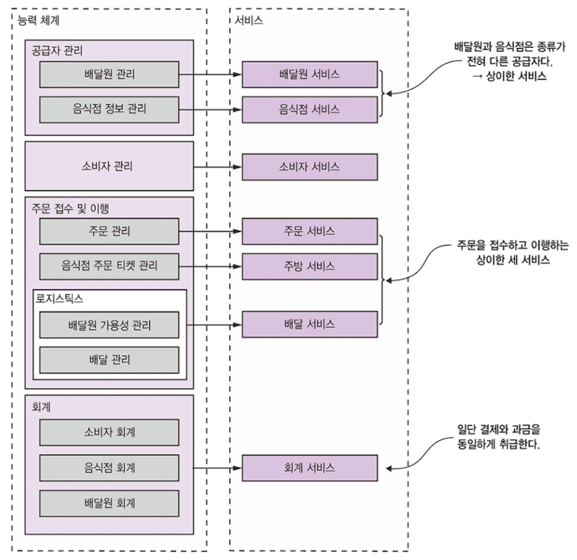

# 분해 전략

**핵심**

- 소프트웨어 아키텍처 정의와 중요성
- 분해 패턴을 적용하여 비즈니스 능력 및 하위 도메인별로 애플리케이션을 서비스로 분해
- DDD의 경계 컨텍스트 개념을 활용하여 복잡하게 얽힌 데이터를 분해하기 더 쉽게 풀기

## 2.1 마이크로 서비스 아키텍처란 무엇인가

MSA 는 **관리성, 테스트성, 배포성**이 높은 애플리케이션을 구축하는 아키텍처 스타일

### 2.1.1 소프트웨어 아키텍처의 정의와 중요성

#### 소프트웨어 아키텍처의 정의

**애플리케이션 아키텍처가 여러 파트로의 분해와 이런 파트 간의 관계(연관성)**

분해가 왜 중요?

- 업무와 지식을 분리
- 각 엘리먼트가 어떻게 상호작용하는지 밝힌다.

**소프트웨어 아키텍처의 4+1 뷰 모델**

- **4뷰**
  - **논리뷰 : 개발자가 작성한 소프트웨어 엘리먼트.** 객체 지향 언어라면 클래스, 패키지에 해당. 
    상속, 연관, 의존 등 클래스와 패키지의 관계를 말한다
  - **구현뷰 : 빌드 시스템의 결과물**
  - **프로세스뷰 : 런타임 컴포넌트.** 각 엘리먼트는 개별 프로세스, IPC는 프로세스 간 관계를 나타낸다.
  - **배포뷰 : 프로세스가 머신에 매핑되는 방법**. 뷰의 엘리먼트는 머신 및 프로세스고, 머신 간의 관계가 바로 네트워킹.

- **+1**
  - 뷰를 구동시키는 시나리오

4+1뷰는 애플리케이션 아키텍처를 명쾌하게 표현하는 수단.
**4뷰는 중요한 아키텍처 측면을, 시나리오는 뷰의 여러 엘리먼트가 협동하는 과정을 명시!**

#### 아키텍처의 중요성

애플리케이션 요건은 2종류로 나눌 수 있다!

1. 애플리케이션이 해야할 일을 정의한 **기능 요건**
2. 서비스 **품질 요건** (확장성, 신뢰성, 관리성, 테스트성 등)

**이러한 요건을 얼마나 충족시킬 수 있을지를 아키텍처의 선택에 따라 결정된다!**

### 2.1.2 아키텍처 스타일 개요

**아키텍처 스타일 : 엘리먼트와 관계의 한정된 범위를 제공하며, 이를 토대로 애플리케이션 아키텍처의 뷰를 정의**

애플리케이션 대부분 아키텍처 스타일을 조합해서 쓴다.

모놀리식 아키텍처도 **구현 뷰를 하나의 컴포넌트로 구성한 아키텍처 스타일**!
마이크로서비스 아키텍처는 애플리케이션을 느슨하게 결합된 여러 서비스로 구성하는 아키텍처 스타일

> 말이 어렵네...

#### 계층화 아키텍처 스타일

계층별로 구성하는 아키텍처는 전형적인 아키텍처 스타일!

계층화 아키텍처는 4뷰 모두 적용 가능!

**3계층 아키텍처가 계층화 아키텍처를 논리뷰에 적용한 사례!**

**3계층 아키텍처**

- 표현 계층 : 사용자 인터페이스 or 외부 API 구현된 계층
- 비즈니스로직 계층 : 비즈니스 로직이 구현된 계층
- 영속화 계층 : DB 상호작용 로직이 구현된 계층

단점은?

- 표현 계층이 하나뿐! : 애플리케이션을 호출하는 시스템이 하나밖에 없을까?
- 영속화 계층이 하나뿐! : 애플리케이션이 상호작용하는 DB가 정말 하나뿐?
- 비즈니스 로직 계층을 영속화 계층에 의존하는 형태로 정의 : DB없이 비즈니스 로직 테스트가 불가!

#### 육각형 아키텍처 스타일

**기존의 표현계층 대신 비즈니스 로직을 호출하여 외부의 요청을 처리하는 인바운드 어댑터**

**외부 애플리케이션을 호출하는 아웃바운드 어댑터**

-> 비즈니스 로직에 있던 표현/데이터 접근 로직이 어댑터와 분리되어 비즈니스 로직이 표현, 데이터 접근 로직 어디에도 접근하지 않는다!

> 실제로 정확하게 보기 전까진 이해가 조금 어려운 것 같다...

### 2.1.3 마이크로 서비스 아키텍처는 일종의 아키텍처 스타일

모놀리식은 구현 뷰를 단일 컴포넌트로 구성한 스타일이라면,
**마이크로 서비스 아키텍처는 구현 뷰를 다수의 컴포넌트(실행 파일이나 WAR 파일)로 구성!**
여기서 컴포넌트는 서비스이며, 각 서비스는 자체 논리뷰 아키텍처를 갖는다!

> 각 도메인별로 분리하여 육각형 아키텍처를 갖는다!

#### 서비스란 무엇인가?

서비스는 어떤 기능이 구현되어 단독 배포가 가능한 소프트웨어 컴포넌트.

클라이언트가 자신이 서비스하는 기능에 접근할 수 있도록 커맨드, 쿼리, 이벤트로 구성된 API를 제공한다.

**API는 서비스에 구현된 비즈니스 로직과 소통하는 어댑터를 이용하여 구현!**

- 느슨한 결합
  - API 통해서만 상호작용하므로 서비스 내부 db와 통신 불가
- 공유 라이브러리
  - 변경 가능성 아예 없는 기능만 공유로 구현
- 서비스 규모는 중요하지 않음
  - 다른 서비스에 영향을 받지 않도록! 마이크로에 집착 X

## 2.2 마이크로 서비스 아키텍처 정의

3단계로 나누어 정의한다!

1. 시스템 작업 식별
   - 애플리케이션이 처리하는 요청을 추상화
     - 데이터를 업데이트, 조회 등 쿼리 모두 해당! 
   - **각 커맨드의 동작은 도메인 관점에서 정의**
2. 서비스 식별
   - 비즈니스 개념 중심으로 이뤄진 서비스
3. 서비스 API 및 협동 정의
   - 식별된 시스템 작업을 각 서비스에 배정.
   - 협동하는 경우, 서비스에 추가 지원 작업을 두는 형태. 
     API 구현 시, 사용할 IPC도 정해야한다!

### 2.1.1 시스템 작업 식별

**시스템 작업을 기술하기 위해 필요한 단어를 제공하는 핵심 클래스로 구성된 도메인 모델 생성!**

도메인 모델은 주로 사용자 스토리의 명사!

#### 고수준 도메인 모델 생성

도메인 모델은 스토리에 포함된 명사를 분석하는 등 여러 방법을 활용하여 생성.

EX) 주문하기 시나리오를 통해서 배달, 배달원 클래스 등을 추출하고
분석을 계속하여 메뉴 항목, 주소 등 여러 클래스를 만들어 핵심 클래스로 구성된 도메인 모델을 만든다!

#### 시스템 작업 정의

시스템 작업은 크게 2종류

- 커맨드 : CUD
- 쿼리 : R

결국은 REST, RPC, 메시징의 끝점으로 구현되지만 이 단계에선 추상적으로!

Ex) 소비자(`Consumer`)는 주문생성(스토리)을 하기 위해 `createOrder`(커맨드)를 한다

- `createOrder(consumer_id, payment, ...)`

  - 반환값 : `orderId`

  - 선행 조건
    - 소비자가 존재, 주문 가능
    - 주문 품목은 음식점의 메뉴에 존재
  - 후행 조건
    - 신용카드는 주문 금액만큼 승인 처리

### 2.2.2 서비스 정의 : 비즈니스 능력 패턴별 분해

**MSA 구축의 1번 전략 - 비즈니스 능력에 따라 분해하는 것!**

비즈니스 능력에 따라 서비스를 정의한다!

#### 비즈니스 능력 식별

특정 비즈니스 객체에 집중해 하위 능력으로 분해!

FTGO는?

- 공급자 관리
  - 배달원 관리
  - 음식점 정보 관리
- 소비자 관리
- 주문접수 및 이행
  - 주문관리
  - 음식점 주문 관리
  - ...
- 회계
- ...

비즈니스 능력을 이제 서비스에 매핑하면 된다!

**서비스를 변하지 않는 비즈니스 능력에 따라 구성한다!**

### 2.2.4 분해 지침

비즈니스 능력에 따른 분해, 하위 도메인에 따른 분해는 MSA 정의하는 주요 수단!

#### 단일 책임 원칙

클래스는 오직 하나의 변경 사유를 갖는다!
독립적으로 변경 가능한 책임을 여럿 짊어지고 있다면 잘못된 것!

#### 공동 폐쇄 원칙 

*패키지의 클래스들은 동일한 유형의 변경에는 닫혀 있어야 한다.*

변경 영향도를 정확히 한 팀, 한 서비스에 국한시킬 것!

### 2.2.5 서비스 분해의 장애물

- 네트워크 지연
  - 왕복이 많다보니 발생
  - 한차례 왕복으로 여러 객체를 가져오는 배치 API를 구현하거나, 
    IPC를 언어 수준의 메서드나 함수 호출로 대체하는 식으로 줄일 수 있다.
- 동기 통신으로 인한 가용성 저하
  - REST 통신으로 동기 호출이 좋지만, 타 서비스가 장애인 경우 제대로 동작X
  - 비동기 메시징(3장 내용)으로 결합도를 제거하고 가용성을 높일 수 있다!
- 여러 서비스에 걸쳐 데이터 일관성 유지
  - 과거에는 2단계 분산 트랜잭션
  - 현재 사가(saga) 트랜잭션
- 데이터의 일관된 뷰 확보
  - 전역 범위에서 일관된 데이터 뷰를 확보할 수 없다. 
- 분해를 저해하는 만능 클래스
  - FTGO의 Order 클래스가 해당
  - 각자 서비스의 각자 버전의 Order 클래스를 갖도록 해야한다!

### 2.2.6 서비스 API 정의

위에서 시스템작업, 서비스 후보 목록화 완료. 서비스별 API를 정의하자!

서비스 이벤트는 타 서비스와 협동하기 위해 발행. 그리고 이벤트를 활용해서 사가를 구현.

