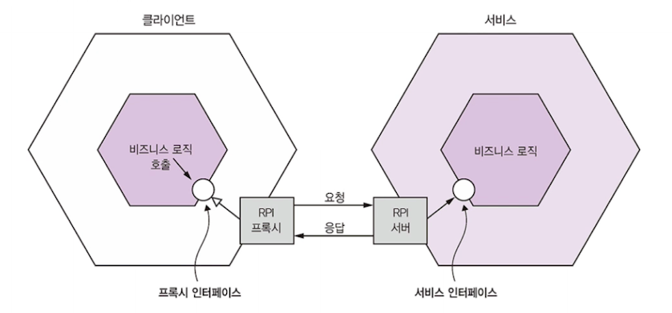
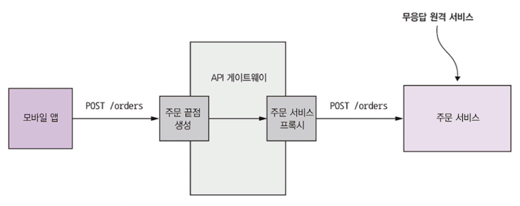
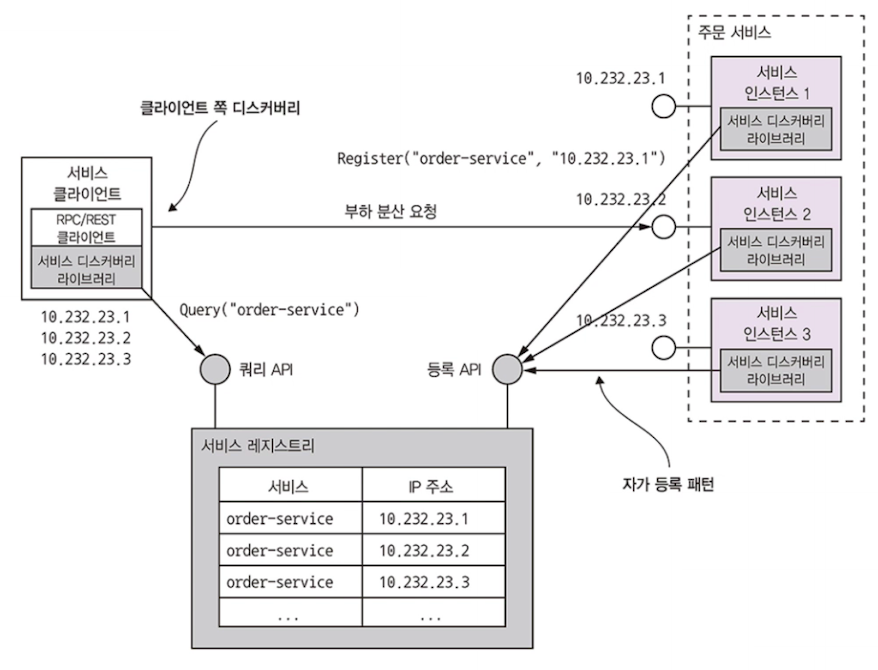
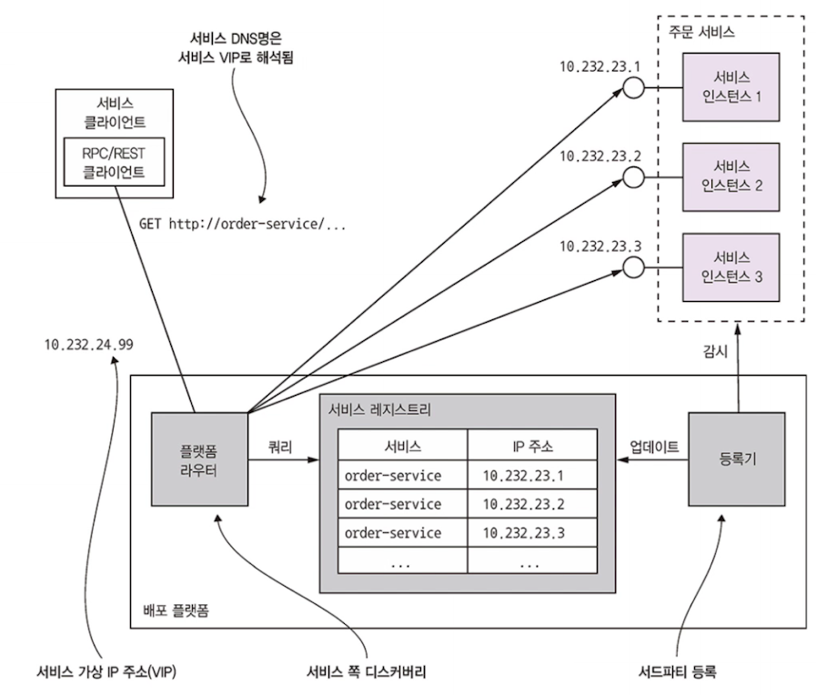

# 3.2 동기 RPI 패턴 응용 통신

> RPI 란?
>
> Romote Procedure Invocation의 줄임말로 원격 프로시저 호출

클라이언트가 서비스에 요청 보내면, 서비스가 처리후 응답을 회신하는 IPC

프록시 인터페이스는 하부 통신 프로토콜을 캡슐화.

> 통신 종류에 무관하게 동작 가능하겠지!

프로토콜은 REST, gRPC 등 이용.

- 부분 실패를 적절히 처리해서 서비스 가용성을 높이는 방법
- RPI를 사용하는 마이크로 서비스 애플리케이션에서 서비스 디스커버리 메커니즘이 필요한 이유

2가지를 알아보자

## 3.2.1 동기 RPI 패턴 : REST

rest 성숙도 모델 제시 -> 4가지 레벨. 

### REST API

IDL 이 없었지만, API 명세가 널리 보급되는 중!

### 요청 한 번으로 많은 리소스 가져오기 어렵다

관련 리소스를 얻기 위해서 왕복 횟수 증가 -> 지연 시간 급증

API 가 관련 리소스를 함께 조회하도록 허락하면 좋지만, 점점 시나리오 복잡해짐.

-> 대체 기술 각광받음!

### 작업을 http 동사에 매핑하기 어렵다

비즈니스 객체에 수행할 작업의 종류가 다양해지는 경우 어떤 동사에 매핑할지 어려워진다.

URL 쿼리 매개변수 지정, 하위 리소스 지정 등의 방법이 있지만 REST 답지 않으며, 
이 점 때문에 gRPC 등 대체 기술이 인기를 끌고 있음

### REST 장단점

장점

- 단순, 익숙 / 테스트도 쉬움
- 요청 응답 스타일 통신 지원
- 중간 브로커 필요하지 않아서 시스템 아키텍처가 단순해진다

단점

- 요청, 응답 스타일 통신만 지원
- 가용성이 떨어진다.
  - 중간 버퍼링 매개자가 없어서 교환이 일어나는 동안 양쪽 모두 실행중이어야 함
- 서비스 인스턴스 위치를 클라이언트가 알아야함
- ...

## 3.2.2 동기 RPI 패턴 : gRPC

 **REST 의 한계인 한정된 동사만 지우너하기에 다양한 업데이트 작업을 지원하기 쉽지 않았음!**

gRPC는 해결 가능!

- 다양한 언어로 클라이언트/서버 작성 가능한 프레임워크
- 이진 메시지 기반의 프로토콜
  - API 우선 방식으로 설계!

- 하나 이상의 서비스와 요청/응답 메시지 데피니션(정의한 코드)으로 구성
- 프로토콜 버퍼 메시지 포맷을 사용
  - 각 필드마다 번호가 매겨지고, 타입 코드 할당.
  - 메시지 수신자는 자신이 필요한 필드만 추출하고 모르는 필드는 그냥 건너뜀

### gRPC 장단점

**장점**

- 다양한 업데이트 작업이 포함된 API를 설계하기 쉬움
- 특히 큰 메세지를 교환할 때 효율적
- 양방향 스트리밍 덕분에 RPI, 메세징 **두 가지 통신 방식 모두 가능**
- 다양한 언어로 작성된 클라이언트/서버 연동 가능

**단점**

- 자바스크립트 클라이언트가 하는 일이 REST/JSON 기반 API보다 더 많음
- 구형 방화벽은 HTTP/2를 지원하지 않음
- **REST와 같이 동기 통신하는 메커니즘이라 부분 실패 문제가 있음**

## 3.2.3 부분 실패 처리 : 회로 차단기 패턴

> Circuit Breaker 패턴!
>
> 연속 실패 횟수가 주어진 임계치를 초과하면 일정 시간동안 호출을 즉시 거부하는 RPI 프록시

**분산 시스템은 항상 부분 실패 가능성 존재**
따라서 부분실패가 전파되지 않도록 서비스를 설계한다!

만일 circuit break 되지 않으면? 응답을 기다리며 무한정 블로킹

-> 스레드 같은 주요 리소스 고갈되어 API 게이트웨이 요청 처리할 수 없음 -> 전체 API 불능

이에 대한 솔루션

- 무응답 원격 서비스를 처리하기 위해 견고한 RPI 프록시를 설계
- 원격 서비스가 실패하면 어떻게 조치할지 결정

### 견고한 RPI 프록시 설계

- 네트워크 타임아웃 
  - 응답 대기 중 무한정 블로킹 하지 않고, 항상 타임아웃 걸어둔다
- 미처리 요청 제한 
  - 클라이언트가 요청 가능한 미처리 요청의 최대 개수를 설정.
    이 개수에 이르면 이후 요청은 무의미
- 회로 차단기 패턴
  - 성공/실패 요청 개수를 지켜보다가 에러율이 주어진 임계치를 초과하면 그 이후 시도는 바로 실패 처리
  - 타임아웃 시간 이후 클라이언트가 재시도해서 성공하면 회로 차단기는 닫힌다

***JVM 환경이라면 히스트릭스를 이용하여 RPI 프록시를 구현해보자!***

### 불능 서비스 복구

히스트릭스 같은 라이브러리는 물론 부분적인 솔루션에 불과!

어떻게 복구할지는 상황에 맞게 판단해야...!

부분 실패 시 기본값, 캐시 등 대체 값 리턴 등의 정책!

API 게이트웨이가 캐시된 버전의 데이터 또는 에러를 반환하게 된다.

## 3.2.4 서비스 디스커버리

REST API가 어떤 서비스를 호출해야할 때 네트워크 위치(IP주소 및 포트)는 반드시 알아야한다!
그런데, 요즘 클라우드 기반 MSA 는 알기 쉽지 않음!
동적으로 할당되기 때문!!

**무조건 서비스 디스커버리가 필요하다!**

### 서비스 디스커버리 개요

**애플리케이션 서비스 인스턴스의 네트워크 위치를 DB화한 서비스 레지스트리 이용!**

**서비스 인스턴스 시작/종료할 때 마다 서비스 레지스트리 업데이트**
**클라이언트가 서비스 호출하면,**
**서비스 디스커버리가 서비스 레지스트리에서 가용 서비스 인스턴스 목록을 가져오고,**
**그중 한 서비스로 요청을 라우팅**

- 클라이언트/서비스가 직접 서비스 레지스트리와 상호작용
- 배포 인프라로 서비스 디스커버리를 처리

### 애플리케이션 수준의 서비스 디스커버리 패턴 적용

*애플리케이션 클라이언트/서비스가 서비스 레지스트리와 직접 통신하는 방법*

2가지 패턴의 조합으로 구현한다!

- 자가 등록 패턴
  - 서비스 인스턴스는 자신의 네트워크 위치를 서비스 레지스트리 등록 API를 호출해서 등록
- 클라이언트쪽 디스커버리 패턴
  - 클라이언트는 서비스를 호출할 때 먼저 서비스 레지스트리에 서비스 인스턴스 목록을 요청
  - 이후 서비스 클라이언트는 부하 분산 알고리즘을 이용하여 서비스 인스턴스를 선택한 후 요청을 전송

**서비스 인스턴스는 자신의 네트워크 위치를 서비스 레지스트리에 등록,** 
**서비스 클라이언트는 이 서비스 레지스트리로부터 전체 서비스 인스턴스 목록을 가져와 그중 한 인스턴스로 요청을 라우팅**

**애플리케이션 수준의 서비스 디스커버리 패턴** 의 장점

- 다양한 플랫폼에 서비스가 배포되어도 처리 가능
  - 일부 서비스만 쿠버네티스에 배포, 나머지는 레거시에 실행하고 싶을 때
    쿠버네티스 기반 서비스 디스커버리는 쿠버 안에서만 동작하지만, 유레카를 이용한 애플리케이션 수준의 디스커버리는 두 환경 모두 잘 동작

**애플리케이션 수준의 서비스 디스커버리 패턴**의 단점

- 언어에 맞는 서비스 디스커버리 라이브러리가 필요

### 플랫폼에 내장된 서비스 디스커버리 패턴 적용

도커나 쿠버네티스 등 최신 배포 플랫폼에는 서비스 레지스트리, 서비스 디스커버리 메커니즘이 탑재됨

**배포 플랫폼은 DNS명, 가상 IP(VIP) 주소, VIP 주소로 해석되는 DNS명을 각 서비스마다 부여**

서비스 IP 주소 추적하는 서비스 레지스트리는 배포 플랫폼에 내장되어 있음

2 가지 패턴 접목

- 서드파티 등록 패턴
  - 서비스가 자신을 서비스 레지스트리에 등록하는 것이 아닌, **배포 플랫폼의 일부인 등록기(레지스트라)라는 서드 파티가 이 작업을 대행**
- 서버쪽 디스커버리 패턴
  - 클라이언트가 서비스 레지스트리를 질의하지 않고 DNS명을 요청. 그러면 서비스 레지스트리를 쿼리하고 요청을 부하 분산하는 요청 라우터로 해석

**장점**

- 서비스 디스커버리는 모두 배포 플랫폼이 알아서 처리하므로 편리
- 서비스 디스커버리 관련 코드는 클라이언트, 서비스 어느 쪽에도 없어서 언어와 무관

**단점**

- 해당 플랫폼으로 배포한 서비스 디스커버리만 지원된다
- 쿠버 기반 디스커버리는 오직 쿠버로 배포한 서비스에만 적용!

