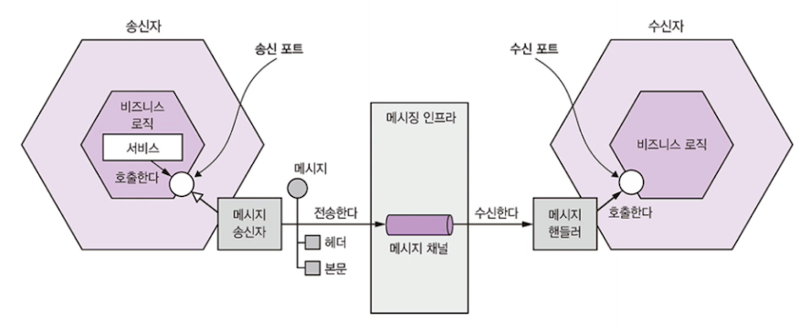
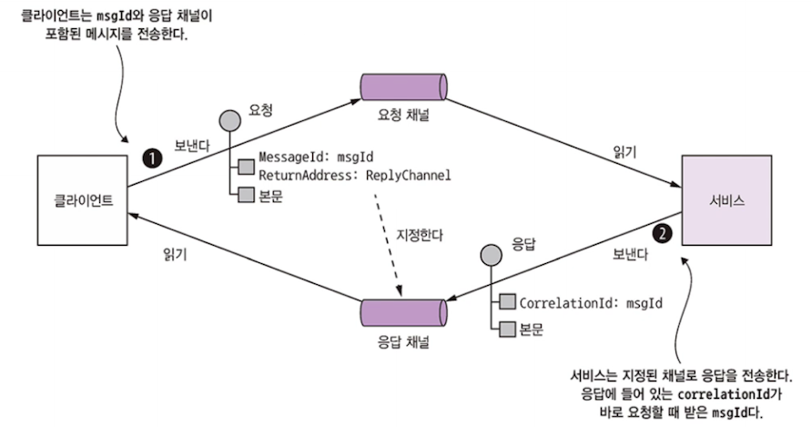

# 비동기 메시징 패턴 응용 통신

메시징 : 서비스가 메시지를 비동기적으로 주고받는 통신 방식

보통 서비스 간 중개 역할을 하는 메시지 브로커를 사용하지만,
서비스가 직접 서로 통신하는 브로커리스 아키텍처도 존재

## 3.3.1 메시징 개요

메시지는 채널을 통해 교환

송신자는 채널에 메시지를 쓰면 수신자는 채널에서 메시지를 읽음

> Pub,sub

### 메시지

메시지 : 헤더 + 본문으로 구성

- 헤더 
  - 송신된 데이터에 관한 메타데이터에 해당하는 키/값들로 구성
  - 송신자 or 메시징 인프라에서 생성된 메시지 ID, 응답이 출력될 메시지 채널을 가리키는 반환 주소
- 본문
  - 실제로 송신할 텍스트 or 이진 포맷의 데이터

**메시지 종류**

- 문서(document) : 데이터만 포함된 제네릭한 메시지, 메시지를 어떻게 해석할지는 수신자가 결정
- 커맨드(command) : RPC 요청과 동등한 메시지로 호출할 작업과 전달할 매개변수가 지정
- 이벤트(event) : 송신자에게 어떤 사건이 발생했음을 알리는 메시지. 이벤트는 대부분 도메인 객체의 상태 변화를 나타내는 도메인 이벤트

### 메시지 채널

**메시지는 채널을 통해 교환**

송신자의 비즈니스 로직

: 하부 통신 메커니즘 캡슐화한 송신 포트 인터페이스 호출 / 이 인터페이스는 메시지 송신자 어댑터 클래스로 구현. 
메시징 인프라를 추상화한 메시지 채널 통해 수신자에게 전달

수신자의 메시지 핸들러 어댑터 클래스는 메시지를 처리하기 위해 호출, 컨슈머 비즈니스 로직으로 구현된 수신 포트 인터페이스를 호출

**채널의 종류**

- 점대점 채널 : 채널을 읽는 컨슈머중 1명에게만 전달 (예 : 커맨드 메시지)
- 발행 구독 채널 : 같은 채널을 보는 모든 컨슈머에게 메시지 전달 ( 예 : 이벤트 메시지)

## 3.3.2 메시징 상호작용 스타일 구현

메시징은 3.1.1에서 언급한 상호작용 스타일 모두 지원할만큼 유연함! 

### 요청/응답 및 비동기 요청 응답

요청/응답은 서비스가 즉시 응답할 것이라고 클라이언트가 기대하고 비동기 요청/응답은 클라이언트가 기대하지 않음

메세징은 원래 성격 자체가 비동적이라서 비동기 요청/응답만 제공하지만 응답을 수신할 때까지 블로킹할 수도 있음!

클라이언트/서비스는 한 쌍의 메시지 주고 받는 비동기 요청응답 스타일로 상호작용

