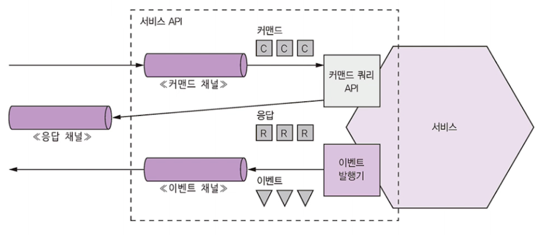
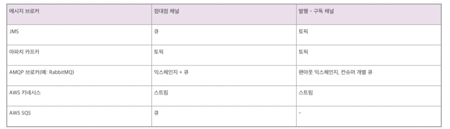
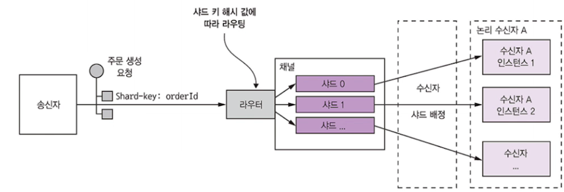
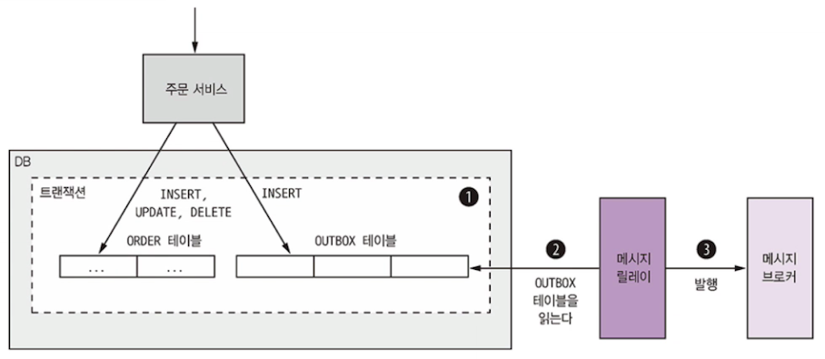
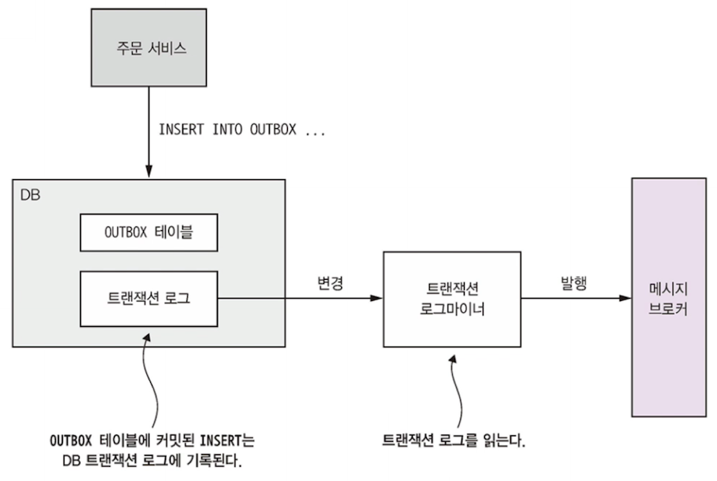

# 비동기 메시징 패턴 응용 통신

메시징 : 서비스가 메시지를 비동기적으로 주고받는 통신 방식

보통 서비스 간 중개 역할을 하는 메시지 브로커를 사용하지만,
서비스가 직접 서로 통신하는 브로커리스 아키텍처도 존재


## 3.3.1 메시징 개요

메시지는 채널을 통해 교환

송신자는 채널에 메시지를 쓰면 수신자는 채널에서 메시지를 읽음

> Pub,sub

### 메시지

메시지 : 헤더 + 본문으로 구성

- 헤더 
  - 송신된 데이터에 관한 메타데이터에 해당하는 키/값들로 구성
  - 송신자 or 메시징 인프라에서 생성된 메시지 ID, 응답이 출력될 메시지 채널을 가리키는 반환 주소
- 본문
  - 실제로 송신할 텍스트 or 이진 포맷의 데이터


**메시지 종류**

- 문서(document) : 데이터만 포함된 제네릭한 메시지, 메시지를 어떻게 해석할지는 수신자가 결정
- 커맨드(command) : RPC 요청과 동등한 메시지로 호출할 작업과 전달할 매개변수가 지정
- 이벤트(event) : 송신자에게 어떤 사건이 발생했음을 알리는 메시지. 이벤트는 대부분 도메인 객체의 상태 변화를 나타내는 도메인 이벤트


### 메시지 채널


**메시지는 채널을 통해 교환**

송신자의 비즈니스 로직

: 하부 통신 메커니즘 캡슐화한 송신 포트 인터페이스 호출 / 이 인터페이스는 메시지 송신자 어댑터 클래스로 구현. 
메시징 인프라를 추상화한 메시지 채널 통해 수신자에게 전달

수신자의 메시지 핸들러 어댑터 클래스는 메시지를 처리하기 위해 호출, 컨슈머 비즈니스 로직으로 구현된 수신 포트 인터페이스를 호출

**채널의 종류**

- 점대점 채널 : 채널을 읽는 컨슈머중 1명에게만 전달 (예 : 커맨드 메시지)
- 발행 구독 채널 : 같은 채널을 보는 모든 컨슈머에게 메시지 전달 ( 예 : 이벤트 메시지)


## 3.3.2 메시징 상호작용 스타일 구현

메시징은 3.1.1에서 언급한 상호작용 스타일 모두 지원할만큼 유연함! 

### 요청/응답 및 비동기 요청 응답

요청/응답은 서비스가 즉시 응답할 것이라고 클라이언트가 기대하고 비동기 요청/응답은 클라이언트가 기대하지 않음

메세징은 원래 성격 자체가 비동적이라서 비동기 요청/응답만 제공하지만 응답을 수신할 때까지 블로킹할 수도 있음!


클라이언트/서비스는 한 쌍의 메시지 주고 받는 비동기 요청응답 스타일로 상호작용


### 발행 / 구독

메시징은 발행/구독 스타일의 상호작용을 기본 지원

- 클라이언트는 여러 컨슈머가 읽는 발행/구독 채널에 메세지를 발행
- 서비스는 도메인 객체의 변경 사실을 알리는 도메인 이벤트를 발행
- 도메인 이벤트 발행한 서비스는 해당 도메인 클래스의 이름을 딴 발행/구독 채널을 소유

### 발행/비동기 응답

- 발행/구독과 요청/응답의 엘리먼트를 조합한 고수준의 상호 작용 스타일
- 클라이언트는 응답 채널 헤더가 명시된 메시지를 발행/구독 채널에 발행
- 컨슈머는 CorrelationId가 포함된 응답 메시지를 지정된 응답 채널에 쓴다.
- 클라이언트는 이 CorrelationId로 응답을 취합하여 응답 메시지와 요청을 맞춰봄


비동기 API를 갖고 있는 앱 서비스는 지금까지 설명한 기법 적어도 하나는 쓴다.
**비동기 API로 작업을 호출하는 서비스**에는 **요청용 메시지 채널**이 있고,
**이벤트를 발행하는 서비스는 이벤트 메시지 채널에 이벤트를 발행할 것이다.**


## 3.3.3 메시징 기반 서비스의 API 명세 작성

- 서비스의 비동기 API 명세
  - 메시지 채널명, 각 채널을 통해 교환되는 메시지 타입과 포맷 명시
- 메시지 포맷
  - JSON, XML, 프로토콜 버퍼 등 표준 포맷으로 기술
- 채널 및 메시지 타입
  - REST, 오픈 API 와 달리 딱히 정해진 문서화 표준 없으므로 자유롭게 기술



위 그림처럼, 서비스의 비동기API는 메시지 채널, 커맨드, 응답, 이벤트 타입으로 구성된다.

### 비동기 작업 문서화

- 요청/비동기 응답 스타일 API : 서비스의 커맨드 메시지 채널, 서비스가 받는 커맨드의 메시지의 타입과 포맷, **서비스가 반환하는 응답 메시지의 타입과 포맷**으로 구성
- 단방향 알림 스타일 API : 서비스의 커맨드 메시지 채널, 서비스가 받는 커맨드 메시지의 타입과 포맷

두 스타일 모두 동일한 요청 채널을 사용할 수 있음

### 발행 이벤트 문서화

- 서비스는 발행/구독 스타일로도 이벤트를 발행 가능 
  - 이벤트 채널, 서비스가 채널에 발행하는 이벤트 메시지의 타입과 포맷으로 구성


메시징 채널 모델은 서비스 비동기 API 를 설계하는 좋은 수단이지만, 
서비스를 구현하려면 **메시징 기술을 선택하고 그 기술이 가진 기능으로 어떻게 설계할지 방향을 잡아야 함!**
이제 구체적으로 살펴보자!

## 3.3.4 메시지 브로커

메시징 기반의 애플리케이션은 대부분 메시지 브로커를 사용

**메시지 브로커 : 서비스가 서로 통신할 수 있게 해주는 인프라 서비스**
(물론 서비스가 서로 직접 통신하는 브로커리스 기반의 메시징 아키텍처도 존재. 일반적으로는 브로커 쓰는게 나음)

### 브로커리스 메시징

종종 브로커리스가 좋은 경우도 있음.

- 브로커리스 아키텍처 서비스는 메시지를 서로 직접 교환
  - ZeroMQ 가 잘 알려진 브로커리스 메시징
  - 그 자체가 명세이자, 여러 언어를 지원하는 라이브러리 세트
  - TCP, 유닉스형 도메인 소켓, 멀티캐스트 등 다양한 전송 기술 지원

- **장점**
  - 송신자가 보낸 메시지가 브로커를 거쳐 수신자로 이동하는게 아니라 **직접 전달되니까 지연시간이 줄어든다.**
  - 브로커가 성능 병목점이나 SPOF(Single Point Or Failure: 단일 장애점) 가 될일은 없음
  - 브로커를 설정/관리 안해도 되니까 운영 복잡도가 낮다
- **단점**
  - **서비스가 서로의 위치를 알고 있어야 하므로 서비스 디스커버리 메커니즘 중 하나를 사용해야한다.**
  - 메시지 교환 시 **송신자 수신자 모두 실행 중이어야 하므로 가용성이 떨어진다.**
  - 전달 보장 같은 메커니즘을 구현하기 어렵다.

가용성 저하, 서비스 디스커버리 필요성은 동기 요청/응답 방식과 다르지 않음 
**-> 엔터프라이즈 애플리케이션은 대부분 메시지 브로커 기반의 아키텍처 사용**


### 브로커 기반 메시징 개요

메시지 브로커 - 모든 메시지가 지나는 중간 지점!

메시지 브로커의 가장 큰 장점은 송신자가 컨슈머의 네트워크 위치를 몰라도 된다!
또 컨슈머가 메시지를 처리할 수 있을 때까지 브로커에 메시지 버퍼링 가능

**메시지 브로커 종류**

- 오픈소스 : ActiveMQ, RabbitMQ, Apache Kafka
- 클라우드 기반 : Aws kinesis, Aws SQS 등


### **메시지 브로커 선택 기준**

- 프로그래밍 언어 지원 여부
- 메시징 표준 지원 여부 - AMQP / STOMP등 표준 프로토콜 지원하는지? 아니면 자체 표준만?
- 메시지 순서 - 유지되는가?
- 전달 보장 - 어떤 종류의 전달 보장을 하는가?
- 영속화 - 브로커가 고장 나도 문제 없도록 메시지를 디스크에 저장하는가?
- 내구성 - 컨슈머가 브로커에 다시 접속할 경우, 접속이 중단된 시간에 전달된 메시지를 받을 수 있나?
- 확장성 - 얼마나 확장성이 좋은가?
- 지연 시간 - 종단간 지연 시간은 얼마나?
- 경쟁사 컨슈머 - 경쟁사의 컨슈머를 지원하는가?

장단이 확실함! 지연시간이 매우 짧은 브로커는 메시지 순서가 유지되지 않거나 메시지 전달이 보장되지 않을 수 있음. 또 메시지를 메모리에만 저장한다던지!

**하지만 메시징 순서 유지 및 확장성은 필수!**

### 메시지 브로커로 메시지 채널 구현

메시징 브로커를 이용해서 메시지 채널을 구축해보자.
메시지 채널은 브로커마다 구현방식은 다름




### 브로커 기반의 메시징의 장단점

- **장점**
  - 느슨한 결합
    - 클라는 적절한 채널에 그냥 메시지를 보내는 식으로 요청. 
      클라는 서비스 인스턴스 몰라도 되므로 서비스 인스턴스 위치 알려주는 디스커버리 메커니즘도 필요 없음
  - 메시징 버퍼링
    - 처리 가능한 시점까지 메시지 버퍼링
    - 동기 요청 응답 프로토콜은 교환 일어나는 동안 클라/서비스 둘 다 가동 필수이지만,
      메시징은 컨슈머가 처리할 수 있을 때까지 큐에 메시지 남김
  - 유연한 통신
    - 모든 상호 작용 스타일 지원
  - 명시적 IPC
    - RPC 메커니즘은 원격 서비스가 마치 자기 로컬 서비스처럼 호출 시도.
      하지만 실패 가능성이 있기에 서비스와 완전 다르긴함!
- **단점**
  - 성능 병목 가능성
    - 브로커가 성능 병목점이 될 수 있다.
      최근엔 대부분 확장이 잘 되도록 설계되긴 함!
    - 단일 장애점 가능성
      - 가용성이 높아야! 이 또한 최근엔 고가용성 보장되도록 설계되긴 함
    - 운영 복잡도 증가
      - 메시징 시스템 역시 설치, 구성, 운영해야 할 시스템 컴포넌트


## 3.3.5 수신자 경합과 메시지 순서 유지

*메시지 순서 유지한 채로 스케일 아웃 어떻게 하지?*

메시지 동시 처리 하려면 서비스 인스턴스 여러 대 필요.  + 정확히 한 번만 순서대로 처리할 필요가 있다!

**-> 최근 메시지 브로커(아파치 카프카, AWS 키네시스)는 샤딩된 채널을 이용!**

### 솔루션

1. 샤딩된 채널은 복수의 샤드로 구성, 각 샤드는 채널처럼 작동
2. 송신자는 메시지 헤더에 샤드 키를 지정. 메시지 브로커는 메시지를 샤드 키별로 샤드/파티션에 배정. 
   예를 들어 샤드 키 해시 값을 샤드 개수로 나눈 나머지를 계산해서 샤드를 선택하는 식
3. 메시징 브로커는 여러 수신자 인스턴스를 묶어 동일한 논리 수신자처럼 취급.
   메시지 브로커는 각 샤드를 하나의 수신자에 배정, 수신자가 시동/종료하면 샤드를 재배정



주문별 이벤트는 동일한 샤드에 발행, 어느 한 컨슈머 인스턴스만 읽기에 메시지 처리 순서가 보장!

> 같은 주문 번호에 대해선 샤드 동일하게! 그러면 같은 주문 관련 이벤트는 동일 샤드 채널로만 송신 가능!


## 3.3.6 중복 메시지 처리

브로커가 각 메시지를 1번만 전달하면 좋겠지만, 그만큼 비용 증가!
**따라서 보통 적어도 1번 이상 메시지 전달하겠다고 약속**

- 시스템이 정상일 때는 적어도 1번 보내는 브로커는 각 메시지를 1번만 전달.
- 클라나 네트워크, 브로커가 실패할 경우 같은 메시지 여러번 전달 할 수 있음
  - 메시지 처리 이후 DB 업데이트까지 끝났는데, 메시지 ACK 하기전에 클라가 갑자기 멎음
  - 클라가 재시동하면 브로커는 ACK 안된 메시지를 다시 보내거나, 다른 클라이언트 레플리카에 전송

- 브로커가 메시지 재전송할 때 원래 순서까지 유지하면 이상적
  - 클라이언트 : 주문 생성됨 이벤트 -> 주문 취소됨 이벤트 순서로 처리
  - 문제가 발생해서 주문 생성됨 이벤트 ACK 를 클라가 못 받았을 때
    - 나중에 브로커가 주문 생성됨 이벤트만 재전송하면 클라가 주문 취소를 undo 할 수 있기 때문에 
      주문 생성됨 이벤트 -> 주문 취소됨 이벤트 둘 다 재전송해야함

**중복 메시지 처리하는 법**

- 멱등한 메시지 핸들러 작성
- 메시지를 추적하고 중복을 솎아낸다.

### 멱등한 메시지 핸들러 작성

*멱등하다 : 동일한 입력값을 반복 호출해도 아무런 부수 효과가 없을 때*

- 어플리케이션의 메시지 처리 로직이 멱등하면 중복 메시지는 전혀 해롭지 않다.
- 취소된 주문을 다시 취소하는 작업, 클라이언트가 전달한 ID로 주문을 생성하는 작업도 멱등하다.
- 메시지 재전송 시 메시지 브로커가 순서를 유지한다는 전제하에 멱등한 메시지 핸들러는 여러번 실행해도 별 문제가 없다.

**But, 실제로 이렇게 멱등한 앱 로직은 별로 없다. 메시지를 다시 전송하면 순서를 보장 안할 수도 있다.**
중복 메시지와 순서가 안 맞는 메시지는 오류를 일으키므로 **중복 메시지를 솎아 내는 메시지 핸들러가 필요하다!!**


### 메시지 추적과 중복 메시지 솎아내기

소비자 신용카드를 승인하는 메시지 핸들러가 있다고 가정
주문별로 정확히 1회 신용카드를 승인해야 함

**이런 종류의 로직은 호출될 때마다 영향을 미치므로 중복 메시지를 걸러내서 멱등한 동작을 만들어야 함!**

컨슈머가 메시지 ID를 이용하여 메시지 처리 여부를 추적하면서 중복 메시지를 솎아내면 끝!
(컨슈머가 소비하는 메시지 ID를 무조건 DB 테이블에 저장하면 끝)

컨슈머는 메시지를 처리할 때 비즈니스 엔터티를 생성/수정하는 트랜잭션의 일부로 메시지ID 를 디비에 기록.
-> 중복된 메시지 insert 를 제거

전용 테이블 대신 일반 애플리케이션 테이블에 메시지 ID를 기록하는 방법도 존재.
한 DB 트랜잭션으로 두 테이블을 업데이트 하는 일이 불가능한 트랜잭션 모델이 제한적인 NoSQL  디비 쓸 때 유용


## 3.3.7 트랜잭셔널 메시징

서비스는 보통 DB 를 업데이트하는 트랜잭션의 일부로 메시지를 발행

DB 업데이트와 메시지 전송을 한 트랜잭션으로 안묶으면? DB 업데이트 후 메시지는 전송되지 않은 상태에서 서비스가 중단될 수 있음 
-> 원자적으로 수행되지 않으면 시스템이 아주 불안정
예전에는 DB 와 메시지 브로커에 분산 트랜잭션 적용했지만 요즘은 더이상 어울리지 않음. + 현대 브로커는 지원도 안함

### DB 테이블을 메시지 큐로 활용

- RDBMS기반 앱이라면 **DB를 임시 메시지 큐로 사용하는 트랜잭셔널 아웃박스 패턴이 가장 알기 쉬운 방법**
- 메시지를 보내는 서비스에 OUTBOX라는 DB테이블을 만들고 
  비지니스 객체 생성, 수정, 삭제하는 DB 트랜잭션 일부로  OUTBOX 테이블에 메시지를 삽입
  - OUTBOX 테이블은 임시 메시지 큐 역할
- 로컬 ACID 트랜잭션 이기 때문에 원자성은 자동 보장
- NoSQL DB에서도 비슷. 
  DB 에 레코드로 적재된 비즈니스 엔터티에 발행할 메시지 목록을 가리키는 속성이 있는데,
  서비스가 DB 엔터티를 업데이트할 때 바로 이 목록에 메시지를 덧붙이면 된다.




그럼 메시지를 DB 에서 브로커로 어떻게 옮기는가?

### 이벤트 발행 : 폴링 발행기 패턴

RDBMS 쓰는 애플리케이션에서 OUTBOX 테이블에 삽입된 메시지를 발행하는 가장 간단한 방법 
: 메시지 릴레이로 테이블을 폴링해서 미발행 메시지를 조회

```sql
select * from outbox order by ... ASC
```

이렇게 조회한 메시지를 각자 목적지 채널로 보내서 메시지 브로커에 발행. 나중에 OUTBOX 에서 메시지 삭제

DB 폴링은 규모가 작을 경우 쓸 수 있는 단순한 방법. 
하지만 DB를 자주 폴링하면 비용이 유발, NoSQL 은 쿼리 능력에 따라 사용 가능 여부가 결정됨.
애플리케이션이 OUTBOX 를 쿼리하는 대신 비즈니스 엔터티를 쿼리해야하는 경우도 있는데 이 때 불가능할 수도 있기 때문

**따라서 DB 트랜잭션 로그 테일링이 조금 더 정교하고 성능이 좋다**

### 이벤트 발행 : 트랜잭션 로그 테일링 패턴

**메시지 릴레이로 DB 트랜잭션 로그를 테일링하는 방법**

애플리케이션에서 커밋된 업데이트는 각 DB 의 트랜잭션 로그 항목으로 남는다. 
트랜잭션 로그 마이너로 로그를 읽어 변경분을 하나씩 메시지 브로커에 발행



- 트랜잭션 로그 항목을 읽고, 삽입된 메시지에 대응하는 각 로그 항목을 메시지로 전환, 브로커에 발행
- RDBMS OUTBOX 테이블에 출력된 메시지를 이런 식으로 발행

**응용 사례**

- 디비지움 ( Debezium ) - DB변경분을 아파치 카프카 메시지 브로커에 발행하는 오픈소스 프로젝트
- 링크드인 데이터버스 - 오라클 트랜잭션 로그를 마이닝하여 변경분을 이벤트로 발행
- DynamoDB Streams - 최근 24시간 동안 DynamoDB테이블 아이템에 적용된 변경분을 시간 순으로 정렬한 데이터를갖고있다. - 스트림에서 변경분을 읽어 이벤트로 발행 가능
- 이벤추에이트 트램 - Mysql 빈로그 프로토콜, Postgres, WAL 폴링을 응용해서 변경분을 읽어 아파치 카프카로 발행

이 책의 필자는 이러한 사례의 단점을 다소 보완한 트랜잭션 테일링+폴링+메시지 API 제공하는 이벤추에이트 트램 프레임워크 개발함


## 3.3.8 메시징 라이브러리/프레임워크

서비스가 메시지 주고받으려면 라이브러리 필요.
메시지 브로커에도 클라 라이브러리가 있지만 직접 사용하면 문제 발생!

- 브로커 API 에 메시지 발행하는 비즈니스 로직이 클라 라이브러리와 결합됨
- 브로커의 클라 라이브러리는 대부분 저수준 + 메시지 주고받는 코드 길다.
- 브로커의 클라 라이브러리는 기본 메시지 소통 수단일 뿐, 고수준의 상호작용 스타일은 지원하지 않음

따라서, 저수준 세부를 감추고 고수준의 상호작요 스타일을 직접 지원하는 고수준 라이브러리 또는 프레임워크 필요.
예시는 필자의 이벤추에이트 트램 프레임워크 사용해서 작성

이벤추에이트 트램 프레임워크 메커니즘

- 트랜잭셔널 메시징 : 메시지를 DB 트랜잭션의 일부로 발행
- 중복 메시지 감지 : 이벤추에이트 트램의 메시지 컨슈머는 중복 메시지를 솎아 낸다.

## 이벤추에이트 트램 API

### 기초 메시징

MessageProducer, MesageConsumer 인터페이스로 구성.

```java
MessageProducer messageProducer = ...;
String channel = ...;
String payload = ...;
messageProducer.send(destination, MessageBuilder.withPayload(payload).build());
```

```java
MessageConsumer messageConsumer;
messageConsumer.subscribe(subscriberId, Collections.singelton(destination), message -> (...));
```


### 도메인 이벤트 발행

도메인 이벤트 : 비즈니스 객체를 생성, 수정, 삭제 시 애그리거트(비즈니스 객체)가 발생시킨 이벤트

도메인 이벤트 발행

```java
DomainEventPublisher domainEventPublisher;
String accountId = ...;
DomainEvent domainEvent = new AccountDebited(...);
domainEventPublisher.publish("Account", accountId, Collections.singletonList(domainEvent));
```


도메인 이벤트 소비

```java
DomainEventHandlers domainEventHandlers = DomainEventHandlersBuilder
            .forAggregateType("Order")
            .onEvent(AccountDebited.class, domainEvent -> { ... })
            .build();

new DomainEventDispatcher("eventDispatcherId",
            domainEventHandlers,
            messageConsumer);
```


### 커맨드/응답 메시징

커맨드 메시지를 서비스에 보냄

```java
CommandProducer commandProducer = ...;
Map<String, String> extraMessageHeaders = Collections.emptyMap();
String commandId = commandProducer.send("CustomerCommandChannel",
        new DoSomethingCommand(),
        "ReplyToChannel",
        extraMessageHeaders);
```


커맨드 메시지 소비

```java
CommandHandlers commandHandlers = CommandHandlersBuilder
            .fromChannel(commandChannel)
            .onMessage(DoSomethingCommand.class, (command) -> { ... ; return withSuccess(); })
.build();
CommandDispatcher dispatcher = new CommandDispatcher("subscribeId",
             commandHandlers, messageConsumer, messageProducer);
```


