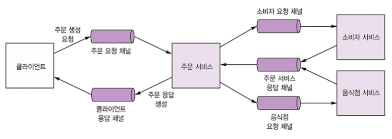
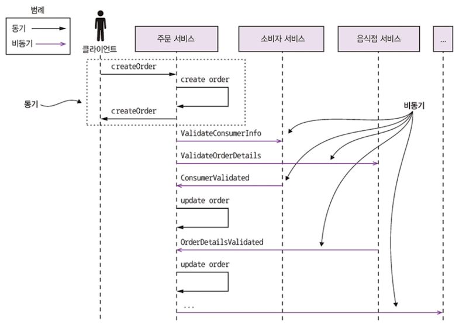

# 3.4 비동기 메시징으로 가용성 개선

다양한 IPC 는 각 장단이 있고, 가용성에 영향을 미친다. 
동기 통신은 가용성이 떨어지는 편이기 때문에, 비동기로 쓰는 편이 좋다!

## 3.4.1 동기 통신으로 인한 가용성 저하

REST 대중적이여서 끌리는 IPC 이지만, 동기 프로토콜이라는 치명적인 문제!

여러 서비스에 걸쳐 있을 때, 모든 서비스가 정상 가동중이어야 하며
수학적으로 표현 시 시스템의 가용성은 그 작업이 호출한 서비스의 가용성의 곱

**-> 동기 통신을 최소화하여 가용성을 최대화하자**

## 3.4.2 동기 상호 작용 제거

비동기 API 만 있는 서비스를 정의해서 해결하는 방법도 있지만, 항상 그런건 아니다.
퍼블릭 API 는 대부분 REST  이니, 서비스에 동기 API 포함시키는 경우가 많다!

다만, 동기 요청을 하지 않아도 동기 요청 처리할 수 있다!

### 비동기 상호작용 스타일

**모든 트랜잭션은 비동기 상호작용 스타일로 처리하는 것이 좋다.**

**예를 들어 비동기 요청/응답 상호 작용의 주문을 보자**

- 클라는 요청 메시지를 주문 서비스에 전송하여 주문을 생성
- 주문 서비스는 다른 서비스와 메시지를 비동기 방식으로 교환, 최종적으로 클라에 응답 메시지 전송
- 클라/서비스는 메시징 채널을 통해 메시지를 전송해서 서로 비동기 통신한다.
- 이런 상호 작용 과정에선 어느 쪽도 응답을 대기하며 블로킹되지 않는다.

- 이런 아키텍처는 메시지가 소비되는 시점까지 브로커가 메시지를 버퍼링해서 매우 탄력적!

**REST 같은 동기 프로토콜 사용해야하는 외부 API 가진 서비스가 있다면 어떻게 가용성을 높일까?**
**데이터를 복제해서 가용성을 높이자!**

### 데이터 복제

- **서비스 요청 처리에 필요한 데이터의 레플리카를 유지!**
  - 데이터 레플리카는 **데이터를 소유한 서비스가 발행하는 이벤트를 구독해서 최신 데이터를 유지**
    - 각자 데이터 변경 시 이벤트 발행
    - 굳이 다른 서비스와 상호작용하지 말자!

- 데이터 복제는 경우에 따라 유용하다.

  - 예를 들어 주문 서비스가 음식점 서비스에서 수신한 데이터를 복제해서 
    메뉴 항목을 검증하고 단가를 매길 때!

  - **하지만 대용량 데이터의 레플리카를 만드는건 대단히 비효율적**
    - 소비자 서비스에 있는 엄청난 양의 소비자 데이터를 주문 서비스에 그대로 복제하는 것은 실용적이지 않다.
    - **다른 서비스가 소유한 데이터를 업데이트 하는 문제도 데이터 복제만으로는 해결되지 않는다.**

**한 가지 해결방법은 자신의 클라이언트에 응답하기 전까지 다른 서비스와 상호작용 지연시키는 것**

### 응답 반환 후 마무리

요청 처리 도중 동기 통신 제거하려면 다음과 같이 처리

1. 로컬에서 가용한 데이터만 갖고 요청을 검증
2. 메시지를 OUTBOX테이블에 삽입하는 식으로 DB를 업데이트한다.
3. 클라이언트에 응답을 반환한다.

서비스는 요청 처리 중 다른 서비스와 동기적 상호작용을 하지 않는 대신 
다른 서비스에 메시지를 비동기 전송한다.

느슨한 결합 과정

1. 주문 서비스는 주문을 PENDING 상태로 생성
2. 주문 서비스는 주문 ID가 포함된 응답을 클라이언트에 반환 
   - 여기까지 클라 ~ 서비스 간 동기 통신!
3. 주문 서비스는 ValidateConsumerInfo 메시지를 소비자 서비스에 전송
4. 주문 서비스는 ValidateOrderDetails 메시지를 음식점 서비스에 전송
5. 소비자 서비스는 ValidateConsumerInfo 메시지를 받고 주문 가능한 소비자인지 확인 후 ConsumerValidated메시지를 주문 서비스에 보낸다.
6. 음식점 서비스는 ValidateOrderDetails 메시지를 받고 올바른 메뉴 항목인지 음식점에서 주문 배달지로 배달이 가능한지 확인 후 OrderDetailsValidated 메시지를 주문 서비스에 전송
7. 주문 서비스는 OrderDetailsValidated ConsumerValidated를 받고 주문 상태를 VALIDATED로 변경
8. ...

주문 서비스는 어떤 순서로든 ConsumerValidated, OrderDetailsValidated 를 받을 수 있다.
서비스는 최초로 수신한 메시지에 따라 주문상태를 변경한다.

- ConsumerValidated 먼저 받으면 CONSUMER_VALIDATED로 변경
- OrderDetailsValidated 먼저 받으면 ORDER_DETAILS_VALIDATED 로 주문 상태 변경
- 다른 메시지를 수신할 때 주문상태를 VALIDATED 로 변경

주문 검증이 위처럼 다 마치고 난 후 주문 생성 프로세스를 완료

소비자 서비스가 고장나도 주문 서비스는 주문을 생성하고, 클라에 응답 가능.
나중에 소비자 서비스 재가동되면 큐의 메시지가 처리 가능!

## 3.5 마치며

- IPC 가 중요!
  - 동기 RPC냐? 비동기 메시징이냐? 매우 중요!
  - 가용성을 높이려면 비동기!
- 실패 전파를 방지하려면 
  - 동기 프로토콜은 부분 실패를 처리할 수 있게!
  - 써킷 브레이커 패턴을 이용해 실패한 서비스가 호출되지 않도록 블로킹
- 동기 프로토콜을 쓰는 아키텍처는 ...
  - 클라가 서비스 네트워크 찾을 수 있게 서비스 디스커버리 필요
    - 간단한 방법은 배포 플랫폼에 구현된 서비스 디스커버리 장치 이용
    - 애플리케이션에서 등록하면 다중 배포 플랫폼에서도 가능
- 메시징 기반 아키텍처는...
  - 하부 메시징 시스템의 세 부분을 추상화한 메시지와 채널 모델을 사용
- 메시징에서 관건 : DB 를 원자적으로 업데이트 및 메시지 발행
  - 트랜잭셔널 아웃박스 패턴에 따라 메시지를 트랜잭션의 일부로 DB 에 쓰는 것도 좋음
  - 그 이후 별도 프로세스가 폴링 발행기 패턴, 로그 테일링 패턴 등으로 DB 에서 메시지 조회 후 메시지 브로커에 발행

