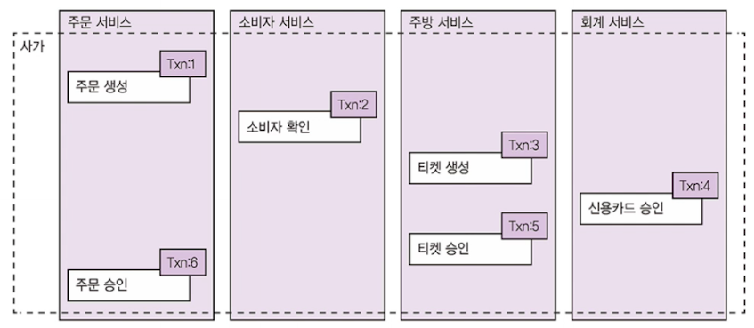

# 4장. 트랜잭션 관리 : 사가

**MSA 가장 큰 걱정거리 => 여러 서비스에 걸친 트랜잭션의 구현 방법**

기존 분산 트랜잭션 관리 기법이 요즘 애플리케이션과 잘 맞지 않다.
여러 서비스의 걸친 데이터 일관성 유지 위해서는 ACID 트랜잭션 대신,
**사가(saga) 라는 메시지 주도 방식의 로컬 트랜잭션 써야한다.**

- **사가는 I(격리성) 제외, ACD 를 지원**
  - **동시 비정상의 영향을 방지하거나 줄일 수 있는 설계 기법 필요**

- FTGO 사례를 보자
  - MSA 전환위해선 
    ACID 트랜잭션으로 관리해오던 단일 DB 를 사가로 관리하는 다중 DB 아키텍처로 전환
  - 

이 장은 

- 마이크로 서비스 아키텍처에서 트랜잭션 관리가 어려운 이유
- 기존 분산 트랜잭션 관리 방식을 사용할 수 없는 이유
  - 사가로 일관성 융지하는 방법 살펴보고, 
    사가를 편성하는 두가지 기법
    - 코레오그래피
      - 중앙 제어 장치 없이 참여자가 각자 이벤트 교환
    - 오케스트레이션
      - 중앙제어 장치가 참여자가 해야할 일 지시

# 4.1 마이크로 서비스 아키텍처에서의 트랜잭션 관리

- 엔터프라이즈 앱은 거의 모든 요청을 하나의 DB 트랜잭션으로 처리
  - *스프링은 선언형 메커니즘*
- 단일 DB 에 접근하는 모놀리식 애플리케이션의 트랜잭션 관리는 쉬움
- 다중 DB, 다중 메시지 브로커 가진 모놀리식 애플리케이션이나 MSA 는 어려움!

## 4.1.1 분산 트랜잭션의 필요성

- `createOrder()` 작업
  - 주문 가능한 소지자인지 확인
  - 주문 내역 확인
  - 소비자 신용카드 승인
  - DB에 주문 생성
  - 스프링이라면 @Transactional 선언으로 트랜잭션 처리 끝
- MSA 구조라면 각 서비스의 데이터에 접근해야함

## 4.1.2 분산 트랜잭션의 문제점

> 여기선 2 페이즈 커밋을 그냥 분산 트랜잭션으로 하는듯

예전에는 분산 트랜잭션을 이용해서 여러 서비스, DB, 메시지 브로커에 걸쳐 데이터 일관성 유지

- X/Open DTP(분산 트랜잭션 처리) 모델이 표준
- XA : 2단계 커밋을 이용하여 전체 트랜잭션 참여자가 반드시 커밋 아니면 롤백 (원자성 보장)
  - SQL DB 는 대부분 XA 와 호환, 메시지 브로커도 일부 제품은 호환
  - 자바 EE 애플리케이션은 JTA를 이용하여 분산 트랜잭션 수행

**분산 트랜잭션의 문제점**

- NoSQL DB 와 현대 메시지 브로커는 분산 트랜잭션을 지원하지 않음
  - 최근 기술 다수 포기해야함
- 동기 IPC 형태 -> 가용성이 떨어짐
  - 모든 서비스가 실행주이어야지만 커밋 가능
  - 일관성 << 가용성 (최근 아키텍처 트렌드)

MSA 에서 데이터 일관성을 유지하려면 느슨하게 결합된 비동기 서비스 개념을 토대로 다른 메커니즘 필요

## 4.1.3 데이터 일관성 유지 : 사가 패턴

- 사가SAGA : MSA 에서 분산 트랜잭션 없이 데이터 일관성을 유지하는 메커니즘
- **여러 서비스의 데이터를 업데이트 하는 시스템 커맨드마다 사가를 하나씩 정의**
- 사가는 일련의 로컬 트랜잭션
  - 각 로컬 트랜잭션은 앞서 언급한 ACID 트랜잭션 프레임워크/라이브러리 이용하여 서비스별 데이터 업데이트

비동기 메시징은 하나 이상의 사가 참여자가 불능이여도 전체 단계를 확실히 실행시킨다!

**차이점**

- 사가에는 격리성이 없다.
  - 격리성은 동시에 실행되는 transaction 은 서로 격리된다는 것을 의미한다. 
    **하나의 트랜잭션이 다른 트랜잭션을 절대로 방해할 수 없다.**
- 사가는 로컬 트랜잭션마다 변경분을 커밋하므로 보상 트랜잭션을 걸어 롤백해야한다.

### 예제 : 주문 생성 사가

`createOrder()` 작업을 사가로 구현해보자!
첫 번째 로컬 트랜잭션은 주문 생성이라는 외부 요청에 의해 시작,
나머지 5개 로컬 트랜잭션은 각자 자신의 선행 트랜잭션이 완료되면 트리거 된다.

1. 주문 서비스 : 주문을 APPROVAL_PENDING 으로 생성
2. 소비자 서비스 : 주문 가능한 소비자인지 확인
3. 주방 서비스 : 주문 내역을 확인하고 티켓을 CREATE_PENDING 상태로 생성
4. 회계 서비스 : 소비자 신용카드를 승인
5. 주방 서비스 : 티켓 상태를 AWAITING_ACCEPTANCE로 변경
6. 주문 서비스 : 주문 상태를 APPROVED 로 변경

- **서비스는 로컬 트랜잭션이 완료되면 메시지를 발행하여 다음 사가 단계를 트리거**
  - 메시지를 통해 사가 참여자를 느슨하게 결합, 사가가 반드시 완료되도록!

도중에 에러가 발생하면 변경분 롤백은 어떻게 하지?

### 사가는 보상 트랜잭션으로 변경분을 롤백한다

ACID 는 쉽다. ROLLBACK 하면 전부 UNDO

사가는 단계마다 로컬 DB에 커밋하므로 자동 롤백 불가능

**예를 들어 주문 시 신용카드 승인이 실패하면 그 앞의 단계에서 적용된 변경분을 명시적으로 Undo 해야한다.**

**즉, 보상 트랜잭션을 미리 작성해야한다.**

n + 1번째 사가 트랜잭션 실패 시, 이전 n 개의 트랜잭션을 undo 한다.

사가는 트랜잭션이 진행하는 반대 방향으로 보상 트랜잭션 실행.(가장 최신 트랜잭션부터)

주문 생성 사가가 실패하는 이유

- 소비자 정보가 올바르지 않거나, 주문을 할 수 없는 소비자
- 음식점 정보가 올바르지 않거나, 주문 접수가 불가한 음식점
- 소비자 신용카드가 승인 거절

- **로컬 트랜잭션이 실패하면 사가는 주문 , 티켓을 무효화하는 보상 트랜잭션을 가동**
  - 읽기만 하는 트랜잭션 or 항상 성공하는 단계 다음에 이어지는 단계는 보상 트랜잭션 필요없음

| 단계 | 서비스 | 트랜잭션                | 보상 트랜잭션  |
| ---- | ------ | ----------------------- | -------------- |
| 1    | 주문   | createOrder()           | rejectOrder()  |
| 2    | 소비자 | verifyConsumerDetails() |                |
| 3    | 주방   | createTicket()          | rejectTicket() |
| 4    | 회계   | authorizeCreditCard()   |                |
| 5    | 주방   | approveTicket()         |                |
| 6    | 주문   | approveOrder()          |                |

신용카드 승인 실패 시 보상 트랜잭션 시나리오

1. 주문 서비스 : 주문 APPROVAL_PENDING 상태로 생성
2. 소비자 서비스 : 소비자가 주문을 할 수 있는지 확인
3. 주방 서비스 : 주문 내역을 확인하고 티켓을 CREATE_PENDING 상태로 생성
4. **회계 서비스 : 소비자의 신용카드 요청 거부**
5. 3') 주방 서비스 : 티켓 상태를 CREATE_REJECTED로 변경
6. 1') 주문 서비스 : 주문 상태를 REJECTED 로 변경

