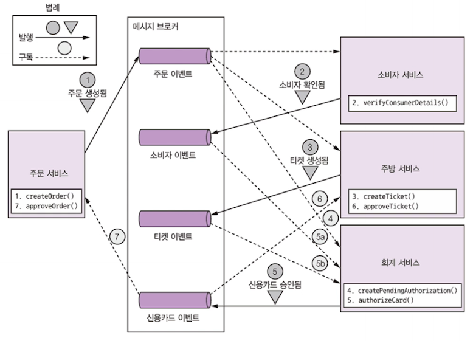
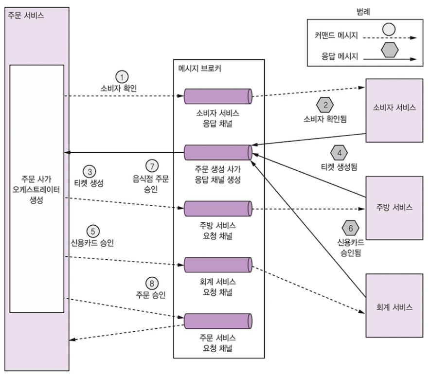
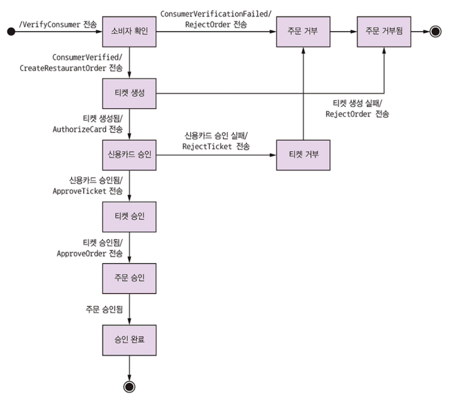

# 4.2 사가 편성

- 사가 - 단계를 편성하는 로직으로 구성
- **시스템 커맨드가 사가를 시작할 때 편성 로직**
  - **첫번째 사가 참여자를 정하여 로컬 트랜잭션 실행을 지시**
  - 트랜잭션 완료되면 **그 다음 사가 참여자를 호출**하는 과정이 모든 단계가 실행될 때까지 반복
    - 하나라도 **실패하면? 앞에서 본 것처럼 보상 트랜잭션 역순으로 실행**

- 사가 편성 로직
  1. 코레오그래피
     - **의사 결정과 순서화를 사가 참여자에게 맡김**
     - 사가 참여자는 이벤트 교환 방식으로 통신
  2. 오케스트레이션
     - **사가 편성 로직을 사가 오케스트레이터에 중앙화**
     - 사가 참여자에게 커맨드 메시지를 보내 수행할 작업을 지시

## 4.2.1 코레오그래피 사가

가장 큰 특징이 중앙화가 아닌 것! 
**사가 참여자가 서로 이벤트를 구독해서 그에 따라 반응**

### 주문 생성 사가 구현 : 코레오그래피 스타일

주문 서비스를 시작으로 각 참여자는 자기 DB 업데이트하고 다음 참여자를 트리거하는 이벤트 발행

**순서**

1. 주문 서비스 : 주문을 APPROVAL_PENDING 상태로 생성 -> 주문 생성 이벤트를 발행
2. 소비자 서비스 : 주문 생성 이벤트 수신 -> 소비자가 주문을 할 수 있는지 확인 -> 소비자 확인 이벤트를 발행
3. 주방 서비스 : 주문 생성 이벤트 수신 -> 주문 내역 확인/티켓을 CREATE_PENDING 으로 생성 -> 티켓 생성 이벤트 발행
4. 회계 서비스 : 주문 생성 이벤트 수신 -> 신용카드 승인을 PENDING 상태로 생성
5. 회계 서비스 : 티켓 생성 및 소비자 확인 이벤트 수신 -> 소비자 신용카드 과금 -> 신용카드 승인됨 이벤트 발행
6. 주방 서비스 : 신용카드 승인 이벤트 수신 -> 티켓을 AWAITING_ACCEPTANCE 로 변경
7. 주문 서비스 : 신용카드 승인 이벤트 수신 -> 주문 APPROVED 변경 -> 주문 승인됨 이벤트 발행

주문 생성 사가는 어떤 사가 참여자가 주문을 거부해서 실패 이벤트가 발행되는 경우를 대비해야함.

4.1 에서 본 내용 동일!

> 1. 주문 서비스 : 주문 APPROVAL_PENDING 상태로 생성
> 2. 소비자 서비스 : 소비자가 주문을 할 수 있는지 확인
> 3. 주방 서비스 : 주문 내역을 확인하고 티켓을 CREATE_PENDING 상태로 생성
> 4. **회계 서비스 : 소비자의 신용카드 요청 거부**
> 5. 3') 주방 서비스 : 티켓 상태를 CREATE_REJECTED로 변경
> 6. 1') 주문 서비스 : 쿠폰 상태를 REJECTED 로 변경
>

### 문제점

사가 참여자간 발행/구독 방식. 문제점은?

### 확실한 이벤트 기반 통신 

**두 가지 통신 이슈를 고려해야함!**

**문제점1. 사가 참여자가 자신의 DB 업데이트하고, DB 트랜잭션의 일부로 이벤트를 발행**

- 주문 생성 사가에서 주방 서비스는 소비자가 확인 이벤트를 받아 티켓을 생성한 후 티켓 생성 이벤트 발행
- **DB 업데이트와 이벤트 발행이 원자적으로 되어야 함!**
- 확실한 통신을 위해선 트랜잭셔널 메시징(3.3.7)을 사용해야함

> **트랜잭셔널 메시징**
>
> **DB를 임시 메시지 큐로 사용하는 트랜잭셔널 아웃박스 패턴이 가장 알기 쉬운 방법**
>
> - 이벤트 발행 : 폴링 발행기 패턴
> - 이벤트 발행 : 트랜잭션 로그 테일링 패턴
>
> 2개가 있었고, 높은 정확성을 위해선 트랜잭션 로그 테일링 패턴을 사용한다고 했었음!

**문제점2. 사가 참여자는 자신이 수신한 이벤트와 자신이 가진 데이터를 연관 지을 수 있어야 한다.**

신용카드 승인됨 이벤트를 받은 주문 서비스는 여기에 해당하는 주문을 찾을 수 있어야!
해결책은 데이터를 매핑할 수 있도록 다른 사가 참여자가 상관관계 ID가 포함된 이벤트를 발행하는 것.
orderId 를 넣어주는 방식으로 해결하겠지?!

### 코레오그래피 사가의 장단점

- **장점**

  - 단순함 : 비즈니스 객체를 생성, 수정, 삭제할 때 서비스가 이벤트를 발행
  - 느슨한 결합 : 이벤트를 구독할 뿐, 서로를 직접 알지 못한다.

- **단점**

  - 이해하기 어렵다 : 사가가 한 곳에 정의된 것이 아니여서 여러 서비스에 구현 로직이 흩어져있다.

  - 서비스 간 순환 의존성 : 서로 이벤트를 구독하는 특성상, 순환 의존성 형성(주문  -> 회계 -> 주문)
  - 단단히 결합될 위험성 : 자신에게 영향 미치는 모든 이벤트 구독해야함.
    - 회계서비스는 소비자 신용카드 과금/환불 처리하는 모든 이벤트를 구독해야한다. 
      따라서 회계 서비스는 주문 서비스에 구현된 **주문 주기와 맞물려 업데이트 되어야 한다.**

**복잡한 사가는 오케스트레이션 방식이 적합하다!**

## 4.2.2 오케스트레이션 사가

오케스트레이션 사가에선 사가 참여자가 할 일을 알려주는 **오케스트레이터 클래스를 정의**

사가 오케스트레이터는 커맨드/비동기 응답 상호작용을 하며 참여자와 통신. 
즉, **사가 단계를 실행하기 위해 해당 참여자가 무슨 일을 해야 하는지 커맨드 메시지에 기록한다.**
사가 참여자가 작업을 마치고 응답 메시지를 오케스트레이터에게 주면, 오케스트레이터는 응답을 처리하고 다음 사가 단계를 어느 참여자가 수행할지 결정

### 주문 생성 사가 구현 : 오케스트레이션 스타일

사가 오케스트레이터인 `CreateOrderSaga` 클래스가 비동기 요청/응답을 주고 받으며 사가 참여자 서비스들을 호출하고 처리 과정에 따라 커맨드 메시지를 전송한다. 이후 자신의 응답 채널에서 메시지를 읽어 다음 사가 단계를 결정

1. 오케스트레이터가 소비자 확인 커맨드를 소비자 서비스에 전송
2. 소비자 서비스는 소비자 확인 메시지 응답
3. 오케스트레이터는 티켓 생성 커맨드를 주방 서비스에 전송
4. 주방 서비스는 티켓 생성 메시지를 응답
5. 오케스트레이터는 신용카드 승인 메시지를 회계 서비스에 전송
6. 회계 서비스는 신용카드 승인됨 메시지 응답
7. 오케스트레이터는 티켓 승인 커맨드를 주방 서비스에 전송,
8. 오케스트레이터는 주문 승인 커맨드를 주문 서비스에 전송

주문 서비스 내의 오케스트레이터, 즉 주문 서비스의 한 컴포넌트이지만 커맨드 메시지를 주문 서비스에 전송한다.
주문 생성 사가가 주문을 직접 업데이트해서 승인 처리해도 되지만, 일관성 차원에서 주문 서비스가 마치 다른 참여자인 것처럼 취급하는 것

주문 생성 사가는 크게 4가지 시나리오를 생각해볼 수 있다.
정상 케이스 외에 소비자/주방/회계 서비스 중 한 곳에 오류가 발생해 사가가 실패하는 3가지 케이스 추가

**따라서 가능한 모든 시나리오를 기술하는 상태 기계로 사가를 모델링하면 좋다.**

### 사가 오케스트레이터를 상태기계로 모델링

- **상태 기계**

  - **상태**와 이벤트에 의해 트리거되는 **상태 전이**로 구성됨
  - 전이가 발생할 때마다 액션이 일어나며, 사가의 액션은 사가 참여자를 호출하는 작용
  - 효율적인 테스트 가능

- **상태 간 전이**?

  - 사가 참여자가 로컬 트랜잭션을 완료하는 시점에 트리거된다.

  - 로컬 트랜잭션의 상태와 결과에 따라 상태 전이를 어떻게 하고, 어떤 액션을 취할지 결정

    

#### 상태 기계로 모델링한 주문 생성 사가

- 상태
  - 소비자 확인 : 초기 상태. 소비자 서비스가 주문 가능한 소비자인지 확인 기다린다.
  - 티켓 생성 : 사가는 티켓 생성 커맨드에 대한 응답을 기다린다.
  - 신용카드 승인 : 회계 서비스가 신용카드 승인할 때까지 기다린다.
  - 주문 승인됨 : 사가가 성공적으로 완료
  - 주문 거부됨 : 참여자중 하나가 주문 거부

여러 상태를 거치면서 결국 주문은 승인 or 거부 상태로 귀결된다.

위처럼 모델링을 하는 것이 좋다!

### 사가 오케스트레이션과 트랜잭셔널 메시징

오케스트레이션 사가는 

- **DB 업데이트 하는 서비스**와 **메시지를 발행하는 서비스**가 단계마다 존재.
- 주문 서비스는 주문, 주문 생성 사가 오케스트레이터 2개를 생성한 뒤 1번 사가 참여자에게 커맨드 메시지를 보낸다.
  - 사가 참여자는 DB 업데이트하고 응답 메시지를 보내는 식으로 커맨드 메시지 처리

이 때 트랜잭셔널 메시지를 사용해서 DB 업데이트와 메시지 발행 작업을 원자적으로 처리한다! (4.4절에서 자세히!)

### 오케스트레이션 사가의 장단점

- **장점**
  - 의존관계 단순화
    - 오케스트레이터는 참여자를 호출하지만 참여자는 오케스트레이터를 호출하지 않으므로 순환 의존성이 발생하지 않는다.
  - 낮은 결합도
    - 각 서비스는 오케스트레이터가 호출하는 API를 구현할 뿐, 사가 참여자가 발행하는 이벤트는 몰라도 된다.
  - 관심사를 더 분리, 비즈니스 로직 단순화
    - 사가 편성 로직이 사가 오케스트레이터 한 곳에만 있어서 도메인 객체는 더 단순해지고 자신이 참여한 사가에 대해선 모른다.
      - Order 클래스는 사가를 모르기에, 상태 전이 모델은 더욱 간단해져 
        주문 생성 사가 실행 도중 APPROVAL_PENDING 에서 APPROVED 로 상태 전이된다.
      - 사가 단계에 대응되는 중간 상태가 하나도 없으므로 비즈니스 로직이 단순해진다.
- **단점**
  - 너무 많은 중앙화
    - 똑똑한 오케스트레이터 하나가 깡통 서비스에 일일이 할 일을 지시
      - 오케스트레이터는 순서화만 담당하고, 비즈니스 로직은 각 도메인에게 맡겨서 해결

**그런데 사가를 이용할 때 편성 로직보다 더 힘든 문제 -> 비격리 문제 등장**
격리가 안되면 트랜잭션 처리는 어떻게 해야하나?

4.3에서 알아보자!
