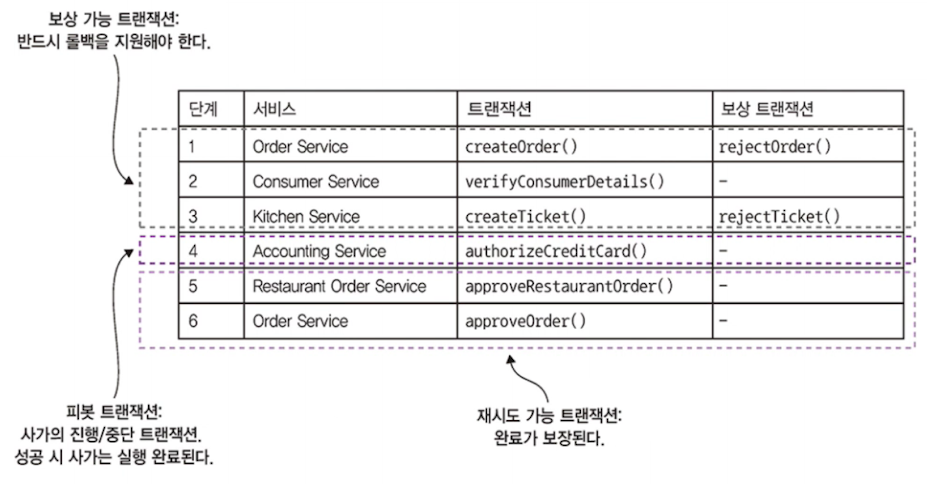

# 4.3 비격리 문제 처리

ACID 의 I : 격리성
동시에 실행 중인 여러 트랜잭션의 결과가 어떤 순서대로 실행된 결과와 동일함을 보장하는 속성
그래서 트랜잭션은 DB 데이터에 배타적으로 접근하듯이 동작, 개발자는 동시 실행되는 비즈니스 로직을 쉽게 작성

- **사가는 격리성이 빠져있다!**
  - **사가의 한 트랜잭션이 커밋한 변경분을 다른 사가가 즉시 바라볼 수 있다**
  - 따라서 사가는 ACD 

- 격리가 안된다면?
  - Anomal (비정상, 이상현상)이 발생할 수 있다.
  - 트랜잭션이 차례대로 실행되지 않는 것처럼 데이터를 읽고 쓰게 되는 현상
- 그래서 사가를 동시 실행한 결과와 순차 실행한 결과가 달라질 수 있다.

**그럼 비격리는 용납못할 문제인가?**

- 실제로는 성능 향상을 위해 격리 수준을 낮추는 경우가 흔하다.
- 격리 수준을 트랜잭션 마다 다르게 지정할 수 있고, 기본적으로 완전 격리보다 약한 격리 수준을 적용

## 4.3.1 비정상 개요

비격리로 인산 비정상

- **Lost Update** 소실된 업데이트 : 한 사가의 변경분을 다른 사가가 미처 못 읽고 덮어 쓴다
  - 한 사가의 결과가 무시되겠지?!
- Dirty Read : 사가 업데이트를 하지 않은 변경분을 다른 트랜잭션이나 사가가 읽는다
- Non-repeatable read : 한 사가의 상이한 두 단계가 같은 데이터를 읽어도 결과가 달라지는 현상

하나씩 살펴보자!

### 소실된 업데이트 **Lost Update**

한 사가의 변경분을 다른 사가가 덮어쓸 때 발생

1. 주문 생성 사가 첫 번째 단계에서 주문을 생성
2. 사가 실행 중 주문 취소 사가(별도의 사가)가 주문을 취소
3. 주문 생성 사가 마지막 단계에서 주문을 승인
   - **2번에서 CANCEL 된 주문의 내용을 읽지 않고 덮어쓴다.**

### Dirty Read

한 사가가 업데이트 중인 데이터를 다른 사가가 읽을 때 발생

- 소비자 서비스 : 잔고를 늘린다.
- 주문 서비스 : 주문을 취소 상태로 변경
- 배달 서비스 : 배달을 취소

주문 취소, 주문 생성 사가 2개가 겹쳐서 실행한다고 해보자.
주문 취소 하기에 늦어서 주문 취소 사가에 대한 롤백이 실행될 때

1. 주문 취소 사가 : 잔고가 늘어난다.
2. 주문 생성 사가 : 잔고를 줄인다.
3. 주문 취소 사가 : 잔고를 늘린 1번에 대해 보상 트랜잭션으로 잔고를 줄인다.

## 4.3.2 비격리 대책

개발자는 비격리로 인한 비정상을 방지하고 비즈니스에 미치는 영향을 최소화하는 방향으로 사가를 작성할 의무가 있다.

**이미 나왔었던 *_PENDING 상태도 이상 현상을 예방하는 전략 중 하나**
주문 생성 사가처럼 주문을 업데이트 하는 사가는 *_PENDING 을 기본으로 두고 시작.
**현재 주문을 사가로 업데이트 하는 중이닌 그에 맞게 행동하라고 다른 사가에게 알리는 것**

> 지금 책에서 소개하는 논문 뭐 있는데, 나중에 키워드로 공부해도 좋을듯 (p140)

### 사가의 구조

사가는 3 가지 트랜잭션으로 구성

- 보상 가능 트랜잭션 : 보상 트랜잭션으로 롤백 가능한 트랜잭션
- 피봇 트랜잭션 : 사가의 진행 / 중단 지점. 피봇 트랜잭션이 커밋되면 사가는 완료될 때까지 실행.
  - 보상 가능 트랜잭션, 재시도 가능 트랜잭션도 아니지만 최종 보상 가능 트랜잭션 또는 최초 재시도 가능 트랜잭션이 될 수 있다.
- 재시도 가능 트랜잭션 : 피봇 트랜잭션 직후의 트랜잭션. 반드시 성공한다.

**보상 가능 트랜잭션과 재시도 가능 트랜잭션의 차이점을 특히 잘 알아 두어야 한다!**
트랜잭션 종류마다 대책에서 하는 역할이 다르기 때문.

MSA 전환 시 모놀리스도 사가에 참여해야 하는 경우도 있고, 모놀리스가 재시도 가능 트랜잭션만 실행하면 처리하기가 아주 간단해진다.

이제 비격리 대책을 알아보자!

### 비격리 대책 1 : 시맨틱 락

**보상 가능 트랜잭션이 생성/수정하는 레코드에 무조건 플래그를 세팅**
플래그는 재시도 가능 트랜잭션 또는 보상 트랜잭션에 의해 해제된다.

***_PENDING 상태가 바로 시맨틱 락!**

락도 관리해야하지만, 잠금된 레코드를 어떻게 사가로 처리할지 사례별로 결정해야 한다.

예를 들어 클라가 시스템 커맨드 cancelOrder() 를 호출해서 주문의 APPROVAL_PENDING 상태의 주문을 소하고 싶다면?

- 해결방법
  - 먼저 cancelOrder 를 실패처리하고, 클라이언트에게 나중에 다시 시도하라고 알리는 것
    - 구현하기는 간단해서 좋지만, 재시도 로직까지 구현해야하므로 클라이언트가 복잡해짐
  - 락이 해제될 때까지 cancelOrder 를 블로킹
    - 시맨틱 락을 이용하면 격리성 살릴 수 있으므로, 같은 레코드를 업데이트 하는 사가를 직렬화시킬 수있고, 클라이언트가 재시도 부담도 줄인다.
    - 락 관리 부담은 감수...!
    - 데드락 감지 알고리즘 구현해서 데드락 발생 시 사가를 롤백시켜 데드락을 해소하고 재실행 할 수 있게 조치

**-> 격리성 제공!**

### 대책 2 : 교환적 업데이트

업데이트를 교환적으로, 즉 어떤 순서로도 실행 가능하게 설계하면 소실된 업데이트 문제를 방지할 수 있다.
예를 들면 Account의 debit()과 credit()은 서로 교환적인 작업!

보상 가능 트랜잭션이 계좌를 인출(debit) 후  사가를 롤백 시켜야하는 상황이라면 계좌를 입금해서 업데이트 undo 하면 끝!

즉, 오퍼레이션의 순서가 바뀌어서 실행해도 문제가 없다면 **오퍼레이션이 교환적**

**-> Lost Update 문제 해결 가능!**

### 대책 3 : 비관적 관점

Dirty read 로 인한 비즈니스 리스크를 최소화하기 위해 **사가 단계의 순서를 재조정.**

- 변경 전 주문 취소 사가 단계
  1. 소비자 서비스 : 가용한 신용 한도 증가
  2. 주문 서비스 : 주문 상태를 Cancelled 로 변경
  3. 배송 서비스 : 배송 취소 처리
     - 주문 생성 사가와 겹칠 경우 더티 리드로 인해 신용 한도를 초과하는 주문이 가능하다
- 변경 후 주문 취소 사가 단계
  1. 주문 서비스 : 주문을 취소 상태로 변경
  2. 배달 서비스 : 배달을 취소
  3. 회계 서비스 : 신용 한도를 늘린다.

이렇게 사가 내의 순서를 조정한다면, `회계 서비스 : 신용 한도를 늘린다.` 이 부분에서 재시도 트랜잭셩에 의해 완료가 보장되고 , 더티 리드 가능성이 사라진다.

**-> Dirty Read  해결!**

### 대책 4 : 값 다시 읽기

사가가 레코드를 업데이트하기 전에 값을 다시 읽어 값이 변경되지 않았는지 확인하는 것

**값을 다시 읽었더니 변경되었다면 사가를 중단하고 나중에 재시작!**

- **낙관적 오프라인 락 패턴** 이다!

이 대책은 주문 생성 사가에 적용하면 주문이 승인되는 도중 취소되지 않는다!
주문 승인 트랜잭션은 해당 주문이 처음 생성된 이후 이전 사가 단계에서 변경되었는지 체크.

> 즉 레코드를 업데이트 하기 전에 한 번 더 읽어서 변경이 발생했다면 사가를 중단하고 나중에 재시작 하겠다는 것!
>
> 음, 근데 진짜 해결이 될까..? 다른 해결책과 같이 써야된다는 거겠지?

**-> Lost Update 해결**

### 대책 5 : 버전 파일

**레코드에 수행한 작업을 다 기록하는 대책**

비교환적 작업을 교환적 작업으로 변환하자!
시맨틱 락을 쓰지 않은 주문 생성 사가와 주문 취소 사가가 동시 실행된다면 
주문 생성 사가가 소비자 신용카드를 승인하기 전에 주문 취소 사가가 해당 신용카드를 승인 취소하는 상황이..!

회계서비스에서 이 흐름을 기록하는 것!

요청이 도착했을 때 오퍼레이션을 기록하고 제대로된 순서대로 진행한다.
승인 취소 요청이 들어와도 일단 기록해두고, 승인 요청이 도착하면 이미 승인 취소 요청이 접수된 상태니까 승인 작업은 생략한다!

> 생략한다면 보상 트랜잭션을 따로 하지 않는다는 건가?

### 대책 6 : 값에 의한 (By value)

**비즈니스 위험성을 기준으로 동시성 메커니즘 선택**

애플리케이션 차원에서 각 요청의 속성을 보고 사가를 쓸지, 아니면 분산 트랜잭션을 사용할지 판단!

위험성이 낮은 요청은 지금까지 설명한 대책을, 위험성이 크다면 분산 트랜잭션을 실행한다.

애플리케이션이 위험성에 따라서 가용성, 확장성 등을 저울질 할 것!

