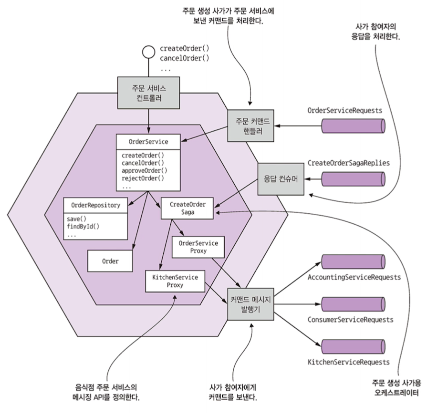
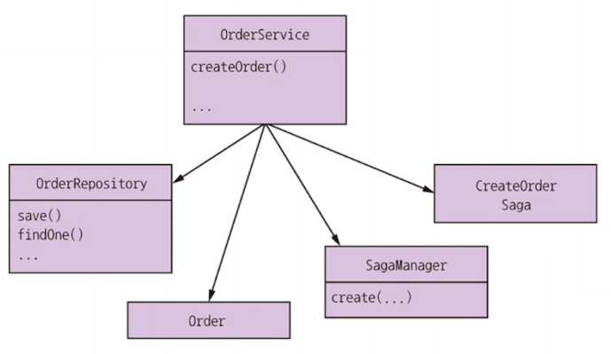
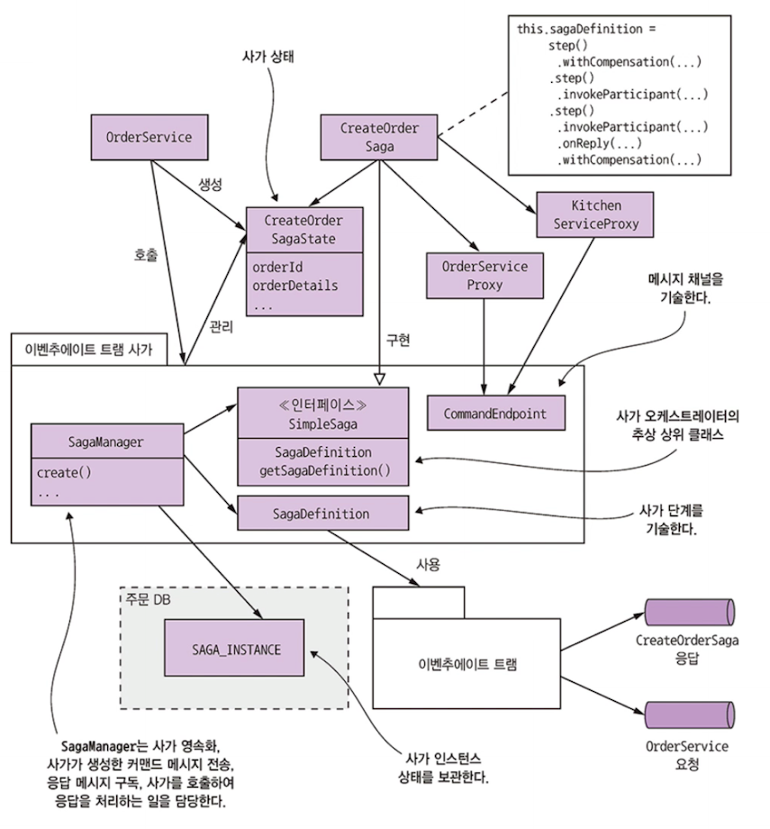
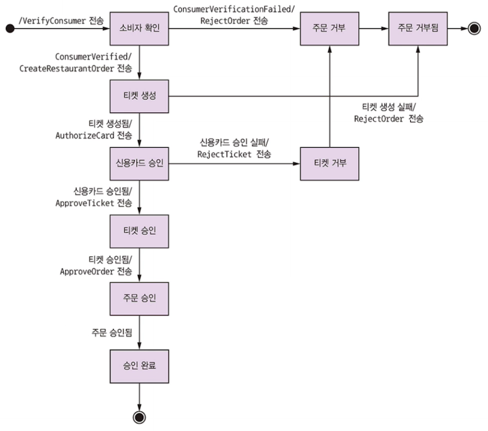
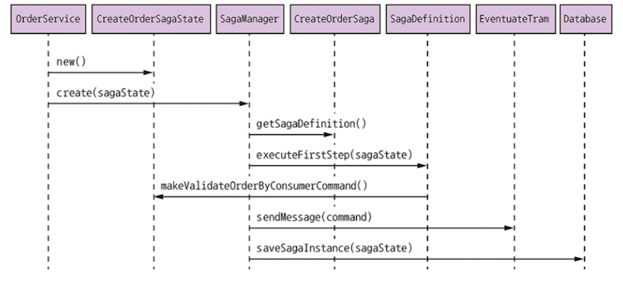
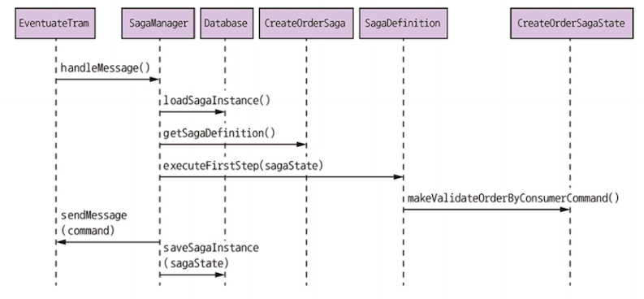
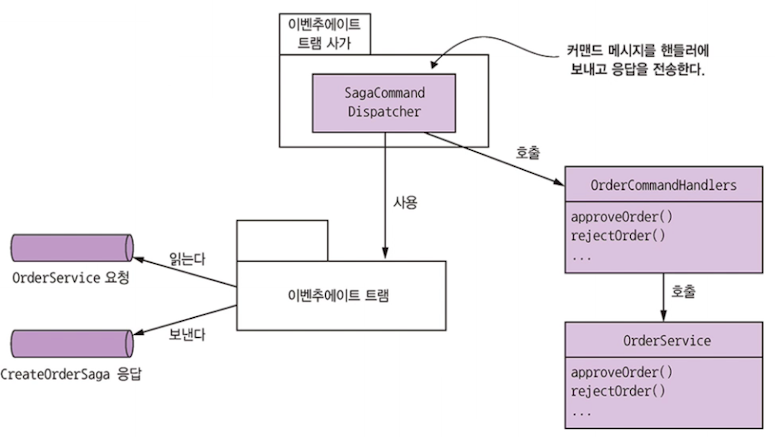

# 4.4 주문 서비스 및 주문 생성 사가 설계

- 주문 서비스
  - 비즈니스 로직이 포함된 OrderService, Order  등의 클래스
  - 주문 생성 사가를 오케스트레이션 하는 `CreateOrderSaga` 가 존재
  - 주문 서비스는 자신의 사가에도 참여하므로 OrderService 를 호출하여 커맨드 메시지를 처리하는 어댑터 클래스 OrderCommandHandlers 가 존재



- 핵심 비즈니스 로직 - OrderService, Order, OrderRepository
  - 사가 오케스트레이터인 주문 서비스는 그 자신이 사가 참여자
- 사가 오케스트레이터는...
  - 사가 참여자 **프록시 클래스**(KitchenServiceProxy, OrderServiceProxy)를 거쳐 **사가 참여자에게 커맨드 메시지 전달**
    - **사가 참여자 프록시 - 사가 참여자의 메시징 API 가 정의된 클래스**
    - OrderCommandHandlers 클래스는 사가가 주문 서비스에 전송한 커맨드 메시지를 처리

구조를 머리에 넣어두고 하나씩 살펴보자!

## 4.4.1 OrderService 클래스

OrderService 클래스 : 주문 생성/관리를 담당하는 서비스 API 계층이 호출하는 도메인 서비스



- `OrderService`
  - order 관련 비즈니스 로직
- `OrderRepository`
  - Order 데이터베이스에 접근, Order 도메인 객체를 DB에 저장하고 관리
- `Order`
  - 주문 도메인
- `SagaManager`
  - 이벤추에이트 트램 사가 프레임워크에서 기본 제공되는 **사가 오케스트레이터와 참여자를 작성하는 클래스**

지금은 OrderService 가 하는 `createOrder`에 주목하자!
이 메서드는 먼저 주문을 생성한 후, 주문을 검증하기 위해 `CreateOrderSaga` 를 생성한다.

```java
@Transactional
public class OrderService {
  
  @Autowired
  private SagaManager<CreateOrderSagaState> createOrderSagaManager;
  
  @Autowired
  private OrderRepository orderRepository;
  
  @Autowired
  private DomainEventPublisher eventPublisher;
  
  public Order createOrder(OrderDetails orderDetails) {
    // ....

    // Order 생성
    ResultWithEvents<Order> orderAndEvents = Order.createOrder(...); // 1
    Order order = orderAndEvents.result;
		orderRepository.save(order);
    
    eventPublisher.publish(Order.class, 
                          Long.toString(order.getId()),
                          orderAndEvents.events
                          );

		// CreateOrderSaga 생성
    // order 상세 정보와 orderId 필요하겠지! 보상 트랜잭션 나중에 필요할 때 ~~
    CreateOrderSagaState data = new CreateOrderSagaState(order.getId(), orderDetails); 

    CreateOrderSagaManager.create(data, Order.class, order.getId());
    
    return order;
  }
    
}
```

1. Order의 static 팩토리 메소드로 order 생성
2. Repository로 Order 저장
3. Order 및 OrderDetails 의 ID 포함된 CreateOrderSagaState 를 SagaManager.create() 에게 넘겨 CreateOrderSaga 생성
4. SagaManager 가 사가 오케스트레이터 생성하면 곧바로 첫 번째 사가 참여자에게 커맨드 메시지가 전달되고, 사가 오케스트레이터를 DB에 저장

CreateOrderSaga 관련 클래스를 보자




## 4.4.2 주문 생성 사가 구현

- **CreateOrderSaga**
  - 사가의 상태 기계를 정의한 싱글턴 클래스 Create OrderSagaState로 커맨드 메시지를 생성하고,
    사가 참여자 프록시 클래스(Kitchen ServiceProxy, ...)가 지정한 메시지 채널을 통해 참여자에게 메시지 전달
- **CreateOrderSagaState**
  - 사가의 저장 상태, 커맨드 메시지를 생성
- **사가 참여자 프록시 클래스**
  - 프록시 클래스마다 커맨드 채널, 커맨드 메시지 타입, 반환형으로 구성된 사가 참여자의 메시징 API 를 정의

이런 클래스를 이벤추에이트 트램 사가 프레임워크로 작성한다.

이벤추에이트 트램 사가 프레임워크는 사가의 상태 기계를 정의하기 위해 필요한 DSL(도메인 특화 언어)를 제공한다.
사가의 상태 기계를 실행하고, 이벤추에이트 트램 프레임워크를 이용하여 사가 참여자와 메시지를 주고 받으며 사가 상태를 DB에 저장

하나씩 살펴보자.


### CreateOrderSaga 오케스트레이터



- CreateOrderSaga 는 위 그림, 상태 기계를 구현한 클래스
- 사가 기초 인터페이스 SimpleSaga 를 구현
  - **핵심은 사가 데피니션!** 
  - 주문 생성 사가 단계는 이벤추에이트 트램 사가 프레임워크에서 제공되는 DSL 을 이용하여 정의

코드 참조 : https://github.com/gilbutITbook/007035/tree/master/ftgo-order-service/src/main/java/net/chrisrichardson/ftgo/orderservice/sagas/createorder

```java

public class CreateOrderSaga implements SimpleSaga<CreateOrderSagaState> {

  private Logger logger = LoggerFactory.getLogger(getClass());
  private SagaDefinition<CreateOrderSagaState> sagaDefinition;

  public CreateOrderSaga(OrderServiceProxy orderService, ConsumerServiceProxy consumerService, KitchenServiceProxy kitchenService, AccountingServiceProxy accountingService) {
    this.sagaDefinition =
             step()
              .withCompensation(orderService.reject, CreateOrderSagaState::makeRejectOrderCommand)
            .step()
              .invokeParticipant(consumerService.validateOrder, CreateOrderSagaState::makeValidateOrderByConsumerCommand)
            .step()
              .invokeParticipant(kitchenService.create, CreateOrderSagaState::makeCreateTicketCommand)
              .onReply(CreateTicketReply.class, CreateOrderSagaState::handleCreateTicketReply)
              .withCompensation(kitchenService.cancel, CreateOrderSagaState::makeCancelCreateTicketCommand)
            .step()
              .invokeParticipant(accountingService.authorize, CreateOrderSagaState::makeAuthorizeCommand)
            .step()
              .invokeParticipant(kitchenService.confirmCreate, CreateOrderSagaState::makeConfirmCreateTicketCommand)
            .step()
              .invokeParticipant(orderService.approve, CreateOrderSagaState::makeApproveOrderCommand)
            .build();

  }


  @Override
  public SagaDefinition<CreateOrderSagaState> getSagaDefinition() {
    return sagaDefinition;
  }

}
```

계속 봐왔던 흐름을 코드로 정의, 

자세히 보면

```java
// ...
.invokeParticipant(kitchenService.create, CreateOrderSagaState::makeCreateTicketCommand)
              .onReply(CreateTicketReply.class, CreateOrderSagaState::handleCreateTicketReply)
              .withCompensation(kitchenService.cancel, CreateOrderSagaState::makeCancelCreateTicketCommand)
// ...
```

- Step(), invokeParticipant(), onReply(), withCompensation() 은 이벤추에이트 트램 사가에서 기본 제공 DSL의 일부
- invokeParticipant()
  - 포워드 트랜잭션
- OnReply() 
  - 응답 받으면 진행
- WithCompensation
  - 보상 트랜잭션 정의

다른 사가 단계도 이처럼 정의하게 된다.

CreateOrderSaga 는 CreateOrderSagaState 를 호출하여 커맨드 메시지를 생성하고, 생성된 메시지를 KitchenServiceProxy 같은 클래스의 끝점으로 전달.


### KitchenServiceProxy 클래스

주방 서비스의 커맨드 메시지 3개의 끝점을 정의

- create: 티켓 생성
- confirmCreate: 생성 확인
- cancel: 티켓 취소

각 끝점(Endpoint)마다 커맨드 타입, 커맨드 메시지의 목적지 채널, 예상 응답 타임을 지정한다.

```java
public class KitchenServiceProxy {

  public final CommandEndpoint<CreateTicket> create = CommandEndpointBuilder
          .forCommand(CreateTicket.class)
          .withChannel(KitchenServiceChannels.kitchenServiceChannel)
          .withReply(CreateTicketReply.class)
          .build();
  
  public final CommandEndpoint<ConfirmCreateTicket> confirmCreate = CommandEndpointBuilder
          .forCommand(ConfirmCreateTicket.class)
          .withChannel(KitchenServiceChannels.kitchenServiceChannel)
          .withReply(Success.class)
          .build();

  public final CommandEndpoint<CancelCreateTicket> cancel = CommandEndpointBuilder
          .forCommand(CancelCreateTicket.class)
          .withChannel(KitchenServiceChannels.kitchenServiceChannel)
          .withReply(Success.class)
          .build();

}
```

- 이런 프록시 클래스가 반드시 필요한 것은 아니다?!
  - **사가는 직접 참여자에게 보낼 수도 있음!**
  - 그러나, 프록시 클래스를 쓰면 좋은 점 2가지
    - 프록시 클래스는 타입이 정해진 끝점을 정의하므로 엉뚱한 메시지가 서비스에 전달될 일이 없다.
    - 프록시 클래스는 잘 정의된 서비스 호출 API라서 코드를 이해하고 테스트 하기 쉽다.


### 이벤추에이트 트램 사가 프레임워크

사가 오케스트레이터 및 사가 참여자 모두 작성할 수 있는 프레임워크

**이벤추에이트 트램의 트랜잭셔널 메시징 기능을 활용한다.**


- SimpleSaga : 사가 기초 인터페이스 
- SagaManager : 사가 인스턴스 생성/관리하는 클래스
  - 사가를 저장, 자신이 생성한 커맨드 메시지 전송, 응답 메시지 구독, 사가를 호출하여 응답을 처리

#### OrderService 가 사가를 생성할 때 이벤트 순서

1. OrderService 는 CreateOrderSagaState 생성
2. OrderService는 SagaManager 호출해 사가 인스턴스 생성
3. SagaManager 는 사가 데피니션의 첫 번째 단계 실행
4. CreateOrderSagaState 호출하여 커맨드 메시지 생성
5. SagaManager 는 커맨드 메시지를 사가 참여자에게 보낸다.
6. SagaManager 는 사가 인스턴스를 DB 에 저장




#### SagaManager 가 소비자 서비스 응답을 수신할 때 이벤트 순서

1. 이벤추에이트 트램은 소비자 서비스의 응답을 SagaManager 에 전달
2. SagaManager 는 DB 에서 사가 인스턴스를 조회
3. SagaManager 는 그 다음 사가 데피니션 단계 실행
4. CreateOrderSagaState 를 호출하여 커맨드 메시지 생성
5. SagaManager 는 커맨드 메시지를 사가 참여자에게 보낸다
6. SagaManager 는 업데이트 사가 인스턴스를 DB 에 저장



실패 시 SagaManager 가 보상 트랜잭션을 역순으로 실행


## 4.4.3 OrderCommandHandlers 클래스

CreateOrderSaga 는 주문을 승인/거부하기 위해 주문 서비스를 호출한다. 
사가가 전송한 커맨드 메시지를 담당할 핸들러 메서드는 OrderCommandHandlers 클래스에 정의한다.

핸들러 메서드는 OrderService 를 호출하여 주문 업데이트 이후 응답 메시지를 만든다.
SagaCommandDispatcher 는 커맨드 메시지를 적절한 핸들러 메서드에 보내고 응답을 반환하는 클래스!



- OrderCommandHandlers
  - approveOrder, rejectOrder 모두 OrderService 를 호출하여 주문을 업데이트한다!
- 사가에 참여한 다른 서비스들도 이런 커맨드 핸들러를 두고 자신의 도메인 객체를 업데이트한다.

```java
public Message approveOrder(CommandMessage<ApproveOrderCommand> cm){
  long orderId = cm.getCommand().getOrderId();
  OrderService.approveOrder(orderId); // order 상태 변경 업데이트
  return withSuccess(); // 제네릭 성공 메시지 반환
}
```


## 4.4.4 OrderServiceConfiguration 클래스

주문 서비스는 스프링 쓰니까 @Configuration 붙여서 스프링 빈으로 쓴다.

> #### @Configuration?
>
> - Bean이란
>   - POJO(Plain Old Java Object)로써 Spring 애플리케이션을 구성하는 핵심 객체
>   - IoC(DI) 컨테이너에 의해 생성 및 관리된다
>
> Bean으로 쓰려면? Bean annotation을 쓰면 된다!
>
> 그중에서 Configuration 은 1개 이상의 @Bean을 제공하는 클래스의 경우에 **반드시 적용**해야한다.

- 여기서 다양한 orderService, createOrderSagaManager, .... 빈으로 정의된다.
  - 이를 통해 각 객체 모두 싱글톤으로 관리


