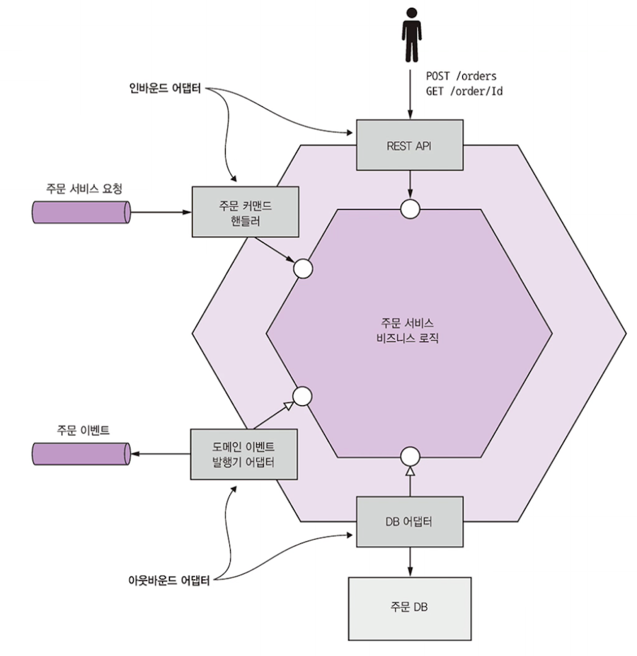
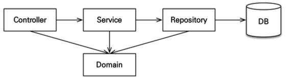

# 5장. 비즈니스 로직 설계

복잡한 비즈니스 로직의 개발? 항상 어려움...

FTGO 도 객체지향적으로 설계했지만 일부 트랜잭션 스크립트 패턴을 적용하기도 했으나, 
**대부분 비즈니스 로직은 JPA 기반의 객체지향 도메인 모델로 개발**

> - 트랜잭션 스크립트 패턴
>   - 서비스 계층에서 비즈니스 로직을 처리하는 패턴
> - **도메인 모델 패턴**
>   - 엔티티가 비즈니스 로직 가지고 객체지향 특성 적극 활용
>     - 응집도 높아지겠지!

- 비즈니스 로직이 여러 서비스에 흩어져 있다면?
  - MSA 는 복잡한 비즈니스 로직 개발 어려움

- **문제점**
  1. 도메인 모델은 대부분 상호 연관된 클래스가 얽혀있음
     - 서비스 경계를 넘나드는 객체 레퍼런스를 제거해야 한다.
  2. 마이크로 서비스 아키텍처 특유의 트랜잭션 관리 제약 조건 하에서도 동작하는 비즈니르 로직 설계해야함(사가패턴)

서비스의 비즈니스 로직을 여러 애그리거트(집합체)로 구성하는 DDD 애그리거트 패턴으로 해결 가능.

- 객체 레퍼런스가 서비스 경계 넘나들 일이 없음 : 객체가 아닌 기본키로 참조하기 때문
- 한 트랜잭션으로 하나의 애그리거트만 생성/수정할 수 있음 -> MSA 트랜잭션 모델 제약조건과 잘 맞음

그래서 이번 장에선 

- 트랜잭션 스크립트 패턴, 도메인 모델 패턴 등 비즈니스 로직 구성하는 패턴을 보고,
- DDD 애그리거트 개념
- 애그리거트가 서비스 비즈니스 로직 구축하는 빌딩 블록으로 적합한지
- 도메인 이벤트 패턴
  - 서비스가 이 이벤트를 발행할 때 왜 유용한지

# 5.1 비즈니스 로직 구성 패턴

- REST API 어댑터 : 비즈니스 로직을 호출하는 REST API 구현된 인바운드 어댑터
- OrderCommandHandlers : 메시지 채널에서 들어온 커맨트 메시지를 받아 비즈니스 로직 호출하는 인바운드 어댑터
- DB 어댑터 : 비즈니스 로직이 디비 접근 위해 호출하는 아웃바운드 어댑터
- 도메인 이벤트 발행 어댑터 : 이벤트를 메시지 브로커에 발행하는 아웃바운드 어댑터

여기서 비즈니스 로직은 절차적 트랜잭션 스크립트 패턴 / 객체 지향적 도메인 모델 패턴 2가지로 구성한다.

## 5.1.1 비즈니스 로직 설계 : 트랜잭션 스크립트 패턴

> 트랜잭션 스크립트 패턴 : 서비스 계층에서 비즈니스 로직을 처리하는 패턴
> 객체에게 위임하지는 않으니, 객체지향적이지 않다고 보일 수 있다?!

- 간단한 비즈니스 로직은 절차적인 코드를 작성하는 것이 더 합리적

- 표현 계층에서 들어온 요청을 그냥 처리하고, 

  - 동작이 구현된 클래스 (서비스, Dao, ...)

  - 상태를 보관하는 클래스 (도메인 / Entity)

    이렇게 2개를 따로 존재하게 설계

복잡한 비즈니스 로직에는 안맞을지 몰라도, 단순한 비즈니스에는 오히려 좋다!

## 5.1.2 비즈니스 로직 설계 : 도메인 모델 패턴

> **도메인 모델 패턴**: 엔티티가 비즈니스 로직 가지고 객체지향 특성 적극 활용

- 비즈니스 로직을 객체지향적으로 설계해 작은 클래스가 서로 얽힌 객체 모델로 구성
  - 제각기 문제 영역(도메인)에 직접 대응
- **클래스는 상태와 동작, 모두 갖는다** <- 잘 설계된 클래스의 특징

도메인 모델 패턴의 사례에선 서비스 메서드가 단순해진다!

서비스에선 단순히 도메인의 메소드를 호출하는 식으로 처리하여, 
확실하게 비즈니스 로직이 잔뜩 있는 도메인 객체에게 위임한다.

- 장점
  - 설계를 이해/관리하기 쉬움
  - 테스트하기 쉬움
  - 설계 패턴을 응용할 수 있어 확장하기 쉬움
    - 전략 패턴, 템플릿 메서드 패턴을 적용하면 코드를 변경하지 않아도 컴포넌트를 확장할 수 있다.

그러나 도메인 모델 패턴도 MSA 에서 해결해야할 문제가 많아 OOD를 개선한 DDD 가 필요하다!

## 5.1.3 도메인 주도 설계 개요

**DDD : 복잡한 비즈니스 로직을 개발하기 위해 OOD 를 개선한 접근 방식**

- DDD 에서 도메인 모델을 구축하는데 쓰이는 빌딩 블록
  - 엔티티 : 영속적 신원을 가진 객체. 엔터티 속성 값이 동일해도 다른 객체. JPA 에선 @Entity 어노테이션

  - 밸류 객체(VO) : 여러 값을 모아놓은 객체. 속성 값이 동일한 두 밸류 객체는 서로 바꾸어 사용할 수 있다.

    - > 이를 위해서 `equals` , `hashCode` 오버라이드 해야함

  - 팩토리 : 일반 생성자로 직접 만들기에 복잡한 객체 생성 로직이 구현된 객체 또는 메서드. 인스턴스로 생성할 구상 클래스를 감출 수 있으며, 클래스의 정적 메서드로 구현 가능

  - 리포지터리 : 엔티티 저장하는 DB 접근 로직 캡슐화

  - 서비스 : 엔티티, VO 에 속하지 않은 비즈니스 로직 구현 객체

  - **애그리거트 : (일반적으로 무시되던 빌딩 블록) 다음 장에서 자세히 파악해보자.**

