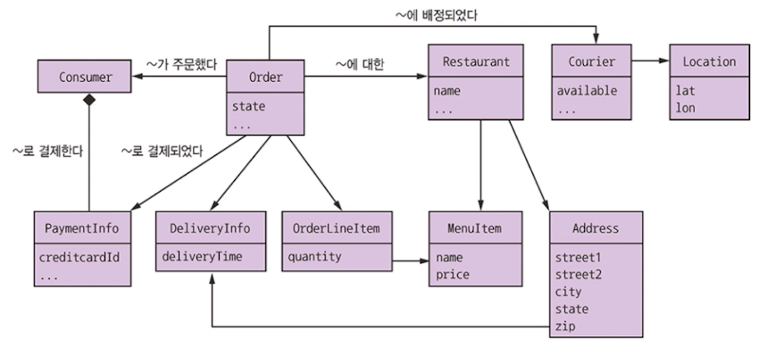
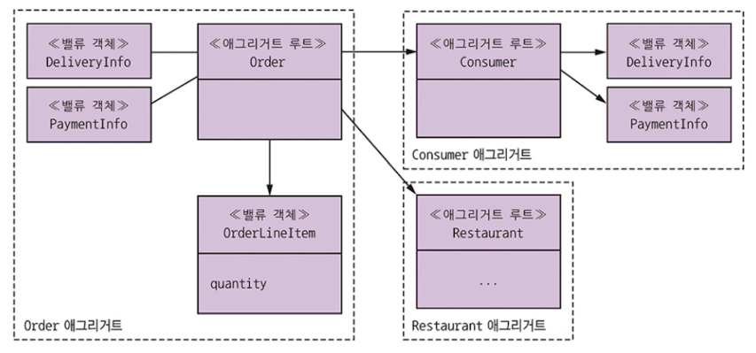
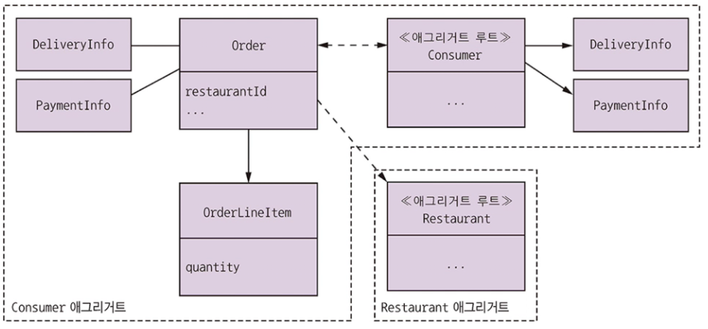
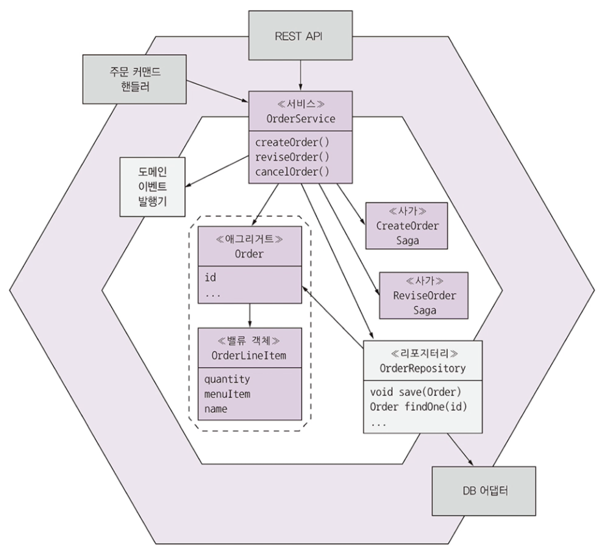

# 5.2 도메인 모델 설계 : DDD 애그리거트 패턴

FTGO 의 도메인 모델

비즈니스 객체에 대응되게 작성되어 있는데, 
경계가 불분명한 부분이 있다!

어느 클래스가 Order 라는 비즈니스 객체의 일부분인지?

## 5.2.1 불분명한 경계 문제

Order 객체의 작업은 무슨 작업을 하며, 그 범위는 어디까지일까?
Order 객체를 조회하거나 변경을 일으키는 일이 해당되지만, 
주문 품목, 지불 정보 등 다른 연관된 정보도 많다. -> **도메인 객체의 경계를 대략 짐작하게 된다.**

경계가 분명하지 않으면, 비즈니스 객체를 업데이트할 때 문제가 생길 수 있다.
비즈니스 객체는 불변 값이 있고 반드시 준수해야할 비즈니스 규칙이 있기 때문에 비즈니스 로직을 주의 깊게 설계해야!

예를 들어 위 도메인 모델만 보고선 주문 최소 금액이라는 비즈니스 로직을 알 수 없다.

## 5.2.2 애그리거트는 경계가 분명하다

애그리거트 : 한 단위로 취급 가능한 경계 내부의 도메인 객체들

하나의 루트 엔티티 + 하나 이상의 기타 엔티티 + 밸류객체(VO)

애그리거트는 도메인 모델을 개별적으로 이해하기 쉬운 덩어리로 분해한다!

로드, 수정, 삭제같은 작업 범위를 분명하게 설정한다.
작업은 애그리거트 일부가 아닌 전체 애그리거트에 적용하며, 
애그리거트는 보통 DB에서 통째로 가져오기 때문에 지연 로딩 문제를 신경쓸 필요 없다. 또한 애그리거트를 삭제하면 해당 객체가 모두 사라진다.

### 애그리거트는 일관된 경계

**일부가 아닌 전체 애그리거트를 업데이트 하므로 일관성 문제가 해소된다.**

업데이트 작업은 애그리거트 루트에서 호출되기 때문에 불변 값이 강제되고, 
동시성 역시 애그리거트 루트를 (버전 번호나 DB 수준의 락으로) 잠금하여 처리한다.

클라이언트는 직접 품목 수량을 수정할 수 없고 반드시 주문 애그리거트 루트에 있는 메서드를 호출해야하기에 최소 주문량 같은 불변 값이 강제된다.

다만, DB에 있는 전체 애그리거트를 업데이트할 필요는 없다. Order 객체와 수정된 OrderLineItem에 해당하는 로우만 업데이트!

### 애그리거트를 식별하는 일이 관건

**DDD 모델 설계의 핵심 : 애그리거트 + 경계, 루트 식별**

애그리거트의 내부 구조는 부차적인 문제 / 애그리거트는 정해진 규칙을 반드시 준수해야하기 때문에, 도메인 모델의 모듈화 + 장점 매우 많다!

## 5.2.3 애그리거트 규칙

애그리거트는 규칙을 지켜야 하며, 이 규칙들 덕분에 애그리거트는 자신의 불변값을 강제하는 자기 완비형 단위가 된다.

### 규칙 1. 애그리거트 루트만 참조하라

외부 클래스는 반드시 애그리거트 루트 엔티티만 참조할 수 있게 제한해야 한다.
클라이언트는 루트 메서드만 호출해서 애그리거트를 업데이트할 수 있다.

예를 들어 어떤 서비스가 리포지토리를 통해 DB에서 애그리거트를 로드하고 애그리거트 루트 레퍼런스를 얻고자 한다면,
이 서비스는 애그리거트 루트에 있는 메서드를 호출하여 애그리거트를 업데이트해야 한다!
이 규칙 덕분에 애그리거트는 자신의 불변 값을 강제할 수 있다.

### 규칙 2. 애그리거트 간 참조는 반드시 기본키를 사용하라

애그리거트는 객체 레퍼런스 대신 **신원(pk)으로 서로를 참조해야** 한다. 

> 객체를 넘기는 짓을 하지마!!

객체 레퍼런스 대신 신원을 사용하면, 애그리거트는 느슨하게 결합되고 애그리거트 간 경계가 분명해지기 때문에 다른 애그리거트를 업데이트할 일이 없다.

- 애그리거트는 그 자체가 저장 단위이므로 저장 로직도 간단해진다. -> NoSQL DB에 애그리거트를 저장하기 한결 쉽다.

- 굳이 지연 로딩을 투명하게 처리할 필요도 없고 그 과정에서 발생하는 부작용이 생길 일도 없다.

  - > '지연 로딩을 투명하게'가 무슨 말이지...? 명확하게 보여줘라...?

- DB를 확장할 때도 애그리거트 샤딩하는 편이 더 알기 쉽다.

### 규칙 3. 하나의 트랜잭션으로 하나의 애그리거트를 생성/수정하라

- 하나의 트랜잭션으로 오직 하나의 애그리거트만 생성/수정해야한다!
  - 띠용?! 싶긴한데, **이전에 배운 사가 트랜잭션 등 MSA 와 완벽하게 맞아떨어진다!**
  - 트랜잭션을 확실하게 서비스 내부에 담을 수 있다!
- 이 규칙을 준수하려면 여러 애그리거트를 생성/수정하는 작업 구현이 복잡해진다.
  - 사가로 해결 가능!
  - 사가의 각 단계는 정확히 하나의 애그리거트를 생성/수정한다.

## 5.2.4 애그리거트 입도

도메인 모델에서 각 애그리거트의 크기를 결정하는 일은 매우 중요!

- 각 애그리거트의 업데이트는 직렬화되므로, 잘게 나뉘어져 있으면 그만큼 애플리케이션이 동시 처리 가능한 요청 개수가 늘고 확장성이 좋아진다!
- 두 사용자가 동시에 같은 애그리거트를 업데이트하다 충돌 가능성 감소
- 애그리거트 자체가 트랜잭션의 범위여서 원자적 처리를 위해서 애그리거트를 크게 잡아야할 수도 있긴 함!
  - 소비자 애그리거트를 주문까지 포함하게 설정할 수도 있다!
  - 
  - Consumer 애그리거트를 크게 잡아서 Consumer 및 하나 이상의 Order를 원자적으로 업데이트가 가능해진다!
    - 단 분해에는 단점...
    - MSA 에서 좋지 않긴함!

## 5.2.5 비즈니스 로직 설계 : 애그리거트

- MSA 비즈니스 로직은 대부분 애그리거트로 구성된다. 나머지는 도메인 서비스와 사가에 위치.
  - 사가는 로컬 트랜잭션을 오케스트레이션해서 데이터 일관성을 맞추고,
  - 인바운드 어댑터는 비즈니스 로직의 진입점이 되는 서비스를 호출
  - 서비스는 리포지토리로 DB에서 애그리거트를 조회하거나, DB에 애그리거트 저장
  - 리포지토리는 각각 DB에 접근하는 아웃바운드 어댑터로 구현

비즈니스 로직 : Order 애그리거트, OrderService, OrderRepository 하나 이상의 사가들로 구성된다

