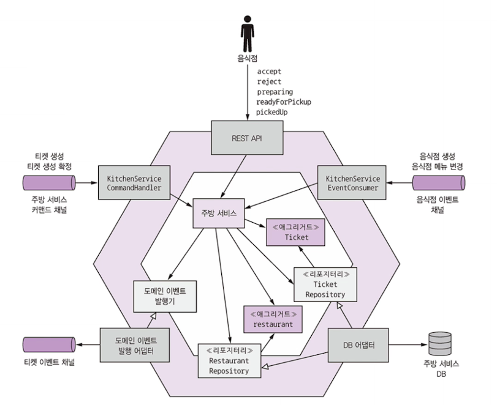

# 주방 서비스 비즈니스 로직


주방 서비스 : 음식점이 주문을 관리할 수 있게하는 서비스

- Restaurant 애그리거트
  - 음식점 메뉴 및 운영 시간을 알고 있는 상태에서 주문 검증 가능 
- Ticket 애그리거트
  - 배달원이 픽업할 수 있게 음식점이 미리 준비해야 할 주문




## 5.4.1 Ticket 애그리거트

- Ticket 애그리거트 : 음식점 주방 관점에서 바라본 주문 
  - 신원, 배달 정보, 지불 내역 등 소비자 관련 정보는 없음
  - 배달원이 픽업할 주문을 준비하는데에만 집중
  - KitchenService 는 티켓 애그리거트 ID 를 생성하지 않고, OrderService 가 전달한 ID 그대로 사용

### Ticket 클래스 구조

```java
@Entity
public class Ticket {
  @Id
  private Long id;
  
  @Enumerated(EnumType.STRING)
  private TicketState state;
  
  private Long restaurangId;
  
  @ElementCollection
  @CollectionTable(name = "ticket_line_items")
  private List<TicketLineItem> lineItems;
  
  // ....
}
```

코드를 보면 **Restaurant 객체를 가리키지 않고 그냥 Long 필드로 되어있다.**

```java
@ManyToOne(fetch = FetchType.LAZY)
@JoinColumn(name = "restaurant_id")
private Restaurant restaurant;
```

이 아니다!


### Ticket 애그리거트 동작

- accept : 음식점이 주문을 접수했다.
- preparing : 음식점이 주문을 준비하기 시작했으므로 더 이상 변경/취소 불가
- readyForPickup : 주문 픽업 준비가 끝남


### KitchenService 도메인 서비스

주방 서비스의 인바운드 어댑터가 호출. 
주문 상태를 변경하는 accept, reject, preparing 등의 메서드가 각각 애그리거트를 가져와 
애그리거트 루트에 있는 해당 메서드를 호출한 후 도메인 이벤트 발행


### KitchenserviceCommandHandler 클래스

주문 서비스에 구현된 사가가 전송한 커맨드 메시지를 처리하는 어댑터.

KitchenService 를 호출하여 Ticket 을 생성/수정하는 핸들러 메서드가 커맨드별로 정의

