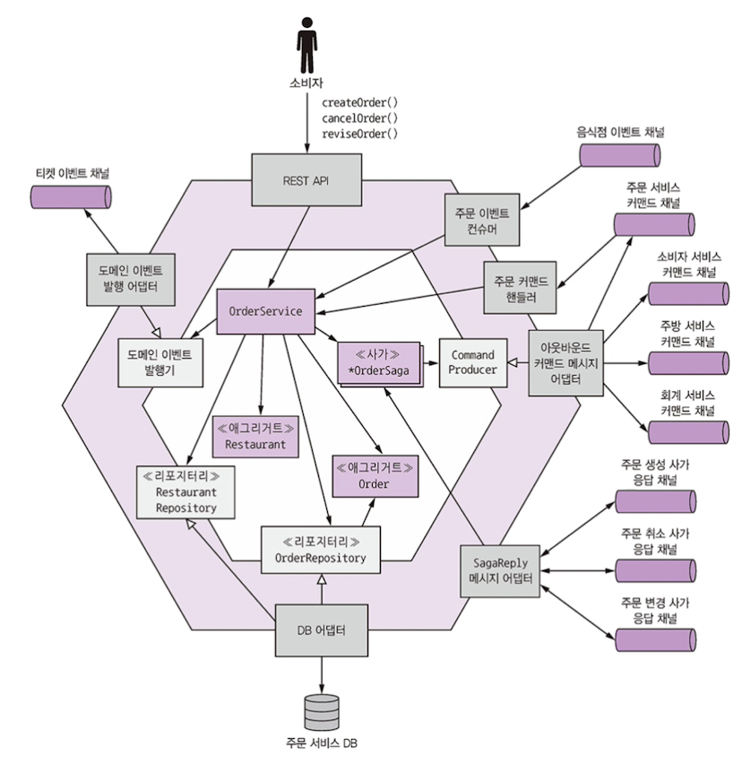
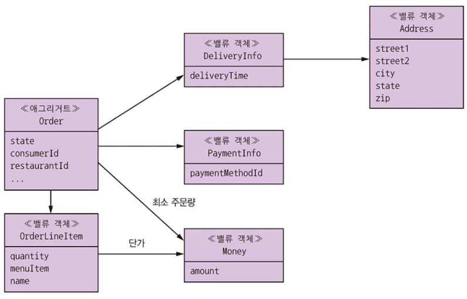
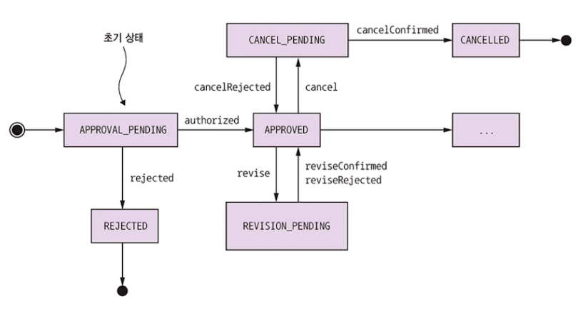

# 5.5 주문 서비스 비즈니스 로직

주문 서비스는 주문 생성, 수정, 취소하는 API 제공하는 서비스

컨슈머가 주로 호출한다!

Order 애그리거트가 중심을 차지하고 있지만, 
음식점 서비스 데이터의 부분 레플리카인 Restaurant 애그리거트도 존재. -> 주문 서비스에서 주문 품목을 검증하고 단가를 책정할 수 있다!

위 그림을 참조해서... 

- 인바운드 어댑터
  - REST API
  - OrderEventConsumer
  - OrderCommandHandler
  - SagaReplyAdapter
- 아웃바운드 어댑터
  - DB 어댑터
  - DomainEventPublishingAdapter
  - OutboundCommandMessageAdapter

## 5.5.1 Order 애그리거트

Consumer 와 Restaurant 는 다른 애그리거트이니 기본키 값으로 참조한다.

### Order 애그리거트 상태 기계

주문을 생성/수정하려면 OrderService는 다른 서비스와 사가로 협동해야한다!

상태는 위처럼 바뀌면서 진행!

### Order 애그리거트 메서드

...

## 5.5.2 OrderService 클래스

...

