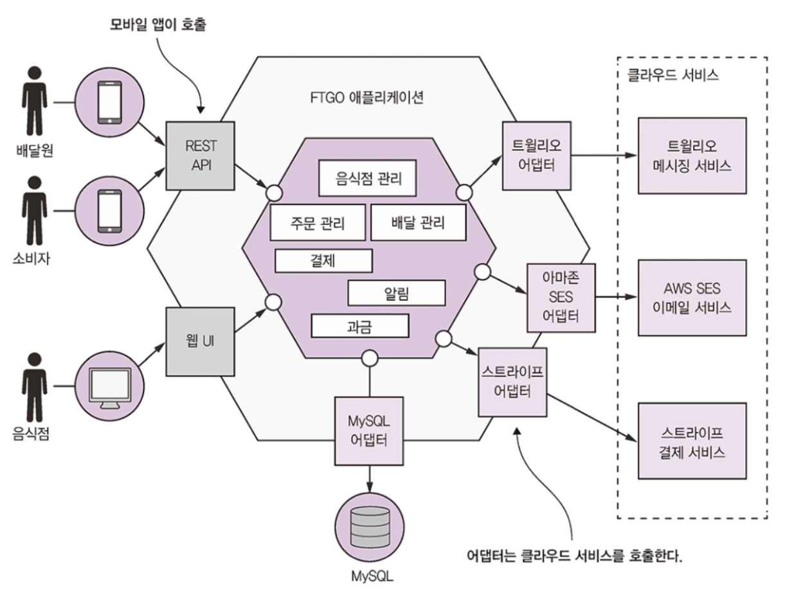

# 1.1 서서히 모놀리식 지옥에 빠져들다

미국 온라인 음식 배달 업계를 선도하는 FTGO는 모놀리스로 개발이 되어있습니다.

점점 애플리케이션은 복잡해졌고, Big Ball of Mud 패턴, 스파게티 코드 범벅 등이 나타났습니다.

소프트웨어 전달 페이스는 느려지고, 점점 한물간 프레임워크를 사용하여 애플리케이션을 개발하다보니 상황은 더 안좋아졌습니다.

 

## 1.1.1 FTGO 애플리케이션 아키텍쳐

전형적인 엔터프라이즈 자바 애플리케이션으로 육각형 아키텍쳐입니다.

논리적으로 모듈화한 아키텍쳐임에도 애플리케이션은 WAR 파일 하나로 패키징합니다.

 

## 1.1.2 모놀리식 아키텍쳐의 장점

모놀리식 아키텍쳐의 장점은 많습니다.

* 개발이 간단합니다 : IDE 등 개발 툴은 단일 애플리케이션 구축에 초점
* 애플리케이션을 쉽게 변경할 수 있다 : 코드, DB 스키마를 변경해서 빌드/배포하기 용이
* 테스트하기 쉽다
* 배포하기 쉽다
* 확장하기 쉽다 : load balance 뒷면에 애플리케이션 인스턴스를 여러 개 실행

하지만 시간이 지날수록 개발, 테스트, 배포, 확장이 어려워집니다.

 

## 1.1.3 모놀리식 지옥의 실상

FTGO는 모놀리식 지옥에 빠져 지금은 애자일식 개발/배포도 불가능합니다.

### 너무 복잡해서 개발자가 주눅 들다

여느 개발자가 완전히 이해할 수 없을 정도로 내용이 방대해서 버그를 고치고 새 기능을 정확하게 구현하기가 힘들고 시간이 오래 걸립니다.

### 개발이 더디다

애플리케이션이 너무 커져서 개발자 IDE의 실행속도도 느려지고 자연히 빌드 시간도 오래 걸립니다.

코드를 고치고 빌드/실행/테스트까지 너무 많은 시간이 낭비되어 생산성을 떨어뜨리는 요인이 됩니다.

### 커밋부터 배포에 이르는 길고 험난한 여정

고친 내용을 프로덕션에 배포하는 일이 아주 길고 고통스럽습니다.

여러 개발자가 같은 코드베이스에 소스 커밋을 하다보니 종종 릴리스할 수 없을 때도 있습니다.

기능 브랜치로 이 문제를 해결하려고 해도 소스 병합 단계가 개발자를 괴롭힙니다.

코드베이스가 너무 복잡하여 변경 영향도가 제대로 파악이 안되므로 전체테스트를 돌려보아야 합니다.

사람이 손으로 직접 테스트 해야하는 부분도 있기 때문에 더 오랜 시간이 소요됩니다.

### 확장하기 어렵다

FTGO 애플리케이션은 모듈마다 리소스 요건이 서로 맞지 않아 확장하기 어렵습니다.

예를 들어 데이터 용량이 큰 음식점 데이터는 인-메모리 DB 형태로 저장을 하기 때문에 메모리 칩이 많이 장착된 서버에 배포하는 것이 좋지만, 이미지 처리 모듈은 CPU를 집중 소모하므로 CPU 코어 수가 많은 서버에 배포하는 것이 최적입니다.

이렇게 같은 애플리케이션이라도 리소스 요건이 상이한 모듈이 존재하므로 서버 구성 시 리소스 배분을 신경 써야 합니다.

### 모놀리스는 확실하게 전달하기 어렵다

애플리케이션 자체가 워낙 덩치가 커서 철저하게 테스트하기 어렵고 테스트성이 부족하면 결국 프로덕션에 버그가 발생할 가능성도 높습니다. 

### 갈수록 한물간 기술 스택에 발목이 붙잡히다

어쩔 수 없이 한물간 기술 스택을 쓸 수 밖에 없습니다.

