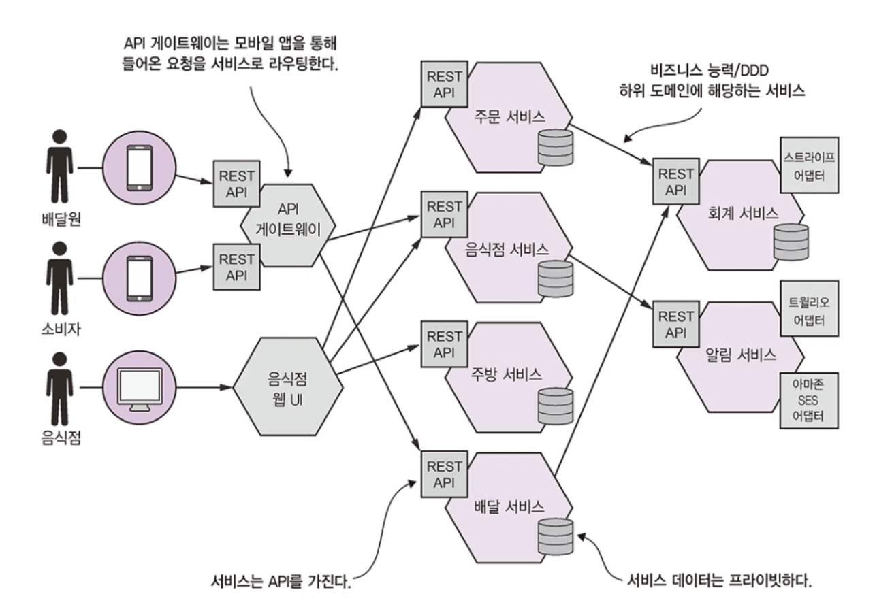

# 1.4 마이크로서비스 아키텍쳐가 답이다

## 1.4.1 확장 큐브와 마이크로서비스

마이크로서비스에 대한 정의가 여러가지가 있지만 The Art of Salability에서는 아래와 같이 설명합니다.

우선 해당 책에서 확장 큐브라는 3차원 확장 모델이 나옵니다.

이 모델에 따르면 애플리케이션을 X축, Y축, Z축 세 방향으로 확장시킬 수 있습니다.

### X축 확장: 다중 인스턴스에 고루 요청 분산

X축 확장은 일반적인 모놀리식 애플리케이션의 확장 수단입니다.

로드 밸런서 뒤에 애플리케이션 인스턴스를  N개 띄워 놓고 요청을 인스턴스에 고르게 분배합니다.

### Z축 확장: 요청 속성별 라우팅

모놀리식 애플리케이션의 다중 인스턴스를 실행하는 것은 X축 확장과 같지만 인스턴스별로 주어진 데이터 하위 집합만 처리하도록 설정하는 방법입니다.

인스턴스 앞면에 위치한 라우터는 요청의 속성에 알맞은 인스턴스로 요청을 라우팅합니다.

아래 이미지 예시에서는 userId에 따라 다른 인스턴스에 분산시킵니다.

### Y축 확장: 기능에 따라 애플리케이션을 서비스로 분해

X축, Z축 확장을 하면 애플리케이션 능력과 가용성은 개선되지만 애플리케이션은 점점 더 복잡해지는 문제는 해결되지 않습니다.

따라서 Y축 확장, 기능 분해가 필요합니다.

 

## 1.4.2 마이크로서비스는 모듈성을 갖고 있다

모듈성은 크고 복잡한 애플리케이션을 개발할 때 꼭 필요한 특성입니다.

모놀리식 애플리케이션은 프로그래밍 언어 구성체(자바 패키지)와 빌드 아티팩트(자바 JAR 파일)을 조합한 단위로 모듈을 정의하지만 이러한 방식은 문제가 많아서 FTGO처럼 연식이 오래된 대부분의 모놀리식 애플리케이션은 점점 상황이 나빠져 진흙잡탕이 되기 쉽습니다.

마이크로서비스 아키텍쳐는 서비스를 모듈성의 단위로 사용합니다.

 

## 1.4.3 서비스마다 DB가 따로 있다

마이크로서비스는 서로 느슨하게 결합되어 있고 API를 통해 통신합니다.

각 서비스는 각각 자체 DB를 가지고 있습니다.

서비스는 서로 완전히 분리되어 다른 서비스가 DB 락을 획득해 내 서비스를 블로킹하는 일이 일어나지 않습니다.

 

## 1.4.4 FTGO 마이크로서비스 아키텍쳐

앞으로 FTGO가 마이크로서비스 아키텍쳐로 전환하는 과정을 살펴봅시다.

 

## 1.4.5 마이크로서비스 아키텍쳐와  SOA

고수준에서 바라보면 SOA(Service Oriented Architecture)와 마이크로서비스, 두 아키텍쳐 모두 시스템을 여러 서비스로 구성하는 아키텍쳐 스타일입니다.

하지만 더 깊이 들어가면 근본적인 차이가 있습니다.

| 구분           | SOA                                                          | 마이크로서비스                                               |
| -------------- | ------------------------------------------------------------ | ------------------------------------------------------------ |
| 서비스 간 통신 | SOAP, WS 표준처럼 무거운 프로토콜을 응용한 엔터프라이즈 서비스 버스 중심의 스마트 파이프 | REST나 gRPC처럼 가벼운 프로토콜을 응용한 메시지 브로커 또는 서비스 간 통심 중심의 덤 파이프 |
| 데이터         | 전역 데이터 모델 및 공유 DB                                  | 서비스 개별 데이터 모델 및 DB                                |
| 주요 사례      | 대규모 모놀리식 애플리케이션                                 | 소규모 서비스                                                |

