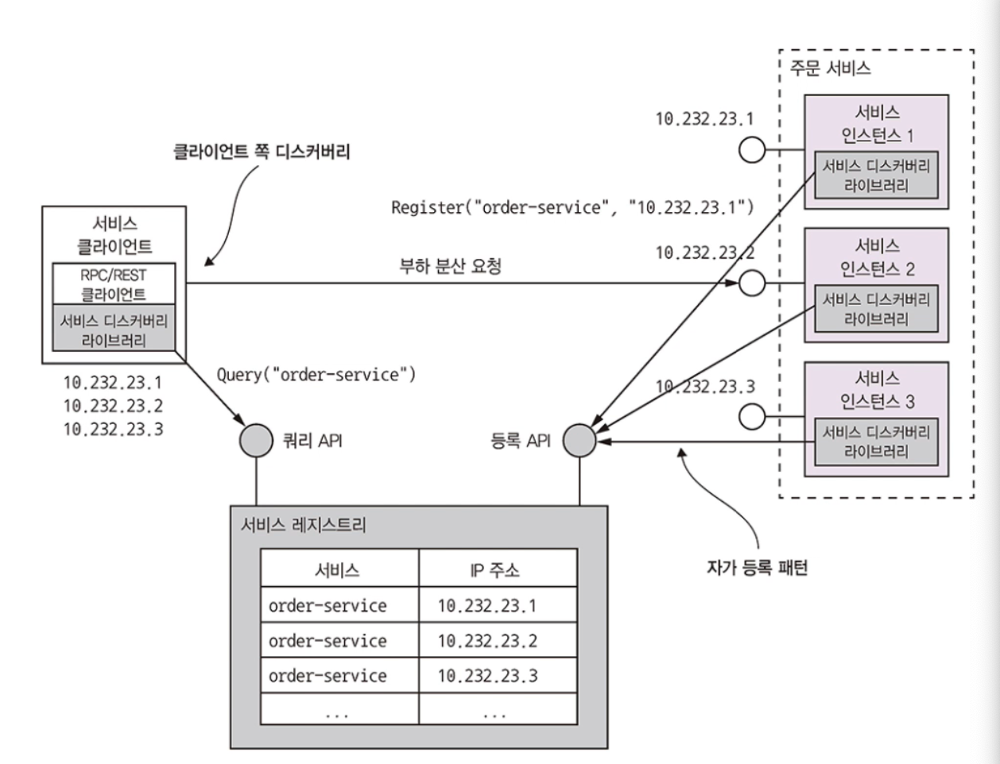
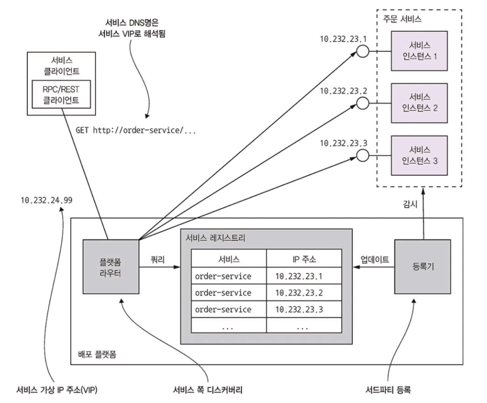

# 3.2 동기 RPI 패턴 응용 통신

RPI는 Romote Procedure Invocation의 줄임말로 원격 프로시저 호출을 의미합니다.

클라이언트가 서비스에 요청을 보내면 서비스가 처리 후 응답을 회신하는 IPC입니다.

응답 대기 중에 블로킹하는 클라이언트도 있고, 리액티브한 논블로킹 아키텍쳐를 가진 클라이언트도 있지만, 어쨌든 메세징으로 통신하는 클라이언트와 달리 응답이 제때 도착하리라 가정합니다.

 

### RPI 작동 원리

클라이언트의 비즈니스 로직은 프록시 인터페이스를 호출합니다.

이 프록시 인터페이스는 RPI 프록시 어댑터 클래스로 구현합니다.

RPI 프록시가 서비스에 전달한 요청은 RPI 서버 어댑터 클래스가 접수하고, 이 클래스는 다시 서비스 인터페이스를 통해 비즈니스 로직을 호출합니다.

비즈니스 로직 처리를 마친 서비스는 다시  RPI 프록시로 응답을 돌려주고 최종 결과는 클라이언트 비즈니스 로직에 반환됩니다.

 

## 3.2.1 동기 RPI 패턴: REST

REST는 HTTP로 통신하는 IPC입니다.

REST는 HTTP method를 사용해 URL로 참조되는 리소스를 가공합니다.

개발자는 대부분 자신이 작성한 HTTP 기반 API가 RESTful 하다고 주장하지만 실제로 그렇지 않은 API도 많습니다.

 

### REST 성숙도 모델

REST의 성숙도는 다음 4단계로 구분됩니다.

* 레벨 0 : 클라이언트는 서비스별로 유일한 URL endpoint에 HTTP POST 요청을 하여 서비스를 호출합니다. 요청을 할 때마다 어떤 액션을 수행할지, 그 대상은 무엇인지 지정합니다. 필요한 매개변수도 함께 전달합니다.
* 레벨 1 : 서비스는 리소스 개념을 지원합니다. 클라이언트는 수행할 액션과 매개변수가 지정된 POST 요청을 합니다.
* 레벨 2: 서비스는 HTTP 동사를 이용해서 액션을 수행하고, 요청 쿼리 매개변수 및 본문, 필요 시 매개변수를 지정합니다. 덕분에 GET은 웹에서 캐싱이 가능합니다.
* 레벨 3 : 서비스를 HATEOAS(Hypertext As The Engine Of Application State) 원칙에 기반하여 설계합니다. HATEOAS는 GET 요청으로 반환된 리소스 표현형에 그 리소스에 대한 액션의 링크도 함께 태워 보내자는 생각입니다. 예를 들어 클라이언트는 GET 요청으로 주문 데이터를 조회하고 이 때 반환된 표현형 내부 링크를 이용해서 해당 주문을 취소할 수도 있습니다. HATEOAS를 사용하면 하드 코딩한 URL을 클라이언트 코드에 욱여넣지 않아도 됩니다.

 

### REST API

REST는 원래 IDL가 없었지만 스웨거라는 오픈 소스 프로젝트를 발전시켜 오픈  API 명세가 REST IDL로서 널리 보급되었습니다.

인터페이스 정의를 기반으로 클라이언트 스텁, 서버 스켈레톤을 생성하는 툴이 포함되어 있습니다.

 

### 요청 한 번으로 많은 리소스를 가져오기 어렵다

REST 리소스는 Consumer, Order같은 비즈니스 객체 중심입니다.

따라서 REST API 설계 시 어떻게 하면 클라이언트가 요청 한 번으로 연관된 객체를 모두 가져올 수 있는지 고민하게 됩니다.

하지만 시나리오가 복잡해지면 효율이 떨어지고 구현 시간이 많이 소요되는 문제도 있습니다.

이런 까닭에 데이터를 효율적으로 조회할 수 있게 설계된 GraphQL이나 넷플릭스 팔코 등 대체 API 기술이 각광받고 있습니다.

 

### 작업을 http 동사에 매핑하기 어렵다

HTTP 동사는 HTTP method를 의미합니다.

 

### REST의 장단점

장점은 아래와 같습니다.

* 단순하고 익숙
* HTTP API를 간편하게 테스트
* 요청/응답 스타일의 통신을 직접 지원
* HTTP는 방화벽 친화적
* 중간 브로커가 필요하지 않기 때문에 시스템 아키텍쳐가 단순

단점은 아래와 같습니다.

* 요청/응답 스타일의 통신만 지원
* 중간에서 메세지를 버퍼링하는 매개자가 없어 양쪽 다 실행중이어야 하기에 가용성이 떨어짐
* 서비스 인스턴스들의 위치(URL)을 클라이언트가 알고 있어야 함
* 요청 한 번으로 여러 리소스를 가져오기 어려움
* 다중 업데이트 작업을 HTTP method에 매핑하기 어려움

 

## 3.2.2 동기 RPI 패턴: gRPC

gRPC는 다양한 언어로 클라이언트/서버를 작성할 수 있는 프레임워크입니다.

gRPC는 프로토콜 버퍼 기반의 IDL로 정의하며 프로토콜 버퍼 컴파일러로 클라이언트 쪽 스텁 및 서버 쪽 스켈레톤을 생성할 수 있습니다.

클라이언트 서버는 이진 메세지를 HTTP/2을 통해 교환합니다.

gRPC API는 하나 이상의 서비스와 요청/응답 메세지 데피니션으로 구성됩니다.

데피니션은 정적 타입 메서드를 모아 놓은 것입니다.

gRPC는 단순 요청/응답 RPC는 물론 스트리밍 RPC도 지원하므로 서버가 클라이언트에 메세지 스트림을 응답하는 것도 가능합니다. 반대로 클라이언트가 서버로 메세지 스트림을 보낼 수도 있습니다.

gRPC는 프로토콜 버퍼 메세지 포맷을 사용합니다. 프로토콜 버퍼는 간결하고 효율적인 이진 포맷입니다. 프로토콜 버퍼 메세지는 각 필드마다 번호가 매겨지고 타입 코드가 할당됩니다. 

메세지 수신자는 사진이 필요한 필드만 추출하고 모르는 필드는 그냥 건너 뛸 수 있기 때문에 하위 호환성을 유지하며 API를 발전시킬 수 있습니다.

아래는 주문 서비스의 gRPC API 코드입니다.

 

### gRPC 장단점

장점은 아래와 같습니다.

* 다양한 업데이트 작업이 포함된 API를 설계하기 쉬움
* 특히 큰 메세지를 교환할 떄 콤팩트하고 효율적인 IPC
* 양방향 스트리밍 덕분에 RPI, 메세징 두 가지 통신 방식 모두 가능
* 다양한 언어로 작성된 클라이언트/서버 연동이 가능

단점은 아래와 같습니다.

* 자바스크립트 클라이언트가 하는 일이 REST/JSON 기반 API보다 더 많음
* 구형 방화벽은 HTTP/2를 지원하지 않음
* REST와 같이 동기 통신하는 메커니즘이라 부분 실패 문제가 있음

 

## 3.2.3 부분 실패 처리: 회로 차단기 패턴

회로 차단기 패턴은 circuit breaker 패턴이라고도 합니다.

분산 시스템은 서비스가 다른 서비스를 동기 호출할 때 부분 실패할 가능성이 항상 존재합니다.

하나의 서비스 실패는 클라이언트의 클라이언트로 거슬러 올라가면서 전체 시스템의 중단을 초래할 위험도 있습니다.

따라서 부분 실패가 전체로 전파되지 않도록 서비스를 설계해야 합니다.

해결책은 두 가지로 나뉩니다.

* 무응답 원격 서비스를 처리하기 위해 OrderServiceProxy 같은 견고한 RPI 프록시를 설계합니다.
* 원격 서비스가 실패하면 어떻게 조치해야 할지 결정합니다.

 

### 견고한 RPI 프록시 설계

넷플릭스 기술 블로그를 보면 다른 서비스를 동기 호출할 때 자기 스스로를 방어하는 방법이 명쾌하게 기술되어 있습니다.

* 네트워크 타임아웃 : 응답 대기 중에 무한정 블로킹하면 안 되고 항상 타임아웃을 걸어 둡니다.
* 미처리 요청 개수 제한 : 클라이언트가 특정 서비스에 요청 가능한 미처리 요청의 최대 개수를 설정합니다. 이 개수에 이르면 더 이상의 요청은 무의하므로 즉시 실패 처리하는 것이 타당합니다.
* 회로 차단기 패턴 : 성공/실패 요청 개수를 모니터링하며 에러율이 임계치를 초과하면 그 이후 시도는 바로 실패 처리합니다.

 

### 불능 서비스 복구

무응답 원격 서비스를 어떻게 복구하면 좋을지는 그때그때 상황에 맞게 판단해야 합니다.

주문 생성 요청이 실패하는 상황에서는 그냥 알기 쉽게 에러를 반환하는 것도 좋은 방법입니다.

또한 미리 정해진 기본값이나 캐시된 응답 등 대체 값을 반환하는 방법도 있습니다.

 

## 3.2.4 서비스 디스커버리

REST API가 있는 어떤 서비스를 호출하는 코드를 개발한다고 하면 이 서비스를 호출하는 코드는 인스턴스의 네트워크 위치(IP주소 및 포트)를 알고 있어야 요청을 할 수 있습니다.

요즘 많이 사용하는 클라우드 기반의 MSA는 네트워크 위치가 훨씬 동적이라서 이를 식별하는 일이 결코 간단하지 않습니다.

따라서 클라이언트 코드는 서비스 디스커버리를 사용할 수 밖에 없습니다.

 

### 서비스 디스커버리 개요

서비스 IP 주소가 정적으로 구성된 클라이언트 대신 서비스 디스커버리 메커니즘을 사용해야 합니다.

핵심은 애플리케이션 서비스 인스턴스의 네트워크 위치를 DB화한 서비스 레지스트리입니다.

서비스 인스턴스가 시작/종료할 때마다 서비스 레지스트리가 업데이트됩니다.

클라이언트가 서비스를 호출하면 우선 서비스 디스커버리가 서비스 레지스트리에서 가용 서비스 인스턴스 목록을 가져오고, 그 중 한 서비스로 요청을 라우팅합니다.

서비스 디스커버리는 주로 다음 두 가지 방법으로 구현합니다.

* 클라이언트/서비스가 직접 서비스 레지스트리와 상호 작용합니다.
* 배포 인프라로 서비스 디스커버리를 처리합니다.

 

### 애플리케이션 수준의 서비스 디스커버리 패턴 적용

애플리케이션 클라이언트/서비스가 서비스 레지스트리와 직접 통신하는 방법입니다.

서비스 인스턴스는 자신의 네트워크 위치를 서비스 레지스트리에 등록하고, 서비스 클라이언트는 이 서비스 레지스트리로부터 전체 서비스 인스턴스 목록을 가져와 그 중 한 인스턴스로 요청을 라우팅합니다.

이는 두 가지 패턴을 조합한 서비스 디스커버리 방식입니다.

1. 자가 등록 패턴

   서비스 인스턴스는 자신의 네트워크 위치를 서비스 레지스트리 등록 API를 호출해서 등록합니다. 

2. 클라이언트 쪽 디스커버리 패턴

   클라이언트는 서비스를 호출할 때 먼저 서비스 레지스트리에 서비스인스턴스 목록을 요청해서 넘겨받습니다.

   그런 다음 서비스 클라이언트는 라운드-로빈이나 랜덤같은 부하 분산 알고리즘을 이용하여 서비스 인스턴스를 선택한 후 요청을 전송합니다.

 

애플리케이션 수준의 서비스 디스커버리는 다양한 플랫폼에 서비스가 배포된 경우도 처리 가능한 장점이 있습니다.

예를 들어 일부 서비스만 쿠버네티스에 배포하고 나머지는 레거시 환경하고 실행하는 경우 쿠버네티스 기반 서비스 디스커버리는 쿠버네티스 내부에서만 동작하지만 유레카를 이용하는 애플리케이션 수준의 디스커버리는 두 환경 모두 잘 동작합니다.

그러나 사용하는 언어나 프레임워크에 맞는 서비스 디스커버리 라이브러리가 필요한 단점도 있습니다.

스프링 클라우드는 스프링 개발자에게는 도움이 되겠지만 다른 언어를 사용하는 개발자는 다른 서비스 디스커버리 프레임워크를 찾아봐야 합니다.

 

### 플랫폼에 내장된 서비스 디스커버리 패턴 적용

도커나 쿠버네티스 등 최신 배포 플랫폼에는 대부분 서비스 레지스트리, 서비스 디스커버리 메커니즘이 탑재되어 있습니다.

배포 플랫폼은 DNS명, 가상 IP 주소, VIP 주소로 해석되는 DNS명을 각 서비스마다 부여합니다.

서비스 클라이언트가 DNS명/VIP를 요청하면 배포 플랫폼이 알아서 가용 서비스 인스턴스 중 하나로 요청을 라우팅합니다.

이는 두 패턴을 접목시킨 방법입니다.

1. 서드파티 등록 패턴

   서비스가 자신을 서비스 레지스트리에 등록하는 것이 아니라 배포 플랫폼의 일부인 등록기라는 서드파티가 이 작업을 대행합니다.

2. 서버 쪽 디스커버리 패턴

   클라이언트가 서비스 레지스트리를 질의하지 않고 DNS명을 요청합니다. 그러면 서비스 레지스트리를 쿼리하고 요청을 부하 분산하는 요청 라우터로 해석됩니다.

 

플랫폼에서 기본 제공된 서비스 디스커버리를 사용하면 서비스 디스커버리를모두 배포 플랫폼이 알아서 처리하므로 아주 편리합니다. 

서비스 디스커버리 관련 코드는 클라이언트/서비스 어느 쪽에도 없기 때문에 서비스 개발 언어와 상관없이 모든 클라이언트/서비스에 곧바로 적용할 수 있습니다.

물론 해당 플랫폼으로 배포한 서비스 디스커버리만 지원되는 단점이 있습니다.