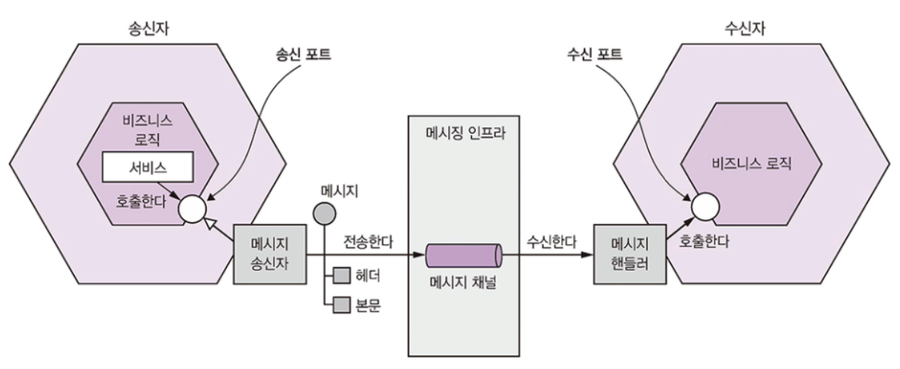
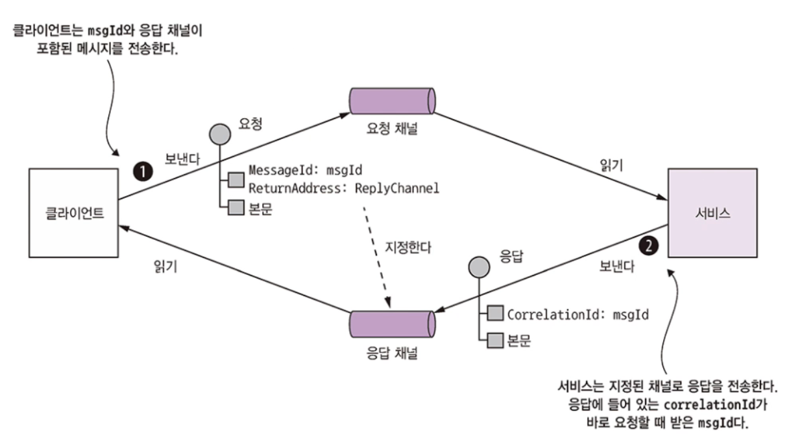
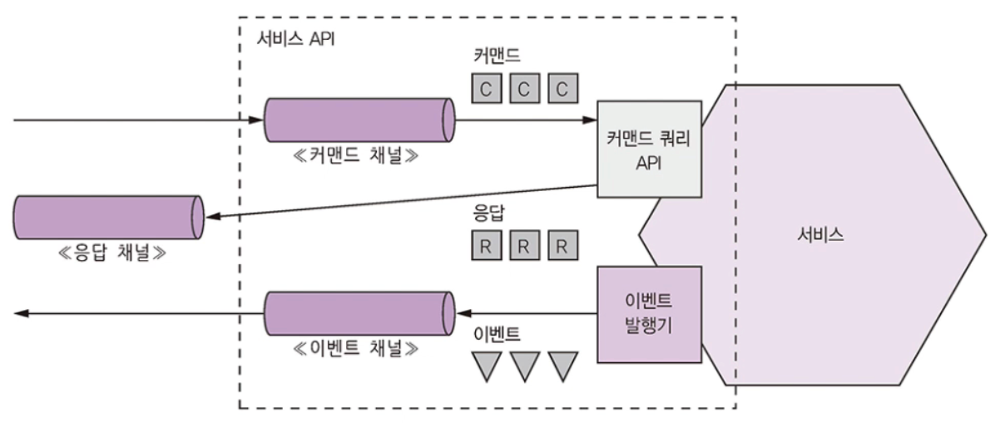

# 3.3 비동기 메세징 패턴 응용 통신

메세징은 서비스가 메세지를 비동적으로 주고받는 통신 방식입니다.

메세징 기반 애플리케이션은 서비스 간 중개 역할을 하는 메세지 브로커를 사용하지만 서비스가 직접 서로 통신하는 브로커리스 아키텍쳐도 있습니다.

 

## 3.3.1 메세징 개요

메세지는 메세지 채널을 통해 교환됩니다.

송신자가 채널에 메세지를 쓰면 수신자는 채널에서 메세지를 읽습니다.

 

### 메세지

메세지는 헤더와 바디로 구성됩니다.

헤더에는 송신된 데이터에 관한 메타데이터에 해당하는 키/값 등이 있습니다.

메세지 바디에는 실제로 송신할 텍스트 또는 이진 포맷의 데이터입니다.

메세지의 종류는 다양합니다.

* document : 데이터만 포함된 제네릭한 메세지, 메세지를 어떻게 해석할지는 수신자가 결정합니다.
* command : RPC 요청과 동등한 메세지로 호출할 작업과 전달할 매개변수가 지정되어 있습니다.
* event : 송신자에게 어떤 사건이 발생했음을 알리는 메세지로 이벤트는 대부분 Order, Customer 같은 도메인 객체의 상태 변화를 나타내는 도메인 이벤트입니다.

이 책에서는 command와 event를 두루 활용하는 방식으로 MSA에 접근합니다.

 

### 메세지 채널

메세지는 채널을 통해 교환됩니다.

채널은 두 종류가 있습니다.

* 점대점 채널 : 채널을 읽는 컨슈머 중 딱 하나만 지정하여 메세지를 전달합니다. (command)
* 발행-구독 채널 : 같은 태널을 바라보는 모든 컨슈머에 메세지를 전달합니다. (event)

 

## 3.3.2 메세징 상호 작용 스타일 구현

### 요청/응답 및 비동기 요청/응답

두 방식 모두 클라이언트가 요청을 보내면 서비스는 응답을 반환합니다.

요청/응답은 서비스가 즉시 응답할 것이라고 클라이언트가 기대하고 비동기 요청/응답은 클라이언트가 기대하지 않습니다.

메세징은 원래 성격 자체가 비동적이라서 비동기 요청/응답만 제공하지만 응답을 수신할 때까지 블로킹할 수도 있습니다.

 

클라이언트/서비스는 한 쌍의 메세지를 주고 받는 비동기 요청/응답 스타일로 상호작용합니다.

클라이언트는 수행할 작업과 매개변수가 담긴 command 메세지를 서비스가 소유한 점대점 메세징 채널에 보냅니다.

그러면 서비스는 요청을 처리한 후 그 결과가 담긴 응답 메세지를 클라이언트가 소유한 점대점 채널로 돌려보냅니다.

 

### 단방향 알림

단방향 알림은 비동기 메세징을 이용하여 직관적으로 구현할 수 있습니다.

서비스가 소유한 점대점 채널로 클라이언트가 메세지를 보내면 서비스는 이 채널을 구독해서 메세지를 처리하는 구조입니다.

물론 단방향이므로 서비스는 응답을 반환하지 않습니다.

 

### 발행/구독

메세징은 발행/구독 스타일의 상호 작용을 기본 지원합니다.

클라이언트는 여러 컨슈머가 읽는 발행/구독 채널에 메세지를 발행하고, 서비스는 도메인 객체의 변경 사실을 알리는 도메인 이벤트를 발행합니다.

이렇게 도메인 이벤트를 발행한 서비스는 해당 도메인 클래스의 이름을 딴 발행/구독 채널을 소유합니다.

주문 서비스는 Order 이벤트를 Order 채널에 발행하고, 배달 서비스는 Delivery 이벤트를 Delivery 채널에 발행합니다.

서비스는 자신이 관심 있는 도메인 객체의 이벤트 채널을 구독합니다.

 

### 발행/비동기 응답

발행/비동기 응답 스타일은 발행/구독과 요청/응답의 엘리먼트를 조합한 고수준의 상호 작용 스타일입니다.

클라이언트는 응답 채널 헤더가 명시된 메세지를 발행/구독 채널에 발행하고, 컨슈머는 CorrelationId가 포함된 응답 메세지를 지정된 응답 채널에 쏩니다.

클라이언트는 이 CorrelationId로 응답을 취합하여 응답 메세지와 요청을 맞추어 봅니다.

 

## 3.3.3 메세징 기반 서비스의 API 명세 작성

서비스의 비동기 API 명세에는 메세지 채널명, 각 채널을 통해 교환되는 메세지 타입과 포맷을 명시하고, 메세지 포맷은 JSON, XML, 프로토콜 버퍼 등표준 포맷으로 기술해야 합니다.

서비스 비동기 API는 클라이언트가 호출하는 작업과 서비스에 의해 발행되는 이벤트로 구성됩니다.

작업과 이벤트는 문서화하는 방법이 다릅니다.

 

### 비동기 작업 문서화

서비스 작업은 두 가지 상호 작용 스타일 중 하나로 호출할 수 있습니다.

* 요청/비동기 응답 스타일 API : 서비스의 command 메세지 채널, 서비스가 받는 command 메세지의 타입과 포맷, 서비스가 반환하는 응답 메세지의 타입과 포맷으로 구성됩니다.
* 단방향 알림 스타일 API : 서비스의 command 메세지 채널, 서비스가 받는 command 메세지의 타입과 포맷

 

### 발행 이벤트 문서화

서비스는 발행/구독 스타일로도 이벤트를 발행할 수 있습니다.

이런 스타일의 API 명세는 이벤트 채널, 서비스가 채널에 발행하는 이벤트 메세지의 타입과 포맷으로 구성됩니다.

 

## 3.3.4 메세지 브로커

메세지 브로커는 서비스가 서로 통신할 수 있게 해주는 인프라 서비스입니다.

서비스가 직접 통신하는 브로커리스 기반의 메세징 아키텍쳐도 있지만 일반적으로 브로커 기반의 아키텍쳐가 더 낫습니다.

 

### 브로커리스 메세징

브로커리스 아키텍쳐의 서비스는 메세지를 서로 직접 교환합니다.

ZeroMQ는 유명한 브로커리스 메세징 기술입니다.

브로커리스 메세징의 장점은 아래와 같습니다.

* 송신자에서 수신자로 직접 전달되므로 네트워크 트래픽이 가볍고 지연시간이 짧습니다.
* 메세지 브로커가 성능 병목점이나 SPOF(single point of failure)가 될 일이 없습니다.
* 메세지 브로커를 설정/관리할 필요가 없으므로 운영 복잡도가 낮습니다.