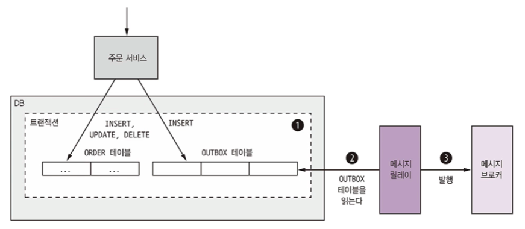

# 3.3 비동기 메세징 패턴 응용 통신

메세징은 서비스가 메세지를 비동적으로 주고받는 통신 방식입니다.

메세징 기반 애플리케이션은 서비스 간 중개 역할을 하는 메세지 브로커를 사용하지만 서비스가 직접 서로 통신하는 브로커리스 아키텍쳐도 있습니다.

<br>

## 3.3.1 메세징 개요

메세지는 메세지 채널을 통해 교환됩니다.

송신자가 채널에 메세지를 쓰면 수신자는 채널에서 메세지를 읽습니다.

<br>

### 메세지

메세지는 헤더와 바디로 구성됩니다.

헤더에는 송신된 데이터에 관한 메타데이터에 해당하는 키/값 등이 있습니다.

메세지 바디에는 실제로 송신할 텍스트 또는 이진 포맷의 데이터입니다.

메세지의 종류는 다양합니다.

* document : 데이터만 포함된 제네릭한 메세지, 메세지를 어떻게 해석할지는 수신자가 결정합니다.
* command : RPC 요청과 동등한 메세지로 호출할 작업과 전달할 매개변수가 지정되어 있습니다.
* event : 송신자에게 어떤 사건이 발생했음을 알리는 메세지로 이벤트는 대부분 Order, Customer 같은 도메인 객체의 상태 변화를 나타내는 도메인 이벤트입니다.

이 책에서는 command와 event를 두루 활용하는 방식으로 MSA에 접근합니다.

<br>

### 메세지 채널

메세지는 채널을 통해 교환됩니다.


채널은 두 종류가 있습니다.

* 점대점 채널 : 채널을 읽는 컨슈머 중 딱 하나만 지정하여 메세지를 전달합니다. (command)
* 발행-구독 채널 : 같은 태널을 바라보는 모든 컨슈머에 메세지를 전달합니다. (event)

<br>


## 3.3.2 메세징 상호 작용 스타일 구현

### 요청/응답 및 비동기 요청/응답

두 방식 모두 클라이언트가 요청을 보내면 서비스는 응답을 반환합니다.

요청/응답은 서비스가 즉시 응답할 것이라고 클라이언트가 기대하고 비동기 요청/응답은 클라이언트가 기대하지 않습니다.

메세징은 원래 성격 자체가 비동적이라서 비동기 요청/응답만 제공하지만 응답을 수신할 때까지 블로킹할 수도 있습니다.

<br>

클라이언트/서비스는 한 쌍의 메세지를 주고 받는 비동기 요청/응답 스타일로 상호작용합니다.

클라이언트는 수행할 작업과 매개변수가 담긴 command 메세지를 서비스가 소유한 점대점 메세징 채널에 보냅니다.

그러면 서비스는 요청을 처리한 후 그 결과가 담긴 응답 메세지를 클라이언트가 소유한 점대점 채널로 돌려보냅니다.


<br>

### 단방향 알림

단방향 알림은 비동기 메세징을 이용하여 직관적으로 구현할 수 있습니다.

서비스가 소유한 점대점 채널로 클라이언트가 메세지를 보내면 서비스는 이 채널을 구독해서 메세지를 처리하는 구조입니다.

물론 단방향이므로 서비스는 응답을 반환하지 않습니다.

<br>

### 발행/구독

메세징은 발행/구독 스타일의 상호 작용을 기본 지원합니다.

클라이언트는 여러 컨슈머가 읽는 발행/구독 채널에 메세지를 발행하고, 서비스는 도메인 객체의 변경 사실을 알리는 도메인 이벤트를 발행합니다.

이렇게 도메인 이벤트를 발행한 서비스는 해당 도메인 클래스의 이름을 딴 발행/구독 채널을 소유합니다.

주문 서비스는 Order 이벤트를 Order 채널에 발행하고, 배달 서비스는 Delivery 이벤트를 Delivery 채널에 발행합니다.

서비스는 자신이 관심 있는 도메인 객체의 이벤트 채널을 구독합니다.

<br>

### 발행/비동기 응답

발행/비동기 응답 스타일은 발행/구독과 요청/응답의 엘리먼트를 조합한 고수준의 상호 작용 스타일입니다.

클라이언트는 응답 채널 헤더가 명시된 메세지를 발행/구독 채널에 발행하고, 컨슈머는 CorrelationId가 포함된 응답 메세지를 지정된 응답 채널에 쏩니다.

클라이언트는 이 CorrelationId로 응답을 취합하여 응답 메세지와 요청을 맞추어 봅니다.

<br>

## 3.3.3 메세징 기반 서비스의 API 명세 작성

서비스의 비동기 API 명세에는 메세지 채널명, 각 채널을 통해 교환되는 메세지 타입과 포맷을 명시하고, 메세지 포맷은 JSON, XML, 프로토콜 버퍼 등표준 포맷으로 기술해야 합니다.

서비스 비동기 API는 클라이언트가 호출하는 작업과 서비스에 의해 발행되는 이벤트로 구성됩니다.

작업과 이벤트는 문서화하는 방법이 다릅니다.


<br>

### 비동기 작업 문서화

서비스 작업은 두 가지 상호 작용 스타일 중 하나로 호출할 수 있습니다.

* 요청/비동기 응답 스타일 API : 서비스의 command 메세지 채널, 서비스가 받는 command 메세지의 타입과 포맷, 서비스가 반환하는 응답 메세지의 타입과 포맷으로 구성됩니다.
* 단방향 알림 스타일 API : 서비스의 command 메세지 채널, 서비스가 받는 command 메세지의 타입과 포맷

<br>

### 발행 이벤트 문서화

서비스는 발행/구독 스타일로도 이벤트를 발행할 수 있습니다.

이런 스타일의 API 명세는 이벤트 채널, 서비스가 채널에 발행하는 이벤트 메세지의 타입과 포맷으로 구성됩니다.

<br>

## 3.3.4 메세지 브로커

메세지 브로커는 서비스가 서로 통신할 수 있게 해주는 인프라 서비스입니다.

서비스가 직접 통신하는 브로커리스 기반의 메세징 아키텍쳐도 있지만 일반적으로 브로커 기반의 아키텍쳐가 더 낫습니다.

<br>

### 브로커리스 메세징

브로커리스 아키텍쳐의 서비스는 메세지를 서로 직접 교환합니다.

ZeroMQ는 유명한 브로커리스 메세징 기술입니다.

브로커리스 메세징의 장점은 아래와 같습니다.

* 송신자에서 수신자로 직접 전달되므로 네트워크 트래픽이 가볍고 지연시간이 짧습니다.
* 메세지 브로커가 성능 병목점이나 SPOF(single point of failure)가 될 일이 없습니다.
* 메세지 브로커를 설정/관리할 필요가 없으므로 운영 복잡도가 낮습니다.

또한 아래와 같은 단점이 있습니다.

* 서비스가 서로의 위치를 알고 있어야 하므로 서비스 디스커버리 메커니즘 중 하나를 사용해야 합니다.
* 메세지 교환 시 송신자/수신자 모두 실행 중이어야 하므로 가용성이 떨어집니다.
* 전달 보장같은 메커니즘을 구현하기가 더 어렵습니다.


이런 단점들 때문에 엔터프라이즈 애플리케이션은 대부분 메세지 브로커 기반의 아키텍쳐를 사용합니다.

<br>

### 브로커 기반 메세징 개요

메세지 브로커의 가장 큰 장점은 송신자가 컨슈머의 네트워크 위치를 몰라도 된다는 것입니다.

또 컨슈머가 메세지를 처리할 수 있을 때까지 메세지 브로커에 메세지를 버퍼링할 수 도 있습니다.

오픈 소스 메세지 브로커는 아래와 같습니다.

* ActiveMQ

* RabbitMQ

* 아파치 카프카

  

AWS 키네시스, AWS SQS 등 클라우드 기반의 메세징 서비스도 있습니다.

메세지 브로커를 선택할 때는 다음 항목을 잘 검토해야 합니다.

* 프로그래밍 언어 지원 여부 : 다양한 프로그래밍 언어를 지원할수록 좋습니다.
* 메세징 표준 지원 여부 : AMQP, STOMP 등 표준 프로토콜을 지원하는 제품인가, 아니면 자체 표준만 지원하는 제품인가?
* 메세지 순서 : 메세지 순서가 유지되는가?
* 전달 보장 : 어떤 종류의 전달 보장을 하는가?
* 영속화 : 브로커가 고장 나도 문제가 없도록 메세지를 디스크에 저장하는가?
* 내구성 : 컨슈머가 메세지 브로커에 다시 접속할 경우, 접속이 중단된 시간에 전달된 메세지를 받을 수 있나?
* 확장성 : 얼마나 확장성이 좋은가?
* 지연 시간 : 종단 간 지연 시간은 얼마나 되나?
* 경쟁사 컨슈머 : 경쟁사의 컨슈머를 지원하는가?


브로커마다 일장일단이 있습니다.

지연 시간이 매우 짧은 브로커는 메세지 순서가 유지되지 않거나 메세지 전달이 보장되지 않는다든지, 아니면 메시지를 메모리에만 저장하는 단점이 있습니다.

반대로 메세지 전달을 보장하고 메세지를 디스크에 확실히 저장하는 브로커는 지연시간이 긴 편입니다.

<br>

### 메세지 브로커로 메세지 채널 구현

메세지 채널은 메세지 브로커마다 구현 방식이 조금씩 다릅니다.

| 메세지 브로커          | 점대점 채널     | 발행-구독 채널                    |
| ---------------------- | --------------- | --------------------------------- |
| JMS                    | 큐              | 토픽                              |
| 아파치 카프카          | 토픽            | 토픽                              |
| AMQP 브로커 (RabbitMQ) | 익스체인지 + 큐 | 팬아웃 익스체인지, 컨슈머 개별 큐 |
| AWS 키네시스           | 스트림          | 스트림                            |
| AWS SQS                | 큐              | -                                 |

AWS SQS를 제외한 나머지 메세지 브로커들은 점대점, 발행/구독 채널을 모두 지원합니다.

<br>

### 브로커 기반 메세징의 장단점

장점은 아래와 같습니다.

* 느슨한 결합 : 클라이언트는 서비스 인스턴스를 몰라도 되므로 서비스 인스턴스 위치를 알려주는 디스커버리 메커니즘도 필요 없습니다.
* 메세지 버퍼링 : 메세지 브로커는 처리 가능한 시점까지 메세지를 버퍼링합니다. 주문 이행 시스템이 느려지거나 불능 상태에 빠지는 사고가 발생해도 컨슈머는 주문을 계속 접수할 수 있습니다.
* 유연한 통신 : 모든 상호 작용 스타일을 지원합니다.


단점은 아래와 같습니다.

* 성능 병목 가능성 : 메세지 브로커가 성능 병목점이 될 위험이 있습니다.
* 단일 장애점 가능성 : 메세지 브로커는 가용성이 높아야 합니다. 
* 운영 복잡도 부가 : 메세징 시스템 역시 설치, 구성, 운영해야 할 시스템 컴포넌트입니다.


<br>

## 3.3.5 수신자 경합과 메세지 순서 유지

메세지 순서를 유지하면서 메세지 수신자를 scale out 할 수 있을까요?

예를 들어 동일한 점대점 채널을 읽는 서비스 인스턴스가 3개 있고, 송신자는 주문 생성, 주문 변경, 주문 취소 이벤트 메세지를 차례로 전송한다고 합시다.

네트워크 이슈나 가비지 켈렉션 문제로 메세지 처리 순서가 어긋나면 시스템이 오작동 할 수 있습니다.

그래서 아파치 카프카, AWS 키네시스 등 요즘 메세지 브로커는 샤딩된 채널을 이용합니다.


1. 샤딩된 채널은 복수의 샤드로 구성되며, 각 샤드는 채널처럼 작동합니다.
2. 송신자는 메세지 헤더에 샤드 키를 지정합니다. 메세지 브로커는 메세지를 샤드 키별로 샤드/파티션에 배정합니다. 예를 들면 샤드 키 해시 값을 샤드 개수로 나눈 나머지를 계산해서 샤드를 선택하는 식입니다.
3. 메세징 브로커는 여러 수신자 인스턴스를 묶어 동일한 논리 수신자처럼 취급합니다.(아파치 카프카에서는 이를 컨슈머 그룹이라고 합니다.) 메세지 브로커는 각 샤드를 하나의 수신자에 배정하고 수진자가 시동/종료하면 샤드를 재배정합니다.

<br>

## 3.3.6 중복 메세지 처리

중복 메세지 처리 문제도 골칫거리입니다.

메세지 브로커가 각 메세지를 꼭 한 번만 전달하면 좋겠지만 이를 강제하려면 그만큼 값비싼 대가를 치러야 합니다.

그래서 메세지 브로커는 한 번 이상 메세지를 전달하는 것을 보장합니다.

시스템이 정상일 때는 메세지 브로커는 각 메세지를 한 번만 전달합니다.

그러나 클라이언트나 네트워크 또는 브로커 자신이 실패할 경우, 같은 메세지를 여러 번 전달할 수도 있습니다.

<br>

메세지 브로커가 메세지를 재전송할 때 원래 순서까지 유지하면 이상적입니다.

클라이언트가 주문 생성 이벤트 후 주문 취소 이벤트를 처리하는데 문제가 발생해서 주문 생성의 ACK를 못받았다고 생각합시다.

나중에 메세지 브로커가 주문 생성 이벤트만 재전송하면 클라이언트가 주문 취소를 undo할 가능성이 있기 때문에 주문 생성, 주문 취소 이벤트를 모두 재전송 해야 합니다.

중복 메세지를 처리하는 방법은 다음 두 가지입니다.

* 멱등한(idempotent) 메세지 핸들러를 작성합니다.
* 메세지를 추적하고 중복을 솎아 냅니다.

<br>

### 멱등한 메세지 핸들러 작성

동일한 입력 값을 반복 호출해도 아무런 부수 효과가 없을 때 멱등하다고 말합니다.

메세지 처리 로직이 멱등하다면 중복 메세지는 문제없습니다.

그러나 이렇게 멱등한 로직은 실제로 별로 없습니다.

메세지를 다시 전송하면 순서를 보장하지 않는 메세지 브로커를 사용 중일지도 모릅니다.

중복 메세지와 순서가 안 맞는 메세지는 오류를 일으키기 때문에 중복 메세지를 솎아 내는 메세지 핸들러가 필요합니다.

<br>

### 메세지 추적과 중복 메세지 솎아 내기

컨슈머가 메세지 ID를 이용하여 메세지 처리 여부를 추적하면서 중복 메세지를 솎아내면 해결됩니다.

예를 들어 컨슈머가 소비하는 메세지 ID를 무조건 DB 테이블에 저장해서 중복을 확인할 수 있습니다.


위 그림처럼 두 테이블로 관리 할 수도 있지만 애플리케이션 테이블에 칼럼으로 메세지 ID를 기록할 수도 있습니다.

한 트랜잭션으로 두 테이블 업데이트가 불가능한 NoSQL DB에서는 이와 같은 방법을 사용합니다.

<br>

## 3.3.7 트랜잭셔널 메세징

서비스는 보통 DB를 업데이트하는 트랜잭션의 일부로 메세지를 발행합니다.

따라서 DB 업데이트와 메세지 전송을 한 트랜잭션으로 묶어야 합니다.

예전에는 분산 트랜잭션을 적용했지만 현대 메세지 브로커는 대부분 분산 트랜잭션을 지원하지 않습니다.

> 분산 트랜잭션이란 2개 그 이상의 네트워크 상의 시스템 간의 트랜잭션을 말한다.

<br>

### DB 테이블을 메세지 큐로 활용

DB 테이블을 임시 메세지 큐로 사용하는 트랜잭셔널 아웃박스 패턴이 가장 알기 쉬운 방법입니다.

메세지를 보내는 서비스에 OUTBOX라는 테이블을 만들고 비즈니스 객체를 생성, 수정, 삭제하는 DB 트랜잭션의 일부로 OUTBOX 테이블에 메세지를 삽입합니다.

이는 로컬 ACID 트랜잭션이기 때문에 원자성을 보장합니다.

그 후 메세지 릴레이(중계기)는 OUTBOX 테이블을 읽어 메세지 브로커에 메세지를 발행하는 컴포넌트입니다



<br>

NoSQL DB도 비슷한 방법으로 동작합니다.

DB에 레코드로 적재된 비즈니스 엔터티에 발행한 메세지 목록을 가리키는 속성이 있는데, 서비스가 DB 엔터티를 업데이트할 때 바로 이 목록에 메세지를 덧붙이면 됩니다.

> 무슨 소리인지 이해가 잘 안되는군..

<br>

메세지를 DB에서 메세지 브로커로 옮기는 방법은 두 가지입니다.

<br>

### 이벤트 발행: 폴링 발행기 패턴

RDBMS를 쓰는 상황에서 OUTBOX 테이블에 삽입된 메세지를 발행하는 가장 간단한 방법은 메세지 릴레이로 테이블을 폴링해서 미발행 메세지를 조회하는 것 입니다.

> 폴링이란 운영체제가 하드웨어 장치의 상태 레지스터를 읽음으로써 명령의 수신 여부를 주기적으로 확인하는 것입니다.

다음과 같은 쿼리를 주기적으로 실행하면 됩니다.

```sql
SELECT *
FROM OUTBOX
ORDER BY ... ASC
```


메세지 릴레이는 이렇게 조회한 메세지를 하나씩 각자의 목적지 채널로 보내서 메세지 브로커에 발행합니다.

그리고 나중에 OUTBOX 테이블에서 메세지를 삭제합니다.

```sql
BEGIN
DELETE FROM OUTBOX WHERE ID in (...)
COMMIT
```


DB 폴링은 규모가 작을 경우 쓸 수 있는 단순한 방법입니다.

하지만 DB를 자주 폴링하면 비용이 유발되고 NOSQL DB는 쿼리 능력에 따라 사용 가능 여부가 결정됩니다.

이런 유로 트랜잭션 로그 테일링 패턴이 더 많이 사용됩니다.

<br>

### 이벤트 발행: 트랜잭션 로그 테일링 패턴

메세지 릴레이로 DB 트랜잭션 로그를 테일링하는 방법입니다.

애플리케이션에서 커밋된 업데이트는 각 DB의 트랜잭션 로그 항목으로 남습니다.

트랜잭션 로그 마이너로 트랜잭션 로그를 읽어 변경분을 하나씩 메세지로 메세지 브로커에 발행하는 것입니다.


<br>

## 3.3.8 메세징 라이브러리/프레임워크

서비스가 메세지를 주고 받으려면 라이브러리가 필요합니다.

메세지 브로커에도 클라이언트 라이브러리가 있지만 직접 사용하면 아래와 같은 문제가 있습니다.

* 메세지 브로커 API에 메세지를 발행하는 비즈니스 로직이 클라이언트 라이브러리와 결합됩니다.
* 메세지 브로커의 클라이언트 라이브러리는 대부분 저수준이고 메세지를 주고 받는 코드가 꽤 긴 편입니다.
* 메세지 브로커의 클라이언트 라이브러리는 기본적인 메세지 소통 수단일 뿐 고수준의 상호 작용 스타일은 지원하지 않습니다.

<br>

따라서 앞으로 사용할 예제는 이벤추에이트 트램 프레임워크를 사용합니다.

이벤추에이트 트램는 두 가지 두요 메커니즘이 있습니다.

* 트랜잭셔널 메세징 : 메세지를 DB 트랜잭션의 일부로 발행합니다.
* 중복 메세지 감지 : 이벤추에이트 트램의 메세지 컨슈머는 중복 메세지를 걸러냅니다. 컨슈머가 메세지를 한 번만 처리하도록 보장하려면 이런 장치가 꼭 필요합니다.

<br>

### 기초 메세징

기초 메세징 API는 MessageProducer, MessageConsumer 두 인터페이스로 구성됩니다.

프로듀서 서비스는 다음 코드처럼 MessageProducer 인터페이스를 통해 메세지를 메세지 채널에 발행합니다.

```
MessageProducer messageProducer = ...;
String channel = ...;
String payload = ...;
messageProducer.send(destination, MessageBuilder.withPayload(payload).build())
```


컨슈머 서비스는 MessageConsumer 인터페이스를 통해 메세지를 구독합니다.

```
MessageConsumer messageConsumer;
messageConsumer.subscribe(subscriberId, Collections.sigleton(destination), message -> {...})
```

이 두 인터페이스는 비동기 요청/응답 및 도메인 이벤트 발행에 관한 핵심 고수준 API입니다.

<br>

### 도메인 이벤트 발행

이벤추에이트 트램은 도메인 이벤트 발행/구독 API를 제공합니다.

도메인 이벤트란 객체를 생성, 수정, 삭제 시 비즈니스 객체가 발생시킨 이벤트입니다.

서비스는 DomainEventPublisher 인터페이스를 이용하여 도메인 이벤트를 발행합니다.

```
DomainEventPublisher domainEventPublisher;
String accountId = ...;
DomainEvent domainEvent = new AccountDebited(...);
domainEventPublisher.publish("Account", accountId, Collections.singletonList(domainEvent));
```


서비스는 DomainEventDispatcher 클래스로  도메인 이벤트를 소비합니다.

```
DomainEventHandlers domainEventHandlers = DomainEventHandlersBuilder.forAggregateType("Order").onEvent(AccountDebited.class, domainEvent -> {...}).build();

new DomainEventDispatcher("eventDispatcherId", domainEventHandlers, messageConsumer);
```

이벤추에이트 트램은 이벤트는 물론 커맨드/응답 기반의 메시징 등 고수준의 메세징 패턴도 지원합니다.

<br>

### 커맨드/응답 메세징

클라이언트는 CommandProducer 인터페이스를 이용하여 커맨드 메시지를 서비스에 보냅니다.

```
CommandProducer commandProducer = ...;

Map<String, String> extraMessageHeaders = Collections.emptyMap();

String commandId = commandProducer.send("CustomerCommandChannel", new DoSomethingCommand(), "ReplyToChannel", extraMEssageHeaders);
```

서비스는 CommandDispatcher 클래스로 커맨드 메세지를 소비합니다.


다음 코드처럼 CommandDispatcher는 MessageConsumer 인터페이스를 통해 특정 이벤트를 구독하고 각 커맨드 메세지를 적절한 핸들러 메서드로 디스패치합니다.

```
CommandHandlers commandHandlers = CommandHandlersBuilder.fromChannel(commandChannel).onMessage(DoSomethingCommand.class, (command) -> {
	...;
	return withSuccess();
}).build();

CommandDispatcher dispatcher = new CommandDispatcher("subscribeId", commandHandlers, messageConsumer, messageProducer);
```

이벤추에이트 트램 프레임워크는 자바 애플리케이션용 트랜잭셔널 메세징을 기본 지원하며, 트랜잭션이 걸린 상태에서 메세지를 주고 받을 수 있는 저수준 API도 함께 제공합니다.

또 도메인 이벤트를 발행/소비하고 커맨드를 전송/처리하는 고수준 API도 있습니다.