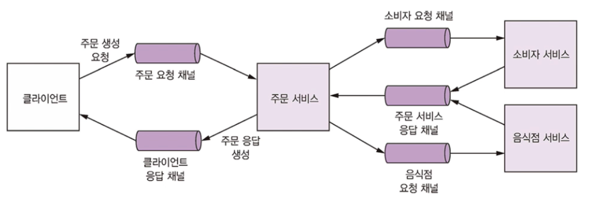

# 3.4 비동기 메세징으로 가용성 개선

다양한 IPC는 나름대로 장단점이 있고 그 선택은 가용성에 영향을 미칩니다.

요청을 처리하는 과정에서 타 서비스와 동기 통신을 하면 그만큼 가용성이 떨어지므로 가능한 서비스가 비동기 메세징을 이용하여 통신하도록 설계하는 것이 좋습니다.

 

## 3.4.1 동기 통신으로 인한 가용성 저하

REST는 동기 프로토콜이라는 치명적인 문제점이 있습니다.

세 서비스 모두 HTTP를 사용하기 때문에 주문 생성 요청이 정상 처리되려면 세 서비스 모두 가동 중이어야 합니다.

수학적으로 표현하면 시스템 작업의 가용성은 그 작업의 호출한 서비스의 가용성을 모두 곱한 값과 같습니다.

각각 세 개의 서비스의 가용성이 99.5%라면 전체 가용성은 99.5^3 = 98.5%입니다.

따라서 가용성을 최대화하라면 동기 통신을 최소화해야 합니다.

## 3.4.2 동기 상호 작용 제거

동기 요청을 하지 않아도 동기 요청을 처리할 수 있는 방법이 있습니다.

 

### 비동기 상호 작용 스타일

모든 트랜잭션은 이 장 앞부분에서 설명한 비동기 상호 작용 스타일로 처리하는 것이 가장 좋습니다.

클라이언트가 비동기 요청/응답 상호 작용을 통해 주문을 생성했다고 합시다.

주문 서비스는 다른 서비스와 메세지를 비동기 방식으로 교환하고, 최종적으로 클라이언트에 응답 메세지를 전송합니다.

 

### 데이터 복제

서비스에 동기 API가 있는 경우 데이터를 복제하면 가용성을 높일 수 있습니다.

서비스 요청 처리에 필요한 데이터의 레플리카를 유지하는 방법입니다.

데이터 레플리카는 데이터를 소유한 서비스와 발행하는 이벤트를 구독해서 최신 데이터를 유지할 수 있습니다.

소비자/음식점 서비스는 각자 데이터가 변경될 때마다 이벤트를 발행하고, 주문 서비스는 이 이벤트를 구독하여 자기 편 레플리카를 업데이트하는 것입니다.

하지만 소비자 서비스에 있는 엄청난 양의 소비자 데이터를 주문 서비스에 그대로 복제하는 것은 실용적이지 않습니다.

다른 서비스가 소유한 데이터를 업데이트하는 문제도 데이터 복제만으로는 해결되지 않습니다.

 

### 응답 반환 후 마무리

요청 처리 도중 동기 통신을 제거하려면 요청을 다음과 같이 처리하면 됩니다.

1. 로컬에서 가용한 데이터만 갖고 요청을 검증합니다.
2. 메세지를 OUTBOX 테이블에 삽입하는 식으로 DB를 업데이트합니다.
3. 클라이언트에 응답을 반환합니다.

서비스는 요청 처리 중에 다른 서비스와 동기적 상호 작용을 하지 않습니다.

그 대신 다른 서비스에 메세지를 비동기 전송합니다. 이를 통해 서비스를 느슨하게 결합할 수 있습니다.

 

주문하는 예시를 이런 방식으로 구현하면 아래와 같은 순서로 동작합니다.

1. 주문 서비스는 주문을 PENDING 상태로 생성합니다.
2. 주문 서비스는 주문 ID가 포함된 응답을 클라이언트에 반환합니다.
3. 주문 서비스는 ValidateConsumerInfo 메세지를 소비자 서비스에 전송합니다.
4. 주문 서비스는 ValidateORderDetails 메세지를 음식점 서비스에 전송합니다.
5. 소비자 서비스는 ValidateConsumerInfo 메세지를 받고 주문 가능한 소비자인지 확인 후, ConsumerValidated 메세지를 주문 서비스에 보냅니다.
6. 음식점 서비스는 ValidateOrderDetails 메세지를 받고 올바른 메뉴 항목인지 음식점에서 주문 배달지로 배달이 가능한지 확인 후, OrderDetailsValidated 메세지를 주문 서비스에 전송합니다.
7. 주문 서비스는 ConsumerValidated 및 OrderDetailsValidated를 받고 주문 상태를 VALIDATED로 변경합니다.

이 경우 혹여나 소비자 서비스가 죽더라도 주문 서비스는 계속 주문을 생성하고 클라이언트에 응답합니다.

나중에 소비자 서비스가 재가동되면 큐에 쌓인 메세지를 처리해서 밀린 주문을 다시 검증하게 됩니다.

 

이처럼 요청을 완전히 처리하기 전에 클라이언트에 응답하는 서비스는 클라이언트 코드가 조금 복잡한 편입니다.

주문 서비스는 응답 반환 시 새로 생성된 주문 상태에 관한 최소한의 정보만 보장합니다.

주문 생성 직후 반환되므로 주문 검증이나 소비자 신용카드 승인은 아직 완료 전입니다.

따라서 클라이언트 입장에서 주문 생성 성공 여부를 알아내려면 주기적으로 폴링하거나 주문 서비스가 알림 메세지를 보내 주어야 합니다.