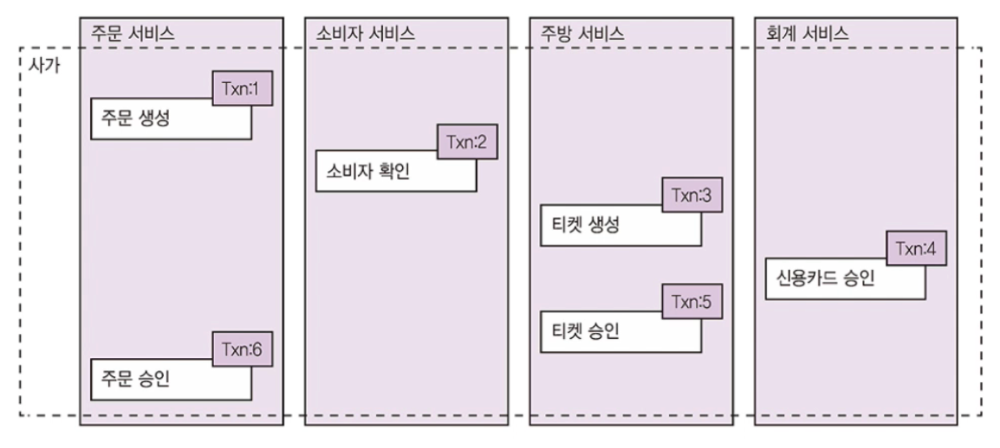
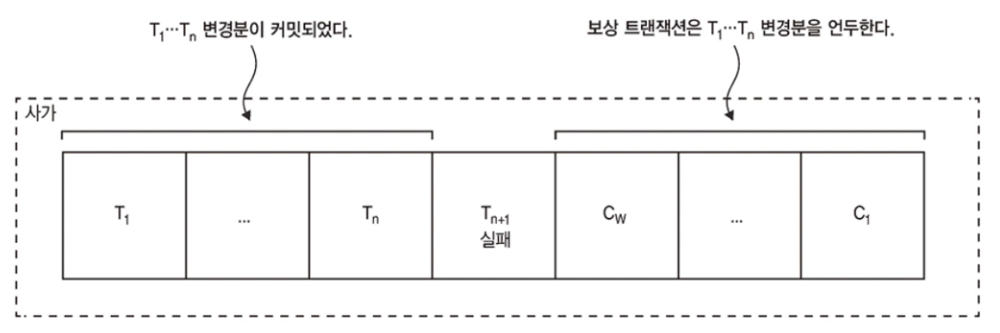
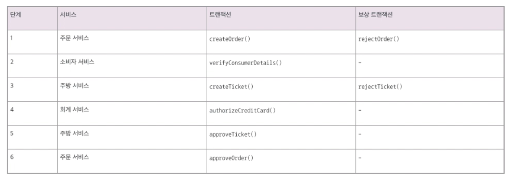

# 4.1 마이크로서비스 아키텍처의 트랜잭션 관리

기존 분산 트랜잭션 관리 기법이 요즘 애플리케이션에 잘 맞지 않는 것은 사실입니다

여러 서비스에 걸친 작업의 데이터 일관성을 유지하려면 ACID 트랜잭션 대신 사가라는 메세지 주도 방식의 로컬 트랜잭션을 사용해야 합니다.

그런데 사가는 ACID에서 I가 빠진 ACD만 지원하고 격리가 되지 않기 때문에 동시 비정상의 영향을 방지하거나 줄일 수 있는 설계 기법을 적용해야 합니다.

 

## 4.1.1 분산 트랜잭션의 필요성 

createOrder()은 주문가능한 소비자인지 확인하고, 주문 내역을 확인하고, 소비자의 신용카드를 승인하고, DB에 주문을 생성하는 작업입니다.

모놀리식 아키텍쳐에서는 이를 구현하기 어렵지 않습니다.

스프링의 경우 `@Transactional` 만 붙이면 데이터 일관성이 보장됩니다.

하지만 MSA에서는 서비스마다 DB가 있기 때문에 여러 DB에 걸쳐 데이터 일관성을 유지할 수 있는 수단을 강구해야 합니다.

 

## 4.1.2 분산 트랜잭션의 문제점

예전에는 분산 트랜잭션을 이용해서 여러 서비스, DB, 메세지 브로커에 걸쳐 데이터 일관성을 유지했습니다.

X/Open DTP 모델인 X/Open XA는 분산 트랜잭션 관리의 사실상 표준입니다.

> DTP : Distributed Transaction Processing, 분산 트랜잭션 처리

XA는 2단계 커밋을 이용하여 전체 트랜잭션 참여자가 반드시 커밋 아니면 롤백을 하도록 보장합니다.

 

분산 트랜잭션은 간단해 보이지만 문제점이 많습니다.

1. NoSQL DB와 현대 메세지 브로커는 분산 트랜잭션을 지원하지 않으므로 분산 트랜잭션이 필수라면 최근 기술을 상당수 포기할 수 밖에 없습니다.
2. 분산 트랜잭션은 참여한 모든 서비스가 모두 가동 중이어야 커밋할 수 있습니다. 즉 트랜잭션 참여 서비스들의 가용성들의 곱이 최종 가용성이 되고 이는 전체 가용성을 낮추게 됩니다. 요즘 아키텍쳐들은 일관성보다 가용성을 더 우선시 하는 편입니다.

이러한 문제들 때문에 요즘 애플리케이션에는 분산 트랜잭션이 잘 맞지 않습니다.

 

## 4.1.3 데이터 일관성 유지: 사가 패턴

사가는 MSA에서 분산 트랜잭션 없이 데이터 일관성을 유지하는 메커니즘입니다.

여러 서비스의 데이터를 업데이트하는 시스템 커맨드마다 사가를 하나씩 정의합니다.

사가는 비동기 메세징을 이용하여 편성한 일련의 로컬 트랜잭션입니다.

각 로컬 트랜잭션은 앞서 언급한 ACID 트랜잭션 프레임워크/라이브러리를 이용하여 서비스별 데이터를 업데이트합니다.

 

시스템 작업은 사가의 첫 번째 단계를 시작합니다.

어느 로컬 트랜잭션이 완료되면 이어서 그 다음 로컬 트랜잭션이 실행됩니다.

비동기 메세징은 하나 이상의 사가 참여자가 일시 불능 상태인 경우에도 사가의 전체 단계를 확실히 실행시킬 수 있는 중요한 장점이 있습니다.

사가와 ACID 트랜잭션은 두 가지 중요한 차이점이 있습니다.

1. ACID 트랜잭션에 있는 격리성이 사가에는 없습니다.
2. 사가는 로컬 트랜잭션마다 변경분을 커밋하므로 보상 트랜잭션을 걸어 롤백해야 합니다.

 

### 예제: 주문 생성 사가

createOrder()을 예제로 사가가 어떻게 동작하는지 알아봅시다.

이 사가의 첫 번째 로컬 트랜잭션은 주문 생성이라는 외부 요청에 의해 시작됩니다.

나머지 5개의 로컬 트랜잭션은 각자 자신의 선행 트랜잭션이 완료되면 트리거됩니다.

주문 생성 사가는 6개의 로컬 트랜잭션으로 구성됩니다.

1. 주문 서비스 : 주문을 APPROVAL_PENDING 상태로 생성합니다.
2. 소비자 서비스 : 주문 가능한 서비자인지 확인합니다.
3. 주방 서비스 : 주문 내역을 확인하고 티켓을 CREATE_PENDING 상태로 생성합니다.
4. 회계 서비스 : 소비자 신용카드를 승인합니다.
5. 주방 서비스 : 티켓 상태를 AWAITING_ACCEPTANCE로 변경합니다.
6. 주문 서비스 : 주문 상태를 APPROVED로 변경합니다.

서비스는 로컬 트랜잭션이 완료되면 메세지를 발행하여 다음 사가 단계를 트리거합니다.

메세지를 통해 사가 참여자를 느슨하게 결합하고 사가가 반드시 완료되도록 보장하는 것입니다.

메세지 수신자가 일시 불능 상태라면, 메세지 브로커는 다시 메세지를 전달할 수 있을 때까지 메세지를 버퍼링합니다.

 

### 사가는 보상 트랜잭션으로 변경분을 롤백한다

사가는 단계마다 로컬 DB에 변경분을 커밋하므로 자동 롤백은 불가능합니다.

주문 생성 사가 4번째 단계에서 신용카드 승인이 실패하면 1~3번째 단계에서 적용된 변경분을 명시적으로 언두해야 합니다.

즉 보상 트랜잭션을 미리 작성해야 합니다.

단계 Ti에서 Ti의 작용을 언두하는 보상 트랜잭션 Ci가 대응되며, 처음 N개 단계의 작용을 언두하려면 사가는 각 Ci를 역순으로 실행하면 됩니다.

 

로컬 트랜잭션이 실패하면 사가는 주문, 티켓을 무효화하는 보상 트랜잭션을 가동합니다.

아래 표는 주문 생성 사가의 단계별 보상 트랜잭션입니다.

모든 단계에 보상 트랜잭션이 필요하지는 않습니다.

verifyConsumerDetails()와 같이 read-only 단계는 보상 트랜잭션이 필요 없습니다.

* 1~3번째 단계는 실패할 가능성이 있는 단계 다음에 있으므로 보상 트랜잭션
* 4번째 단계는 절대로 실패하지 않는 단계 다음에 있으므로 피봇 트랜잭션
* 5~6번째 단계는 항상 성공하기 때문에 재시도 가능 트랜잭션

> 왜지..? 이해가 잘 안된다.

예를 들어 소비자의 신용카드 승인이 실패하면 보상 트랜잭션은 다음 순서대로 작동될 것입니다.

1. 주문 서비스 : 주문을 APPROVAL_PENDING 상태로 생성합니다.
2. 소비자 서비스 : 소비자가 주문을 할 수 있는지 확인합니다.
3. 주방 서비스 : 주문 내역을 확인하고 티켓을 CREATE_PENDING 상태로 생성합니다.
4. 회계 서비스 : 소비자의 신용카드 승인 요청이 거부됩니다.
5. 주방 서비스 : 티켓 상태를 CREATE_REJECTED로 변경합니다.
6. 주문 서비스 : 주문 상태를 REJECTED로 변경합니다.

5~6번째 단계는 주방 서비스, 주문 서비스가 수행한 업데이트를 언두하는 보상 트랜잭션입니다.

일반 트랜잭션과 보상 트랜잭션의 순서화는 바로 다음에 설명할 사가 편성 로직이 하는 일입니다.

