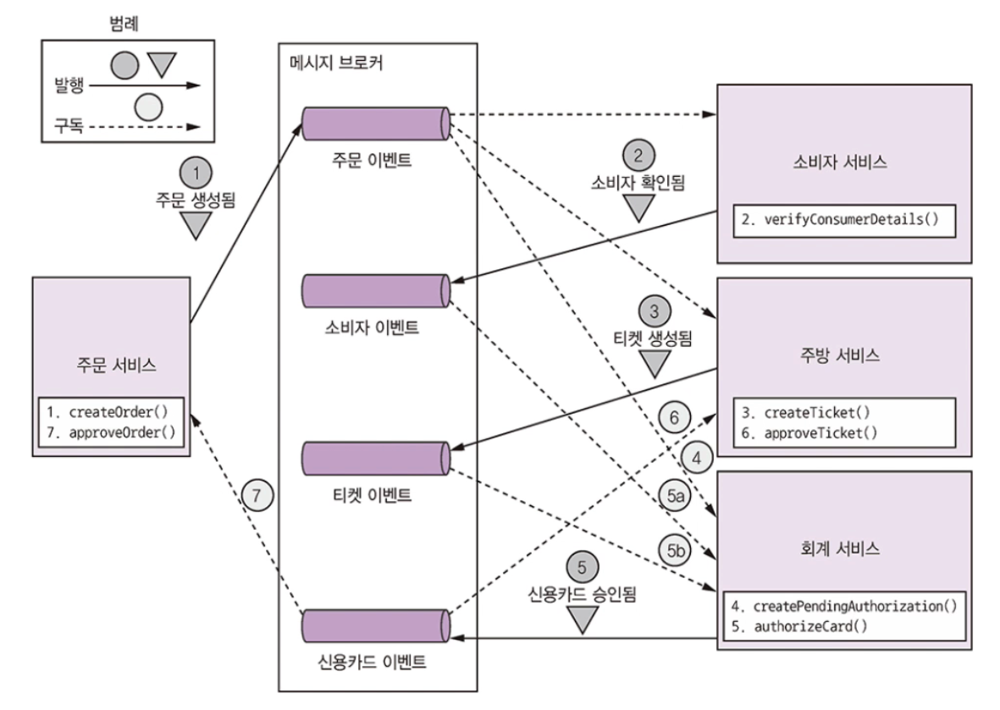
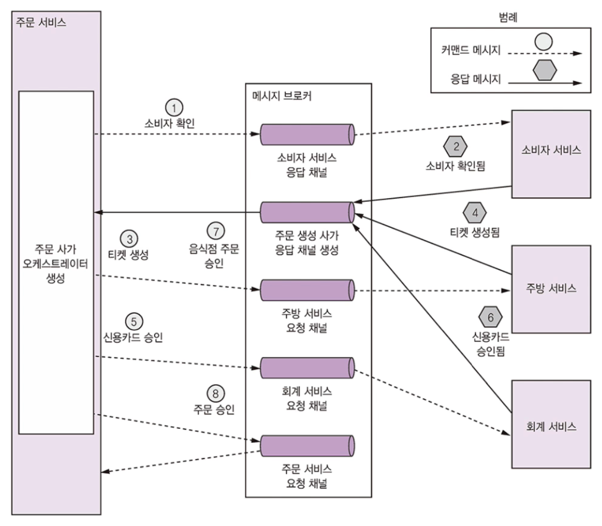
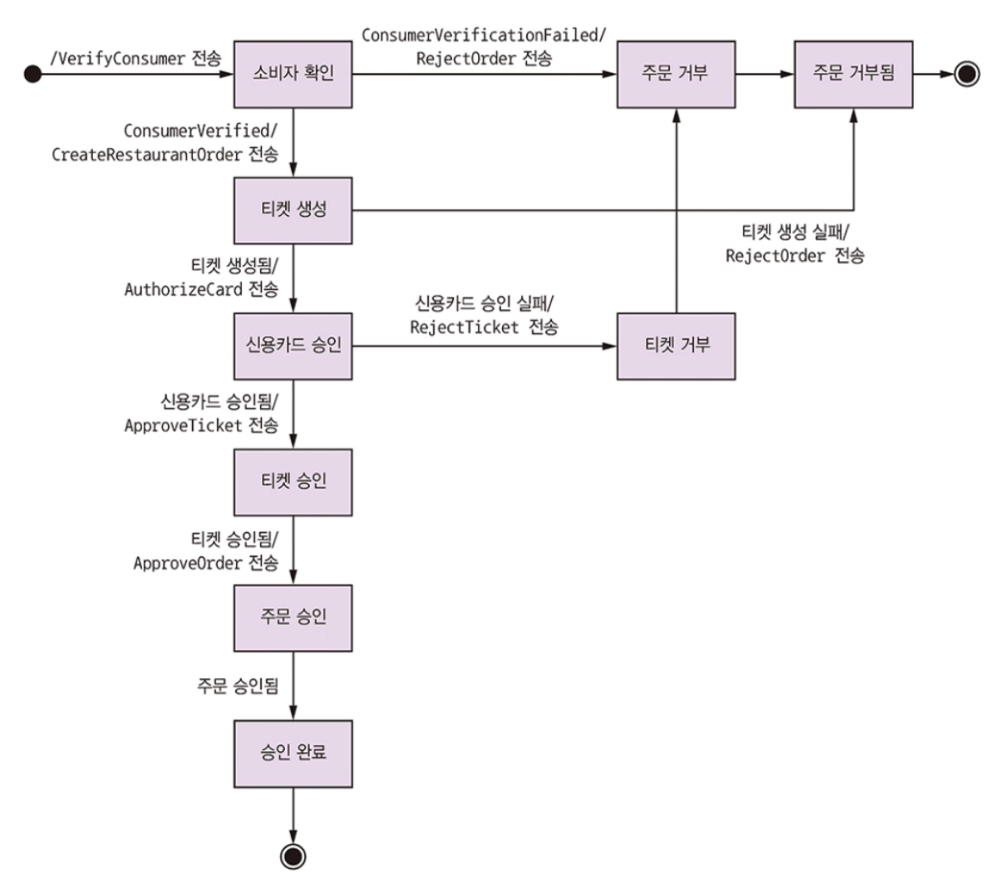

# 4.2 사가 편성

사가는 단계를 편성하는 로직으로 구성됩니다.

시스템 커맨드가 사가를 시작할 때 이 편성 로직은 첫 번째 사가 참여자를 정하여 로컬 트랜잭션 실행을 지시하고, 트랜잭션이 완료되면 그 다음 사가 참여자를 호출하는 과정이 모든 단계가 실행될 때까지 반복됩니다.

도중 하나라도 로컬 트랜잭션이 실패하면 사가는 보상 트랜잭션을 역순으로 실행합니다. 

사가 편성 로직은 두 가지 종류가 있습니다.

* 코레오그래피 : 의사 결정과 순서화를 사가 참여자에게 맡깁니다. 사가 참여자는 주로 이벤트 교환 방식으로 통신합니다.
* 오케스트레이션 : 사가 편성 로직을 사가 오케스트레이터에 중앙화합니다. 사가 오케스트레이터는 사가 참여자에게 커맨드 메세지를 보내 수행할 작업을 지시합니다.

 

## 4.2.1 코레오그래피 사가

코레오그래피 방식은 사가 참여자가 할 일을 알려주는 중앙 편성자가 없습니다.

그 대신 사가 참여자가 서로 이벤트를 구독해서 그에 따라 반응하는 것입니다.

 

### 주문 생성 사가 구현: 코레오그래피 스타일

코레오그래피 스타일로 설계한 주문 생성 사가입니다.

사가 참여자는 서로 이벤트를 주고받으며 소통합니다.

주문 서비스를 시작으로 각 서비스는 가진의 DB를 업데이트하고 다음 참여자를 트리거하는 이벤트를 발행합니다.

별 문제가 없다면 다음 순서대로 진행될 것입니다.

1. 주문 서비스 : 주문을 APPROVAL_PENDING 상태로 생성 -> 주문 생성 이벤트를 발행
2. 소비자 서비스 : 주문 생성 이벤트 수신 -> 소비자가 주문을 할 수 있는지 확인 -> 소비자 확인 이벤트를 발행
3. 주방 서비스 : 주문 생성 이벤트 수신 -> 주문 내역 확인 -> 티켓을 CREATE_PENDING 상태로 생성 -> 티켓 생성됨 이벤트를 발행
4. 회계 서비스 : 주문 생성 이벤트 수신 -> 신용카드 승인을 PENDING 상태로 생성
5. 회계 서비스 : 티켓 생성 및 소비자 확인 에빈트 수신 -> 소비자 신용카드 과금 -> 신용카드 승인됨 이벤트를 발행
6. 주방 서비스 : 신용카드 승인 이벤트 수신 -> 티켓 상태를 AWAITING_ACCEPTANCE로 변경
7. 주문 서비스 : 신용카드 승인 이벤트 수신 -> 주문 상태를 APPROVED로 변경 -> 주문 승인됨 이벤트를 발행

주문 생성 사가는 어떤 사가 참여자가 주문을 거부해서 실패 이벤트가 발행하는 경우를 대비해야 합니다.

이 때 사가는 어떻게든 보상 트랜잭션을 가동하여 이미 수행한 작업을 언두해야 합니다.

 

### 확실한 이벤트 기반 통신

코레오그래피 방식으로 사가를 구현하려면 두 가지 통신 이슈를 고려해야 합니다.

1. 사가 참여자가 자신의 DB를 업데이트하고 DB 트랜잭션의 일부로 이벤트를 발행하도록 해야 합니다. 사가 참여자가 서로 확실하게 통신하려면 트랜잭셔널 메세지를 사용해야 합니다.
2. 사가 참여자는 자신이 수신한 이벤트와 자신이 가진 데이터를 연관 지을 수 있어야 합니다. 데이터를 매핑할 수 있도록 다른 사가 참여자가 상관관계 ID가 포함된 이벤트를 발행합니다.

 

### 코레오그래피 사가의 장단점

장점은 아래와 같습니다.

* 단순함 : 비즈니스 객체를 생성, 수정, 삭제할 때 서비스가 이벤트를 발행합니다.
* 느슨한 결합 : 참여자는 이벤트를 구독할 뿐 서로를 직접 알지 못합니다.

하지만 다음과 같은 단점도 있습니다.

* 이해하기 어렵다 : 오케스트레이션 사가와 달리 사가를 어느 한 곳에 정의한 것이 아니라서 여러 서비스에 구현 로직이 흩어져 있습니다. 어떤 사가가 어떻게 작동되는지 개발자가 이해하기 어려운 편입니다.
* 서비스 간 순환 의존성 : 참여자가 서로 이벤트를 구독하는 특성상, 순환 의존성이 발생하기 쉽습니다. 이것이 반드시 문제는 아니지만 잠재적인 설계 취약점입니다.
* 단단히 결합될 위험성 : 사가 참여자는 각자 자신에게 영향을 미치는 이벤트를 모두 구독해야 합니다. 이를테면 회계 서비스는 소비자 신용카드를 과금/환불 처리하게 만드는 모든 이벤트를 구독해야 합니다.

이러한 이유로 복잡한 사가는 오케스트레이션 방식이 적합합니다.

 

## 4.2.2 오케스트레이션 사가

오케스트레이션 사가에서는 사가 참여자가 할 일을 알려주는 오케스트레이터 클래스를 정의합니다.

사가 오케스트레이터는 커맨드/비동기 응답 상호 작용을 하며 참여자와 통신합니다.

즉, 사가 단계를 실행하기 위해 해당 참여자가 무슨 일을 해야 하는지 커맨드 메세지를 적어보냅니다.

사가 참여자가 작업을 마치고 응답 메세지를 오케스트레이터에 주면, 오케스트레이터는 응답 메세지를 처리한 후 다음 사가 단계를 어느 참여자가 수행할지 결정합니다.

 

### 주문 생성 사가 구현: 오케스트레이션 스타일

오케스트레이션 스타일로 설계한 주문 생성 사가는 아래와 같습니다.

사가 오케스트레이터인 CreateOrderSaga 클래스가 비동기 요청/응답을 주고 받으면서 사가 참여자를 호출하고 그 처리 과정에 따라 커맨드 메세지를 전송합니다.

1. 사가 오케스트레이터가 소비자 확인 커맨드를 소비자 서비스에 전송합니다.
2. 소비자 서비스는 소비자 확인 메세지를 응답합니다.
3. 사가 오케스트레이터는 티켓 생성 커맨드를 주방 서비스에 전송합니다.
4. 주방 서비스는 티켓 생성 메세지를 응답합니다.
5. 사가 오케스트레이터는 신용카드 승인 메세지를 회계 서비스에 전송합니다.
6. 회계 서비스는 신용카드 승인됨 메세지를 응답합니다.
7. 사가 오케스트레이터는 티켓 승인 커맨드를 주방 서비스에 전송합니다.
8. 사가 오케스트레이터는 주문 승인 커맨드를 주문 서비스에 전송합니다.

제일 마지막 단계에서 사가 오케스트레이터는 커맨드 메세지를 주문 서비스에 전송합니다. 

물론 주문 생성 사가가 주문을 직접 업데이트해서 승인 처리해도 되지만 일관성 차원에서 주문 서비스가 마치 다른 참여자인 것처럼 취급하는 것입니다.

 

### 사가 오케스트레이터를 state machine으로 모델링

사가 오케스트레이터를 state machine으로 모델링하면 아래와 같습니다.

 

### 사가 오케스트레이션과 트랜잭셔널 메세징

오케스트레이션 사가는 DB를 업데이트하는 서비스와 메세지를 발행하는 서비스가 단계마다 있습니다.

예를 들면 주문 서비스는 주문 및 주문 생성 사가 오케스트레이터를 생성한 후 1번 사가 참여자에게 메세지를 보냅니다.

사가 참여자는 자신의 DB를 업데이트한 후 응답 메세지를 보내는 식으로 커맨드 메세지를 처리합니다.

그러면 다시 주문 서비스는 사가 오케스트레이터 상태를 업데이트한 후 커맨드 메세지를 다음 사가 참여자에게 보냅니다.

이런 식으로 참여자의 응답 서비스를 처리하는 것입니다.

이 때 서비스는 트랜잭셔널 메세지를 사용해서 DB 업데이트와 메세지 발행 작업을 원자적으로 처리해야 합니다.

 

### 오케스트레이션 사가의 장단점

장점은 아래와 같습니다.

* 의존 관계 단순화 : 오케스트레이터는 참여자를 호출하지만 참여자는 오케스트레이터를 호출하지 않으므로 순환 의존성이 발생하지 않습니다.
* 낮은 결합도 : 각 서비스는 오케스트레이터가 호출하는 API를 구현할 뿐, 사가 참여자가 발행하는 이벤트는 몰라도 됩니다.
* 관심사를 더 분리하고 비즈니스 로직을 단순화 : 사가 편성 로직이 사가 오케스트레이터 한곳에만 있으므로 도메인 객체는 더 단순해지고 자신이 참여한 사가에 대해서는 알지 못합니다.

단점은 아래와 같습니다.

* 비즈니스 로직을 오케스트레이터에 너무 많이 중앙화하면 똑똑한 오케스트레이터 하나가 깡통 서비스에 일일이 할 일을 지시하는 모양새가 될 수 있습니다. 이는 오케ㅅ트레이터가 순서화만 담당하고 비즈니스 로직은 갖고 있지 않도록 설계하면 해결됩니다.

