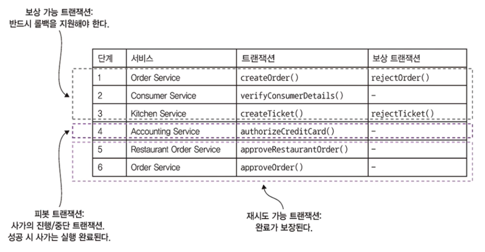

# 4.3 비격리 문제 처리

ACID의 I는 격리성을 의미하며 동시에 실행중인 여러 트랜잭션의 결과가 어떤 순서대로 실행된 결과와 동일함을 보장하는 속성입니다.

사가는 격리성이 빠져 있어 두 가지 문제를 야기합니다.

1. 한 사가가 실행 중에 접근하는 데이터를 도중에 다른 사가가 바꿔치기 할 수 있습니다.
2. 한 사가가 업데이트를 하기 이전 데이터를 다른 사가가 읽을 수 있어서 데이터 일관성이 깨질 수 있습니다.

사가는 사실 ACD 트랜잭션으로 보아야 합니다.

* 원자성(Atomicity) : 사가는 트랜잭션을 모두 완료하거나 모든 변경분을 언두해야 합니다.
* 일관성(Consistency) : 서비스 내부의 참조 무결성은 로컬 DB가 여러 서비스에 걸친 참조 무결성은 서비스가 처리합니다.
* 지속성(Durability) : 로컬 DB로 처리합니다.

격리가 안되면 DB용어로 비정상(anomaly)이 나타날 가능성이 있습니다.

 

## 4.3.1 비정상 개요

비격리로 인한 비정상은 다음과 같이 정리할 수 있습니다.

* 소실된 업데이트(lost updates) : 한 사가의 변경분을 다른 사가가 미처 못 읽고 덮어 씁니다.
* 더티 읽기(dirty reads) : 사가 업데이트를 하지 않은 변경분을 다른 트랜잭션이나 사가가 읽습니다.
* 퍼지/반복 불가능한 읽기(fuzzy/nonrepeatable reads) : 한 사가의 상이한 두 단계가 같은 데이터를 읽어도 결과가 달라지는 현상. 다른 사가가 그 사이 업데이트를 했기 때문에 생기는 문제입니다.

 

### 소실된 업데이트

소실된 업데이트는 한 사가의 변경분을 다른 사가가 덮어 쓸 때 일어납니다.

1. 주문 생성 사가 첫 번째 단계에서 주문을 생성합니다.
2. 사가 실행 중 주문 취소 사가가 주문을 취소합니다.
3. 주문 생성 사가 마지막 단계에서 주문을 승인합니다.

 

### 더티 읽기

한 사가가 업데이트 중인 데이터를 다른 사가가 읽을 때 발생합니다.

소비자들의 신용 한도가 정해져 있고 주문 취소 사가는 다음과 같은 트랜잭션으로 구성됩니다.

* 소비자 서비스 : 신용 잔고를 늘립니다.
* 주문 서비스 : 주문을 취소 상태로 변경합니다.
* 배달 서비스 : 배달을 취소합니다.

주문 취소 사가와 주문 생성 사가의 실행이 서로 겹쳐 실행 중인데, 소비자가 배달을 취소하기는 너무 늦어서 주문 취소 사가가 돌백되는 경우를 생각해 봅시다.

아래와 같이 순서가 엉킬 가능성이 생깁니다.

1. 주문 취소 사가 : 신용 잔고를 늘립니다.
2. 주문 생성 사가 : 신용 잔고를 줄입니다.
3. 주문 취소 사가 : 신용 잔고를 줄이는 보상 트랜잭션이 가동됩니다.

 

## 4.3.2 비격리 대책

앞서 나왔던 *_PENDING 상태도 이상 현상을 예방하는 전략 중 하나입니다.

주문 생성 사가처럼 주문을 업데이트하는 사가는 일단 주문을 *_PENDING 상태로 두고 시작합니다.

 

### 사가의 구조

사가는 다음 세 가지 트랜잭션으로 구성됩니다.

* 보상 가능 트랜잭션 : 보상 트랜잭션으로 롤백 가능한 트랜잭션
* 피봇 트랜잭션 : 사가의 진행/중단 지점. 피봇 트랜잭션이 커밋되면 사가는 완료될 때까지 실행됩니다. 피봇 트랜잭션은 최종 보상 가능 트랜잭션이 될 수도 있고 최초 재시도 가능 트랜잭션이 될 수도 있습니다.
* 재시도 가능 트랜잭션 : 피봇 트랜잭션 직후의 트랜잭션으로 반드시 성공합니다.

 

### 비격리 대책 예시

#### 시맨틱 락

보상 가능 트랜잭션이 생성/수정하는 레코드에 무조건 플래그를 세팅하는 대책입니다.

플래그는 레코드가 아직 커밋 전이라서 변경될지 모른다는 표시를 하는 역할입니다.

플래그를 통해 다른 트랜잭션이 레코드에 접근하지 못하게 락을 걸어놓거나 다른 트랜잭션이 해당 레코드를 처리할 때 조심하도록 경고합니다. 

플래그는 사가가 완료되었을 때는 재시도 가능 트랜잭션에 의해,

사가가 롤백 될 때는 보상 트랜잭션에 의해 해제됩니다.

* 시맨틱 락 : 애플리케이션 수준의 락
* 교환적 업데이트 : 업데이트 작업은 어떤 순서로 실행해도 되게끔 설계합니다.
* 비관적 관점 : 사가 단계 순서를 재조정하여 비즈니스 리스크를 최소화합니다.
* 값 다시 읽기 : 데이터를 덮어 쓸 때 그 전에 변경된 내용은 없는지 값을 다시 읽고 확인하여 더티 쓰기를 방지합니다.
* 버전 파일 : 순서를 재조정할 수 있게 업데이트를 기록합니다.
* 값에 의한 : 요청별 비즈니스 위험성을 기준으로 동시성 메커니즘을 동적 선택합니다.

