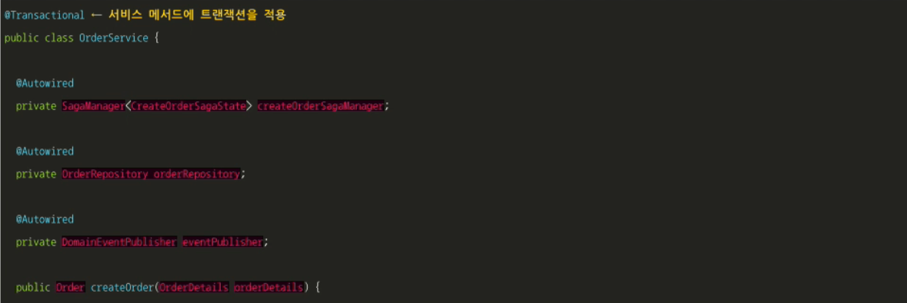

# 4.4 주문 서비스 및 주문 생성 사가 설계

주문 서비스에는 비즈니스 로직이 포함된 OrderService, Order 등의 클래스와 주문 생성 사가를 오케스트레이션하는 CreateOrderSaga 클래스가 있습니다.

핵심 비즈니스 로직은 OrderService, Order, OrderRepository 세 클래스에 있습니다.

사가 오케스트레이터인 주문 서비스는 그 자신이 사가 참여자이기도 한 서비스입니다.

CreateOrderSaga를 비롯하여 여러 사가 오케스트레이터를 거느리고 있습니다.

사가 오케스트레이터는 사가 참여자 프록시 클래스(OrderServiceProxy, KitchenServiceProxy)를 거쳐 사가 참여자에게 커맨드 메세지를 전달합니다.

 

## 4.4.1 OrderService 클래스

OrderService 클래스는 주문 생성/관리를 담당하는 서비스 API 계층이 호출하는 도메인 서비스입니다.

createOrder() 메서드는 먼저 주문을 생성한 후 주문을 검증하기 위해 CreateOrderSaga를 생성합니다.

createOrder()는 정적 팩토리 메서드 Order.createOrder()를 호출하여 Order를 생성한 후 OrderRepository로 Order를 저장합니다.

그리고 새로 저장된 Order 및 OrderDetails의 ID가 포함된 CreateOrderSagaState를 SagaManager.create()에 넘겨 CreateOrderSaga를 생성합니다.

SagaManager가 사가 오케스트레이터 인스턴스를 생성하면 곧바로 첫 번째 사가 참여자에게 커맨드 메세지가 전달되고 사가 오케스트레이터를 DB에 저장합니다s

아래 이미지는 CreateOrderSaga 및 관련 클래스들입니다.

