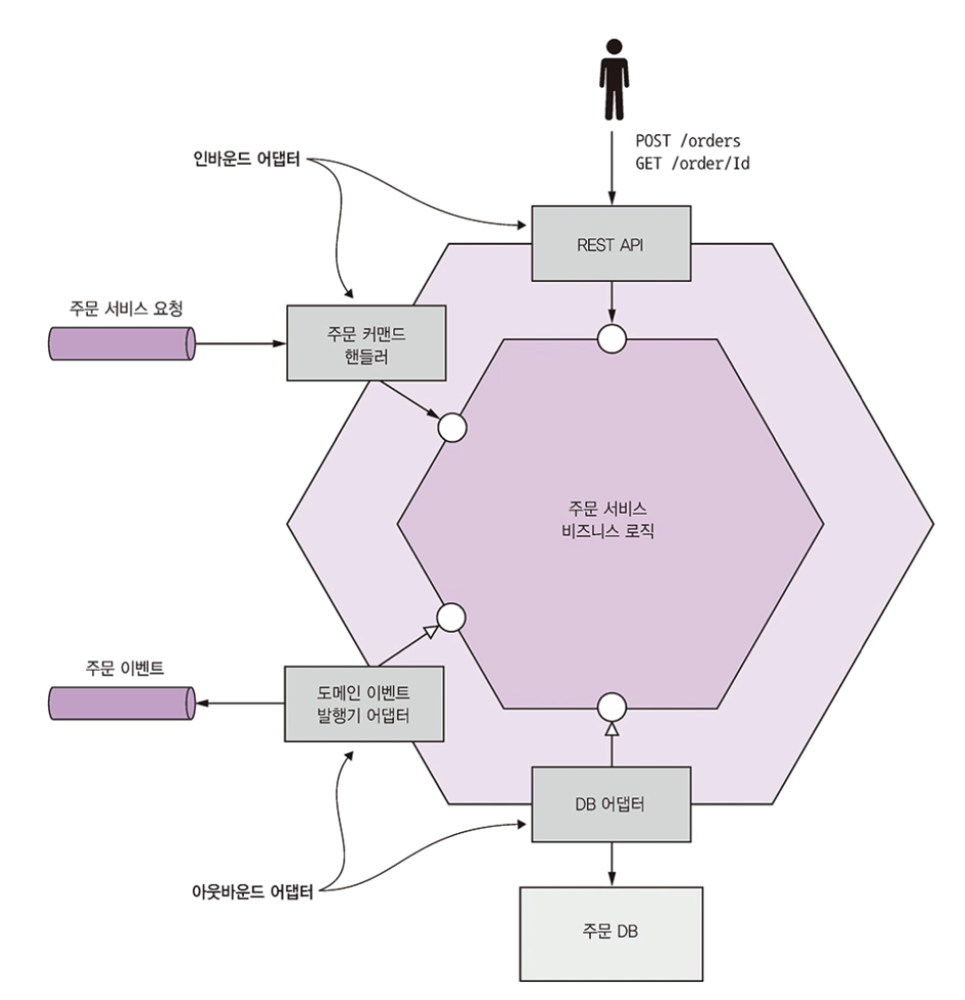
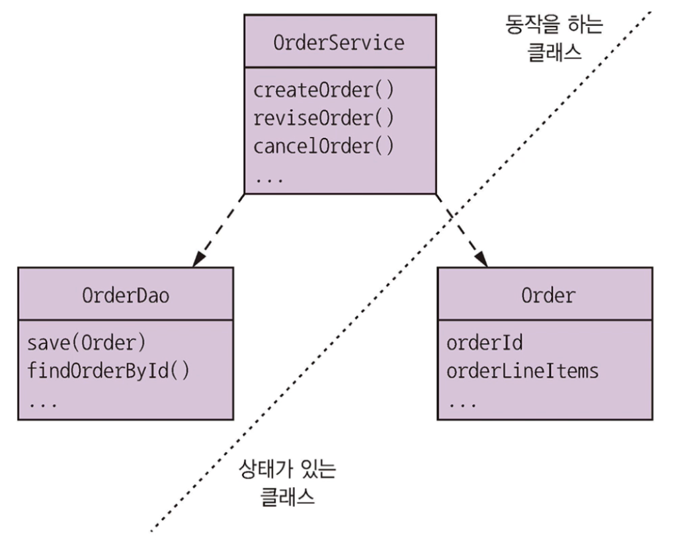
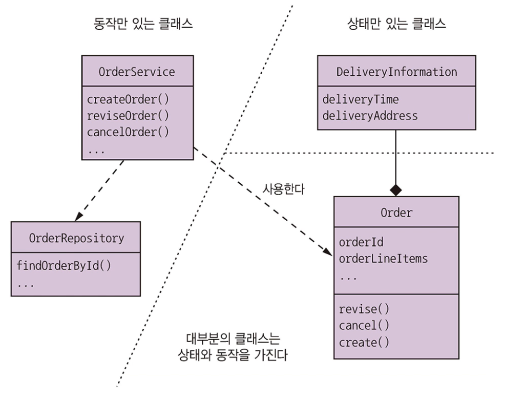

# 5.1 비즈니스 로직 구성 패턴

비즈니스 로직이 여러 서비스에 흩어져 있는 MSA는 복잡한 비즈니스 로직을 개발하기가 까다롭습니다.

까다로운 이유는 크게 두 가지입니다.

* 도메인 모델은 대부분 상호 연관된 클래스가 거미줄처럼 뒤얽혀 있습니다.
* MSA 특유의 트랜잭션 관리 제약 조건하에서도 작동하는 비즈니스 로직을 설계해야 합니다.

해당 문제는 서비스 비즈니스 로직을 여러 애그리거트로 구성하는 DDD aggregate 패턴으로 해결할 수 있습니다.

aggregate는 한 단위로 취급 가능한 객체를 모아 놓은 것입니다.

MSA에서 비즈니스 로직을 개발할 때에는 다음 두 가지 이유로 aggregate가 요긴하게 쓰입니다.

* 애그리거트를 사용하면 객체 레퍼런스가 서비스 경계를 넘나들 일이 없습니다. 객체 참조 대신 기본키를 이용하여 aggregate가 서로 참조하기 때문입니다.
* 한 트랜잭션으로 하나의 aggregate만 생성/수정할 수 있습니다. 따라서 aggregate는 microservice 트랜잭션 모델의 제약 조건에 잘 맞습니다.

 

주문 서비스는 중심에 비즈니스 로직이 있고 인바운드/아웃바운드 어댑터가 주변을 감싼 육각형 아키텍쳐 구조입니다.

인바운드 어댑터는 클라이언트 요청을 받아 비즈니스 로직을 호출하고, 비즈니스 로직은 다시 아웃바운드 어댑터를 호출하여 다른 서비스 및 애플리케이션을 실행합니다.

주문 서비스는 비즈니스 로직과 다음 어댑터로 구성됩니다.

* REST API 어댑터 : 비즈니스 로직을 호출하는 REST API가 구현된 인바운드 어댑터
* OrderCommandHandlers : 메세지 채널에서 들어온 커맨드 메세지를 받아 비즈니스 로직을 호출하는 인바운드 어댑터
* DB 어댑터 : 비즈니스 로직이 DB 접근을 위해 호출하는 아웃바운드 어댑터
* 도메인 이벤트 발행 어댑터 : 이벤트를 메세지 브로커에 발행하는 아웃바운드 어댑터

비즈니스 로직은 절차적 트랜잭션 스크립트 패턴과 객체 지향적 도메인 모델 패턴, 두가지 패턴으로 구성합니다.

 

## 5.1.1 비즈니스 로직 설계: 트랜잭션 스크립트 패턴

객체 지향 접근 방식이 좋지만 간단한 비즈니스 로직을 개발하는 경우 절차적인 코드를 작성하는 것이 합리적입니다.

객체 지향 설계를 하지 않고 트랜잭션 스크립트라는 메서드를 작성하여 표현 계층에서 들어온 요청을 처리하는 것입니다.

이 방법은 동작이 구현된 클래스와 상태를 보관하는 클래스가 따로 존재하는 중요한 특징이 있습니다.

 

## 5.1.2 비즈니스 로직 설계: 도메인 모델 패턴

절차적 접근 방식은 클래스를 어떻게 구성할지 고민하지 않고 단순하게 코딩할 수 있는 매력이 있지만, 비즈니스 로직이 복잡해지면 거의 관리 불가한 상태로 악화됩니다.

객체 지향적으로 설계한 비즈니스 로직은 비교적 작은 클래스가 그물망처럼 얽힌 객체 모델로 구성됩니다.

이런 클래스는 제각기 문제 영역 개념에 직접 대응됩니다.

상태, 동작 둘 중 하나만 있는 클래스도 있지만 대부분은 상태/동작 모두 갖고 있습니다.

이것이 잘 설계된 클래스의 특징입니다.

트랜잭션 스크립트 패턴을 적용하면 OrderService 클래스는 각 요청 및 시스템 작업마다 하나의 메서드를 갖게 두지만, 도메인 모델 패턴을 적용하면 서비스 메서드가 단순해집니다.

서비스 메서드가 거의 항상 비즈니스 로직이 잔뜩 포함된 영속화 도메인 객체에 위임하기 때문입니다.

서비스 메서드는 DB에서 도메인 객체를 로드하고 메서드들 중 하나를 호출합니다.

 

객체 지향 설계를 하면 여러모로 좋은 점이 많습니다.

1. 설계를 이해/관리하기 쉽습니다. 만사를 광장하는 하나의 거대한 클래스 대신 소수의 책임만 맡은 아담한 여러 클래스들로 구성되기 때문입니다.
2. 테스트하기 쉽습니다. 각 클래스는 독립적으로 테스트할 수 있습니다.
3. 잘 알려진 설계 패턴을 응용할 수 있기 때문에 확장하기 쉽습니다.

 

## 5.1.3 도메인 주도 설계 개요

Domain-Driven-Design는 복잡한 비즈니스 로직을 개발하기 OOD를 개선한 접근 방식입니다.

DDD 방식으로 설계하면 각 서비스는 자체 도메인 모델을 가지며, 애플리케이션 전체 도메인 모델의 문제점을 방지할 수 있습니다.

하위 도메인과 이와 연관된 경계 컨텍스트 개념은 DDD 패턴의 양대 전략입니다.

* 엔터티 : 영속적 신원을 가진 객체. 두 엔터티가 속성 값이 동일해도 엄연히 다른 객체입니다. 자바 언어는 클래스에 JPA @Entity를 붙여 DDD 엔터티를 나타냅니다.
* 밸류 객체 : 여러 값을 모아 놓은 객체. 속성 값이 동일한 두 밸류 객체는 서로 바꾸어 사용할 수 있습니다.(예: 통화와 금액으로 구성된 Money 클래스)
* 팩토리 : 일반 생성자로 직접 만들기에 복잡한 객체 생성 로직이 구현된 객체 또는 메서드. 인스턴스로 생성할 구상 클래스를 감출 수 있으며, 클래스의 정적 메서드로 구현할 수 있습니다.
* 리포지터리 : 엔터티를 저장하는 DB 접근 로직을 캡슐화한 객체
* 서비스 : 엔터티, 밸류 객체에 속하지 않은 비즈니스 로직 구현 객체

