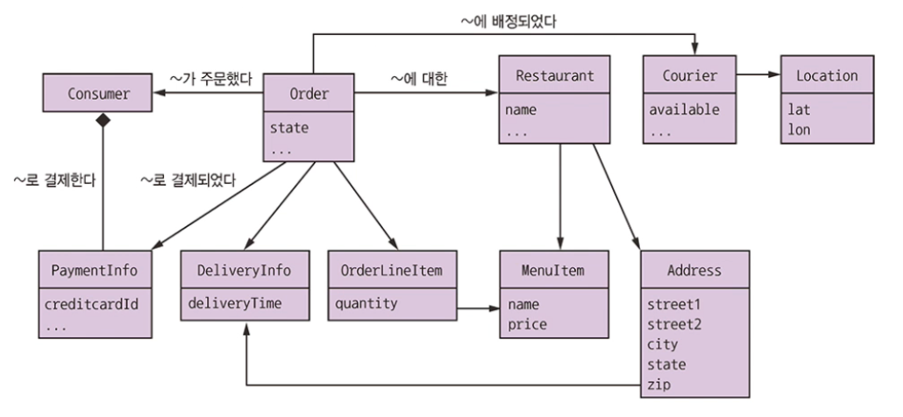
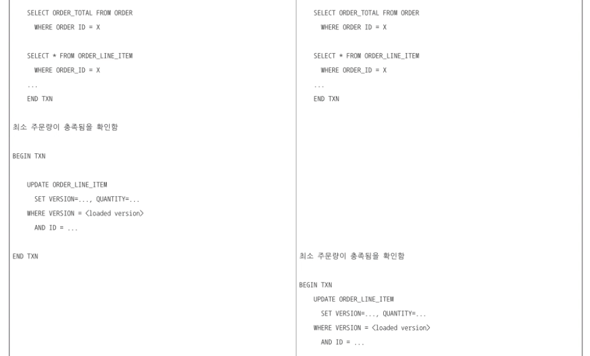
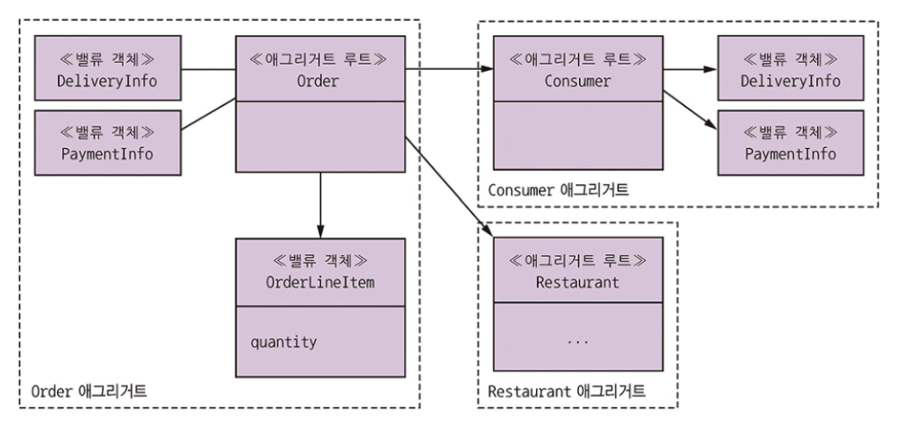
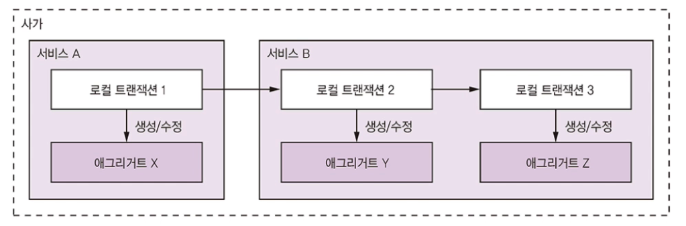
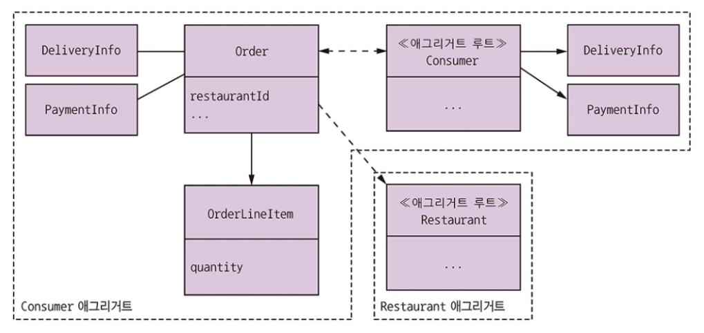
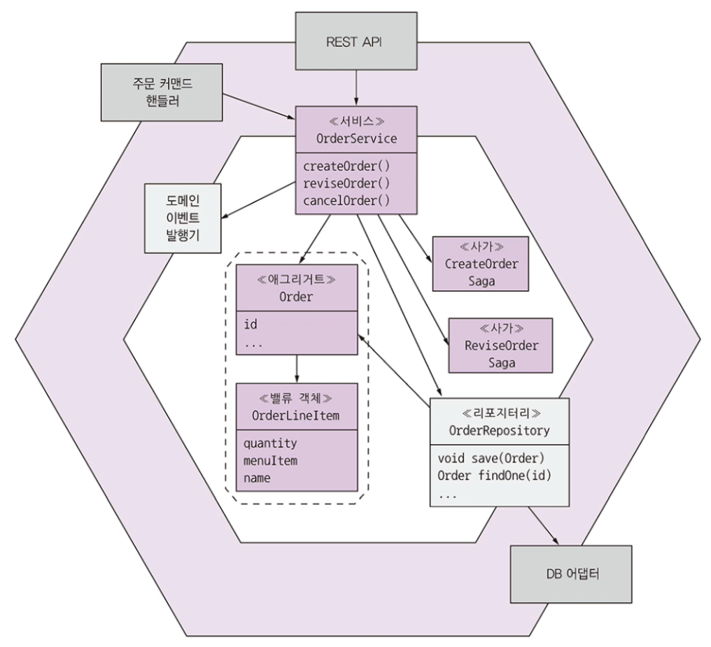

# 5.2 도메인 모델 설계: DDD 애그리거트 패턴

전통적인 객체 지향 설계에 기반한 도메인 모델은 클래스와 클래스 간 관계를 모아 놓은 것입니다.

이럴 경우, 기존 도메인 모델을 보면 비즈니스 객체들의 경계가 불분명합니다.

예를 들면 어느 클래스가 Order라는 비즈니스 객체의 일부인지 분명하지 않습니다.

경계가 불분명하면 MSA에서 문제가 생길 가능성이 높습니다.

 

## 5.2.1 불분명한 경계 문제

여러 소비자가 주문하는 상황에서 최소 주문량의 충족 여부를 어떻게 보장할 수 있을까요?

셈과 메리라는 두 소비자가 주문을 하는 동시에 주문이 본인의 예산을 초과했는지 결정한다고 합시다.

샘은 사모사를, 메리는 난을 주문합니다.

애플리케이션 관점에서 두 소비자는 DB에서 주문 및 품목을 조회합니다.

두 사람은 주문 단가를 낮추기 위해 품목을 수정하고, 각자 입장에서 보면 최소 주문량은 충족됩니다.

DB 트랜잭션은 다음 순서대로 갈겁니다.

왼쪽이 메리, 오른쪽이 샘입니다.

두 소비자는 두 트랜잭션을 통해 품목을 변경합니다.

첫 번째 트랜잭션은 주문 및 품목을 로드하고, UI는 두번 째 트랜잭션 이전에 최소 주문량이 충족됨을 확인합니다.

두 번째 트랜잭션은 낙관적 오프라인 락으로 품목을 업데이트합니다.

 

샘은 X만큼, 메리는 Y만큼 주문 총액을 줄입니다.

결국 이 Order는 더 이상 유효하지 않습니다.

> 왜 유효하지 않은거지? 주문 총액을 줄여서? 근데 왜 두번째 트랜잭션 전에 UI에서 확인을 하지? 당연히 끝나고 해야하는거 아닌가? Order ID가 어떻게 둘이 같을 수 있지?

하지만 두 소비자가 업데이트한 후에도 애플리케이션은 이 주문이 최소 주문량 조건을 충족한다고 볼 것입니다.

이처럼 비즈니스 객체 일부를 직접 업데이트하면 결과적으로 비즈니스 규칙을 위반하게 됩니다.

 

## 5.2.2 aggregate는 경계가 분명하다

aggregate는 한 단위로 취급 가능한 경계 내부의 도메인 객체들입니다.

하나의 루트 엔터티와 하나 이상의 기타 엔터티 + 밸류 객체로 구성됩니다.

비즈니스 객체는 대부분 aggregate로 모델링합니다.

아래 그림은 Order aggregate와 그 경계입니다.

하나의 Order 엔터티와 하나 이상의 OrderLineItem 밸류 객체, 그 밖에 DeliveryInfo, PaymentInfo 등의 밸류 객체로 구성됩니다.

aggregate는 도메인 모델을 개별적으로 이해하기 쉬운 덩어리로 분해합니다.

또 로드, 수정, 삭제 같은 작업 범위를 분명하게 설정합니다.

작업은 aggregate 일부가 아닌 전체 aggregate에 적용합니다.

aggregate는 보통 DB에서 통째로 가져오기 때문에 복잡한 지연 로딩 문제를 신경쓸 필요가 없습니다.

그리고 aggregate를 삭제하면 해당 객체가 DB에서 모두 사라집니다.

 

### aggregate는 일관된 경계

일부가 아니라 전체 aggregate를 업데이트하므로 일관성 문제가 해소됩니다.

예를 들어 클라이언트가 직접 품목 수량을 수정할 수 없고 반드시 주문 aggregate 루트에 있는 메서드를 호출해야 하기 때문에 최소 주문량 같은 불변 값이 강제되는 원리입니다.

하지만 그렇다고 DB에 있는 전체 aggregate를 업데이트할 필요는 없습니다.

Order 객체와 수정된 OrderLineItem에 해당하는 로우만 업데이트할 수도 있습니다.

 

### aggregate를 식별하는 일이 관건

DDD 도메인 모델 셀계의 핵심은 aggregate와 그 경계, 그리고 루트를 식별하는 것입니다.

aggregate의 내부 상세 구조는 부차적인 문제입니다.

그러나 aggregate는 정해진 규칙을 반드시 준수해야 하기 때문에 도메인 모델의 모듈화뿐만 아니라 장점이 무궁무진합니다.

 

## 5.2.3 aggregate 규칙

aggregate는 몇 가지 지켜야할 규칙이 있습니다.

이런 규칙들 덕분에 aggregate는 자신의 불변 값을 강제하는 자기 완비형 단위가 됩니다.

 

### 규칙 #1: aggregate루트만 참조하라

위 예제에서 OrderLineItem를 직접 건드리면 왜 위험한지 설명했습니다.

이 문제를 근본적으로 방지하려면 무엇보다 외부 클래스는 반드시 aggregate의 루트 엔터티만 참조할 수 있게 제한해야 합니다.

따아서 클라이언트는 aggregate 루트 메서드만 호출해서 aggregate를 업데이트할 수 있습니다.

 

### 규칙 #2: aggregate간 참조는 반드시 기본키를 사용하라

aggregate는 객체 레퍼런스 대신 기본키로 서로를 참조해야 합니다.

객체 레퍼런스 대신 신원을 사용하면 aggregate는 느슨하게 결합되고 aggregate간 경계가 분명해지기 때문에 혹여 실수로 다른 aggregate를 업데이트할 일은 일어나지 않습니다.

또 aggregate가 다른 서비스의 일부인 경우에도 여러 서비스에 걸친 객체 레퍼런스 문제는 없습니다.

 

### 규칙 #3: 하나의 트랜잭션으로 하나의 aggregate를 생성/수정하라

하나의 트랜잭션으로 오직 하나의 aggregate만 생성/수정해야 합니다.

MSA와 잘 맞을 뿐 아니라 대다수 NoSQL DB의 제한된 트랜잭션 모델과도 잘 어울립니다.

트랜잭션을 확실하게 서비스 내부에 담을 수 있기 때문입니다.

단 이 규칙을 준수하려면 여러 aggregate를 생성/수정하는 작업을 구현하기가 조금 복잡해집니다.

하지만 사가를 사용하면 사가의 각 단계는 정확히 aggregate 하나를 생성/수정합니다.

 

## 5.2.4 aggregate 입도

도메인 모델에서 각 aggregate의 크기를 결정하는 일은 매우 중요합니다.

aggregate는 작을수록 좋습니다.

잘게 나뉘어져 있으면 그만큼 애플리케이션이 동시 처리 가능한 요청 개수가 늘고 확장성이 좋아집니다.

하지만 aggregate 자체가 곧 트랜잭션의 범위라서 어떤 업데이트를 원자적으로 처리하려면 aggregate를 크게 잡아야 할 수도 있습니다.

앞서 주문, 소비자를 개별 aggregate로 분리했지만 아래와 같이 주문 aggregate를 소비자 aggregate의 일부로 설계하는 방법도 있습니다.

하지만 두 사용자가 동일한 고객의 다른 주문을 고치려고 하면 충돌이 날 것입니다.

또한 MSA에서 분해의 걸림돌이 될 수 있습니다.

 

## 5.2.5 비즈니스 로직 설계: aggregate

MSA 비즈니스 로직은 대부분 aggregate로 구성됩니다.

나머지는 도메인 서비스와 사가에 위치합니다.

사가는 로컬 트랜잭션을 오케스트레이션하여 데이터 일관성을 맞추고, 인바운드 어댑터는 비즈니스 로직의 진입점인 서비스를 호출합니다.

서비스는 리포지터리로 DB에서 aggregate를 조회하거나 DB에 aggregate를 저장합니다.

리포지터리는 각각 DB에 접근하는 아웃바운드 어댑터로 구현합니다.

비즈니스 로직은 Order Aggregate, OrderService, OrderRepository, 하나 이상의 사가들로 구성됩니다.

OrderService는 OrderRepository를 이용하여 Order를 조회/저장합니다.

주문 서비스에 국한된 간단한 요청은 Order Aggregate를 직접 업데이트하고 여러 서비스에 걸친 업데이트 요청은 사가를 생성하여 처리합니다.
