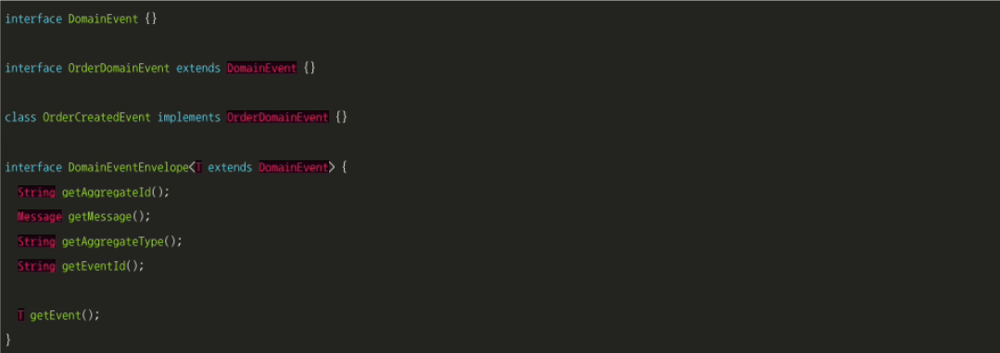
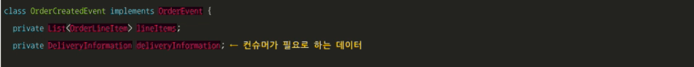
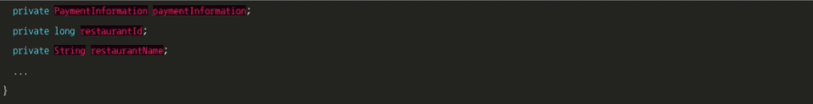
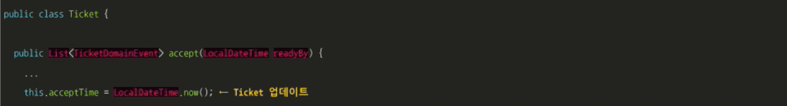
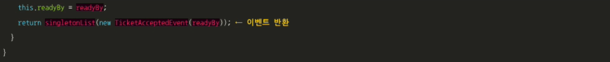
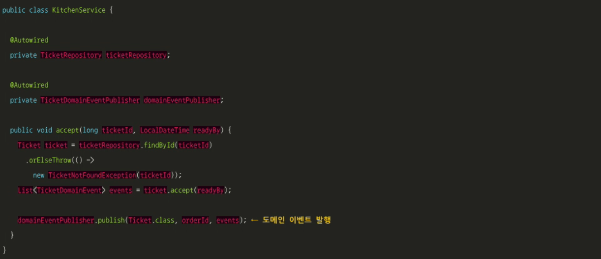

# 5.3 도메인 이벤트 발행

메리엄-웹스터 사전에서 이벤트라는 단어를 찾아보면 다음과 같이 씌어 있습니다.

1. Something that happens : 뭔가 일어난 것
2. A noteworthy happening : 주목할 만한 사건
3. A social occasion or activity : 사교적 행사나 활동
4. An adverse or damaging medical occurrence, A heart attack or other cardiac event : 건강에 안 좋거나 손상을 일으키는 의료 사고

DDD 맥락에서 도메인 이벤트는 aggregate에 발생한 사건입니다.

도메인 이벤트는 모데인 모델에서는 클래스로 표현되며 대부분 어떤 상태 변경을 나타냅니다.

Order aggregate라면 주문 생성됨, 주문 취소됨, 주문 배달됨 등 상태가 바뀌는 이벤트가 발생합니다.

aggregate는 상태가 전이될 때마다 이에 관련된 컨슈머를 위해 이벤트를 발행합니다.

 

## 5.3.1 변경 이벤트를 발행하는 이유

다른 구성원들이 aggregate의 상태 변경을 궁금해 하기 때문에 도메인 이벤트는 유용합니다.

다음과 같은 상황을 생각해 볼 수 있습니다.

* 코레오그래피 사가를 이용하여 여러 서비스에 걸쳐 데이터 일관성을 유지합니다.
* 레플리카를 둔 서비스에 소스 데이터가 변경되었음을 알립니다. 7장에서 설명할 CQRS라는 기법입니다.
* 미리 등록된 웹훅이나 메세지 브로커를 통해 비즈니스 프로세스의 다음 단계를 진행하도록 다른 애플리케이션에 알립니다.

* 기타 등등

애플리케이션 DB에서의 aggregate 상태 전이가 이 모든 상황에서 알림을 트리거하는 장본인입니다.

 

## 5.3.2 도메인 이벤트란 무엇인가?

도메인 이벤트는 과거 분사형 동사로 명명한 클래스입니다.

이벤트에 의미를 부여하는 프로퍼티가 있는데, 프로퍼티는 원시 값(primitive value) 또는 밸류 객체(value object)입니다.

OrderCreated 이벤트 클래스에는 orderId 프로퍼티가 있습니다.

도메인 이벤트에는 대부분 이벤트 ID, 타임스탬프 같은 메타데이터도 있습니다.

변경을 일으킨 사용자 신원 정보를 넣기도 하는데 감사(audit) 용도로 좋습니다.

메타데이터는 상위 클래스에 정의된 이벤트 객체의 일부이거나, 이벤트 객체를 감싼 엔벨로프 객체에 있습니다.

이벤트를 발생시킨 aggregate ID는 특정 이벤트 프로퍼티가 아닌 엔벨로프의 일부일 수 있습니다.

 

OrderCreatedEvent도 도메인 이벤트입니다.

주문 ID가 이벤트 엔벨로프의 일부이기 때문에 필드가 하나도 없습니다.

DomainEvent 인터페이스는 자신을 구현한 클래스가 도메인 이벤트임을 알리는 마커 인터페이스입니다.

이 인터페이스를 상속한 OrderDomainEvent는 Order aggregate가 발행한 OrderCreatedEvent의 마커 인터페이스입니다.

DomainEventEnvelope에는 이벤트 객체 및 메타데이터를 조회하는 메서드가 있습니다.

이 인터페이스는 DomainEvent를 상속한 매개변수화 객체를 받습니다.

 

## 5.3.3 이벤트 강화

주문 이벤트를 처리하는 컨슈머를 작성한다고 합시다.

발생한 일은 OrderCreateEvent 클래스에 고스란히 담겨 있지만, 이벤트 컨슈머가 이 이벤트를 받아 처리하려면 주문 내역이 필요합니다.

필요한 정보르 OrderService에서 직접 가져와도 되지만, 이벤트 컨슈머가 서비스를 쿼리해서 aggregate를 조회하는 것은 오버헤드를 유발합니다.

그래서  컨슈머에 필요한 정보를 이벤트가 갖고 다니는 이벤트 강화(event enrichment) 기법을 적용합니다.

이벤트를 발행한 서비스를 다시 쿼리해서 데이터를 가져올 필요가 없으니 이벤트 컨슈머가 아주 간단해집니다.

아래 예제와 같이 Order aggregate는 주문 내역까지 OrderCreatedEvent에 넣어 강화할 수 있습니다.

상세한 주문 내역이 이미 OrderCreatedEvent에 있기 때문에 이제 주문 이력 서비스 같은 이벤트 컨슈머는 따로 데이터를 조회할 필요가 없습니다.

 

이벤트 강화 기법은 컨슈머를 단순화하는 이점이 있지만, 컨슈머 요건이 바뀌면 이벤트 클래스도 함께 바뀌어야 하므로 이벤트 클래스의 안정성은 떨어집니다.

변경할 일이 생기면 애플리케이션 곳곳에 영향이 있을 수 있으니 유지보수성도 나빠지겠죠.

모든 컨슈머를 전부 만족시킬 수는 없습니다.

다행히 대부분의 경우는 이벤트 안에 포함시켜야 할 프로퍼티가 명백합니다.

 

## 5.3.4 도메인 이벤트 식별

도메인 이벤트는 여러 가지 방법으로 식별할 수 있습니다.

요건 정의서는 알림이 필요한 사니리오를 "X가 일어나면 Y를 수행하라." 라는 식으로 보통 기술합니다.

FTGO 애플리케이션도 "주문이 접수되면 소비자에게 이메일을 전송하라." 라는 요건이 있을 것입니다.

알림 요건은 곧 도메인 이벤트가 필요하다는 뜻입니다.

 

요즘은 이벤트 스토밍이라는 방법을 많이 사용하는 추세입니다.

복잡한 도메인을 이해하기 위해 이벤트 중심으로 위크숍을 하는 것입니다.

이벤트 소토밍은 다음 3단계를 거칩니다.

1. 이벤트 브레인스토밍 : 도메인 이벤트를 머리 속에서 쥐어 짜냅니다. 오렌지색 점착식 메모지로 구분된 도메인 이벤트를 모델링 화면에 대략 그려 놓은 타임라인에 배치합니다.
2. 이벤트 트리거 식별 : 각각의 이벤트를 일으키는 트리거를 식별합니다.
   * 사용자 액션 : 파란색 점착식 메모지로 커맨드를 표시
   * 외부 시스템 : 자주색 점착식 메모지로 표시
   * 기타 도메인 이벤트
   * 시간 경과
3. aggregate 식별 : 각 커맨드 소비 후 적절한 이벤트를 발생시키는 aggregate를 식별해서 노란색 점착식 메모지로 표시합니다.

 

## 5.3.5 도메인 이벤트 생성 및 발행

도메인 이벤트를 이용한 통신은 비동기 메세징 형태를 취하지만 비즈니스 로직이 도메인 이벤트를 메세지 브로커에 발행하려면 먼저 도메인 이벤트를 생성해야 합니다.

### 도메인 이벤트 생성

개념적으로 도메인 이벤트는 aggregate가 발행합니다.

aggregate는 자신의 상태가 변경되는 시점과 그 결과 어떤 이벤트를 발행할지 알고 있습니다.

 

aggregate와 호출하는 서비스의 책임을 분리하는 것이 좋습니다.

서비스는 디펜던시를 주입하여 메세징 API를 가리키는 레퍼런스를 획득할 수 있으므로 이벤트를 발행하기가 더 쉽습니다.

aggregate는 상태 전이 시 이벤트를 생성하고, 이렇게 생성한 이벤트를 두 가지 방법으로 서비스에 반환합니다.

서비스는 aggregate 루트 메서드를 호출한 후 이벤트를 발행합니다.

Kitchenservice는 Ticket.accept()를 호출합니다.

accept()는 DB에서 TicketRepository로 Ticket을 가져온 후 다시 Ticket.accept()로 Ticket을 업데이트합니다.

그런 다음 TicketDomainEventPublisher.publish()를 호출하여 Ticket이 반환한 이벤트를 발행합니다.
