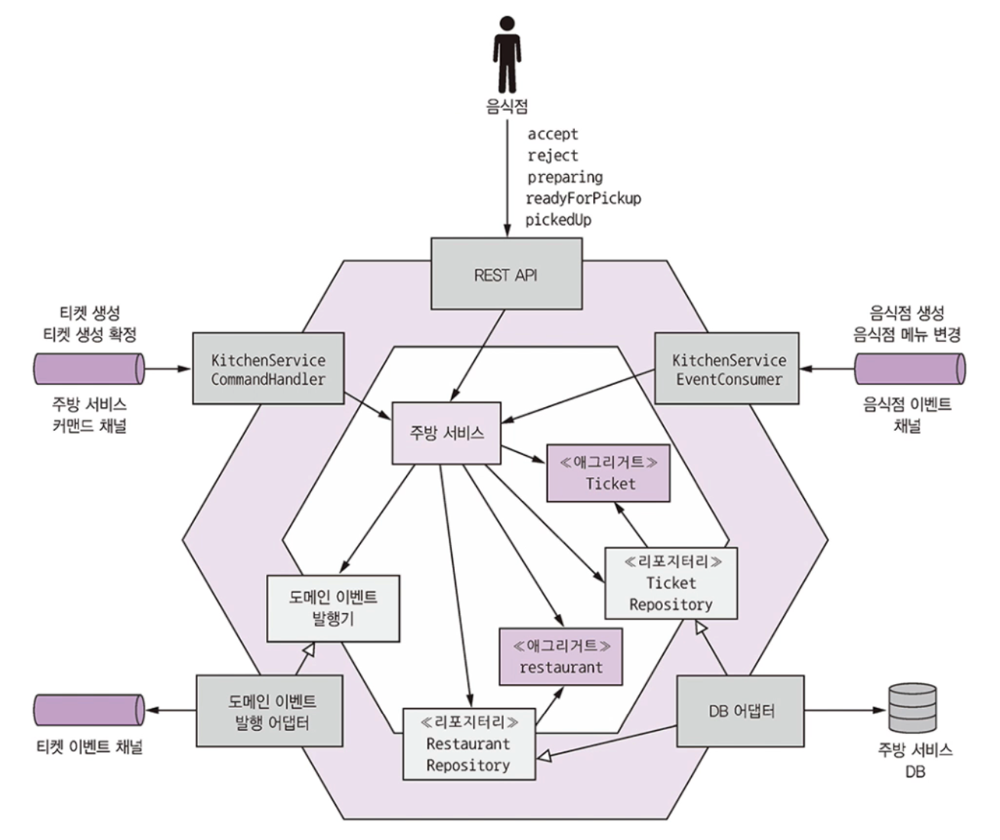
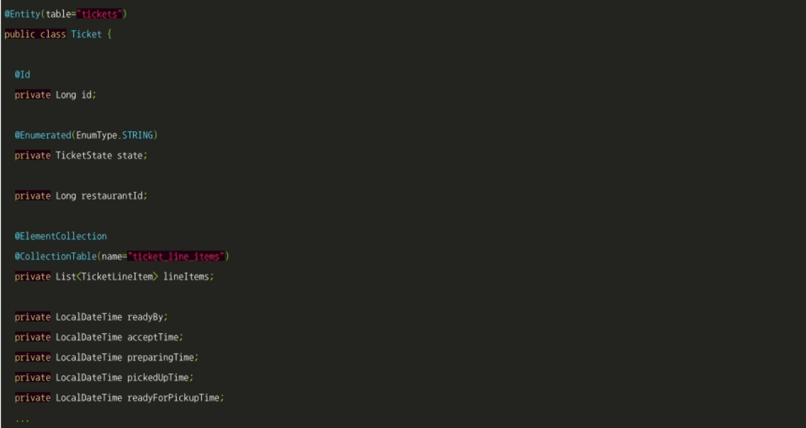
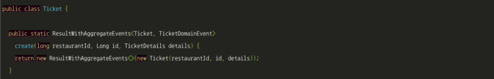
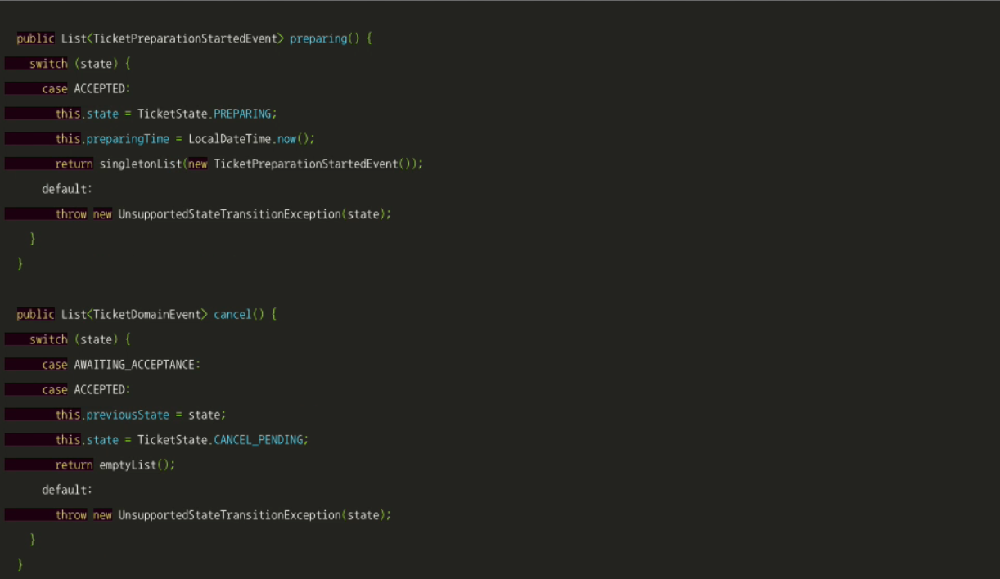
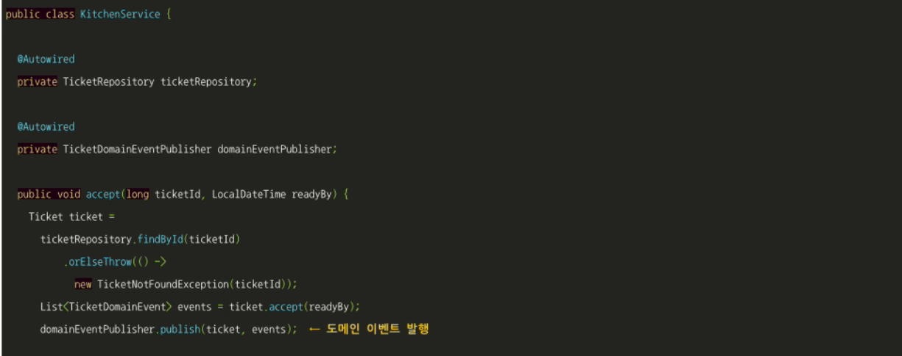
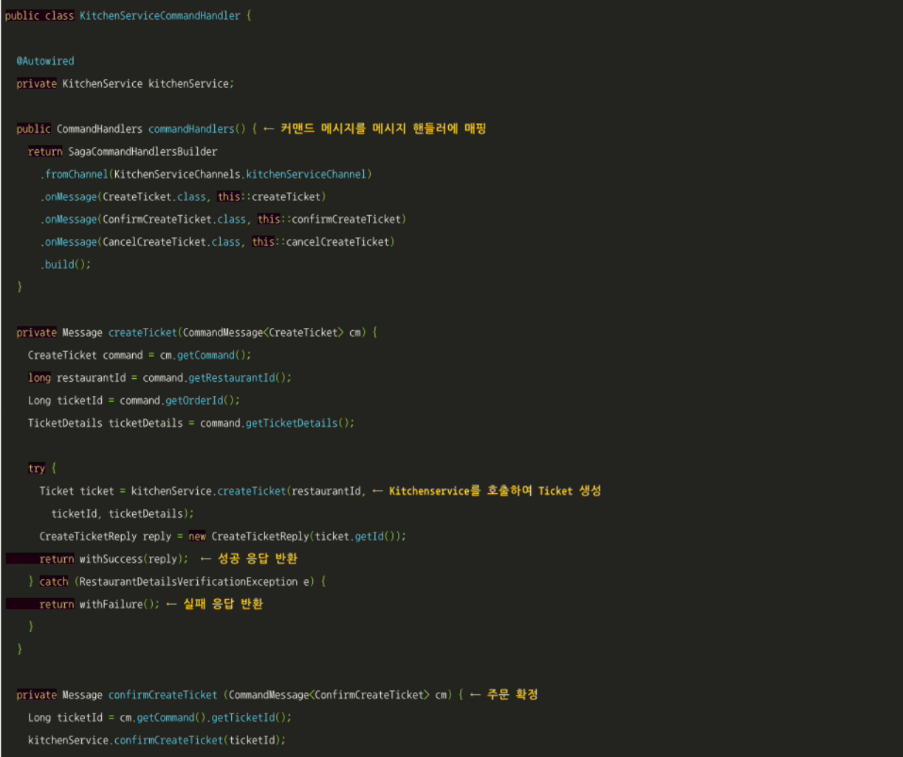

# 5.4 주방 서비스 비즈니스 로직

주방 서비스는 음식점이 주문을 관리할 수 있게 해주는 서비스입니다.

Restaurant aggregate와 Ticket aggregate는 이 서비스의 메인 aggregate입니다.

Restaurant aggregate는 음식점 메뉴 및 운영 시간을 알고 있는 상태에서 주문을 검증할 수 있습니다.

티켓은 배달원이 픽업할 수 있게 음식점이 미리 준비해야 할 주문을 나타냅니다.

 

주방 서비스에는 aggregate말고도 주요 비즈니스 로직이 있습니다.

비즈니스 로직의 진입점인 KitchenService에는 Restaurant와 Ticket aggregate를 생성/수정하는 메서드가 있습니다.

TicketRepository, RestaurantRepository에는 각각 Ticket, Restaurant를 저장하는 메서드가 있습니다.

주방 서비스에는 인바운드 어댑터가 3개 있습니다.

* REST API : 음식점 점원이 사용하는 UI가 호출하는 REST API. KitchenService를 호출하여 Ticket을 생성/수정합니다.
* KitchenServiceCommandHandler : 사가가 호출하는 비동기 요청/응답 API. KitchenService를 호출하여 Ticket을 생성/수정합니다.
* KitchenServiceEventHandler : RestaurantService가 발행한 이벤트를 구독합니다. KitchenService를 호출하여 Restaurant을 생성/수정합니다.

아웃바운드 어댑터는 2개입니다.

* DB 어댑터 : TicketRepository, RestaurantRepository 인터페이스를 구현하여 DB에 접근합니다.
* DomainEventPublishingAdater : DomainEventPublisher 인터페이스를 구현하여 Ticket 도메인 이벤트를 발행합니다.

 

## 5.4.1 Ticket aggregate

Ticket aggregate는 음식점 주방 관점에서 바라본 주문을 나타낸 것입니다.

신원, 배달 정보, 지불 내역 등 소비자와 관련된 정보는 하나도 없고 오직 음식점 주방이 배달원이 픽업할 주문을 준비하는 데에만 집중합니다.

KitchenService는 따로 Ticket aggregate ID를 생성하지 않고 OrderService가 전달한 ID를 그대로 사용합니다.

restaurantId는 Restaurant 객체를 가르키는 레퍼런스가 아닌 그냥 Long형 필드입니다.

 

### Ticket aggregate 동작

Ticket aggregate는 Ticket을 생성하는 정적 팩토리 메서드 create()를 비롯하여 음식점이 주문 상태를 업데이트하기 위해 호출하는 메서드를 여럿 갖고 있습니다.

* accept() : 음식점이 주문을 접수했습니다.
* preparing() : 음식점이 주문을 준비하기 시작했습니다. 따라서 주문은 더 이상 변경/취소 불가능합니다.
* readyForPickup() : 주문 픽업 준비가 끝났습니다.

 

### KitchenService 도메인 서비스

KitchenService는 주방 서비스의 인바운드 어댑터가 호출합니다.

주문 상태를 변경하는 accept(), reject(), preparing() 등의 메서드는 각각 aggregate를 가져와 aggregate 주문상태를 변경하는 메서드는 각각 aggregate를 가져와 aggregate 루트에 있는 해당 메서드를 호출한 후 도메인 이벤트를 발행합니다.

accept()는 음식점에서 새 주문을 접수할 때 다음 두 매개변수를 전달받아 호출됩니다.

* orderId : 접수한 주문 ID

* readyBy : 주문 픽업 준비가 끝날 것으로 예상되는 시간

 

### KitchenserviceCommandHandler 클래스

KitchenserviceCommandHandler 클래스는 주문 서비스에 구현된 사가가 전송한 커맨드 메세지를 처리하는 어댑터입니다.

KitchenService를 호출하여 Ticket을 생성/수정하는 핸들러 메서드가 커맨드별로 정의되어 있습니다.

