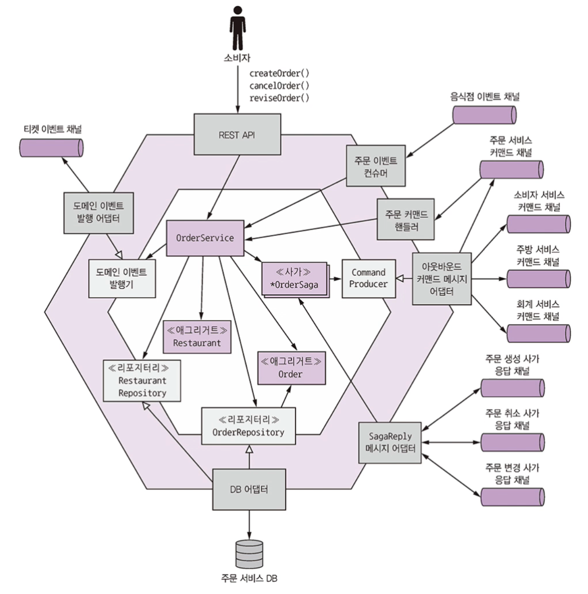
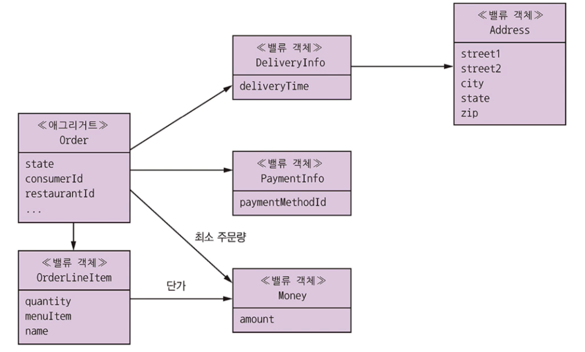
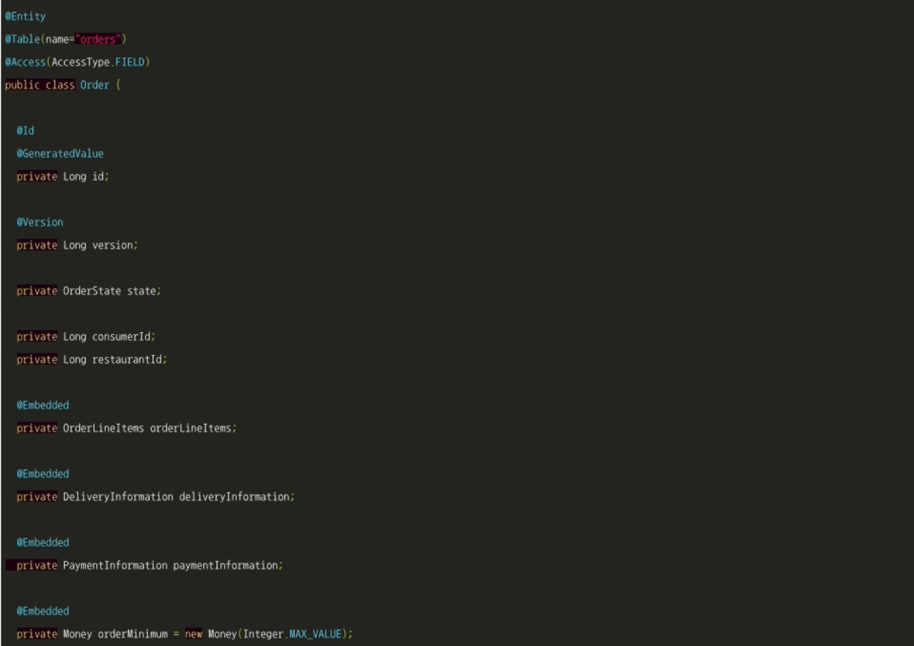
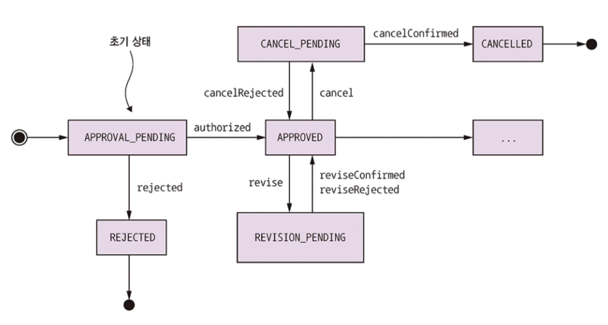
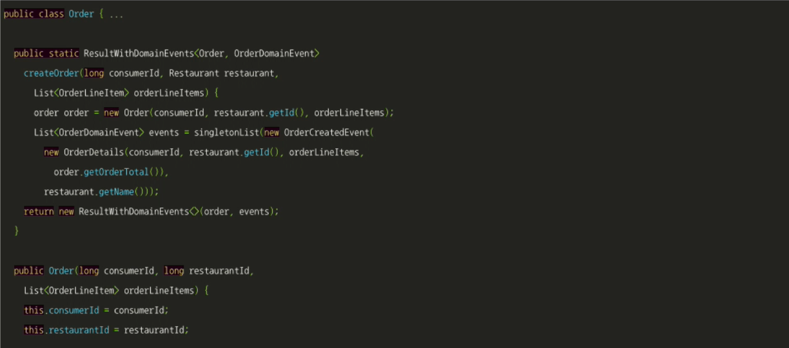
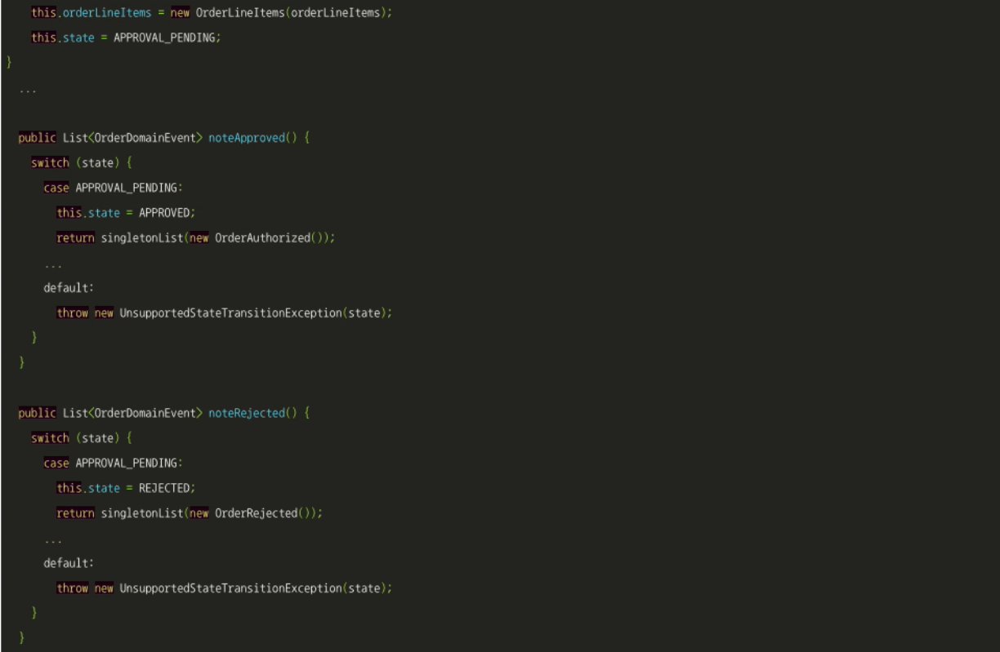
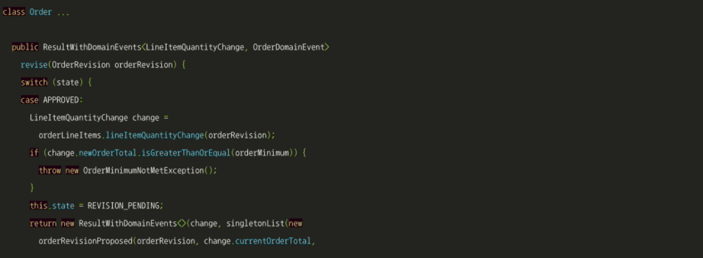
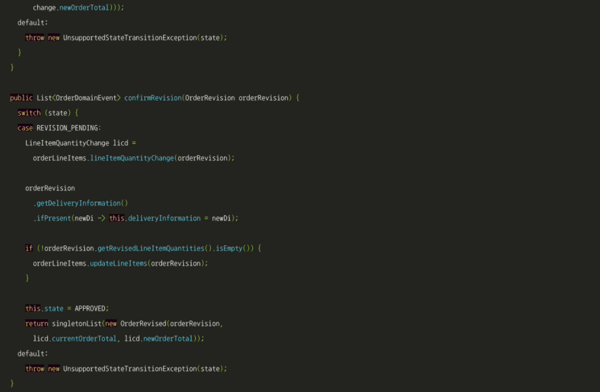
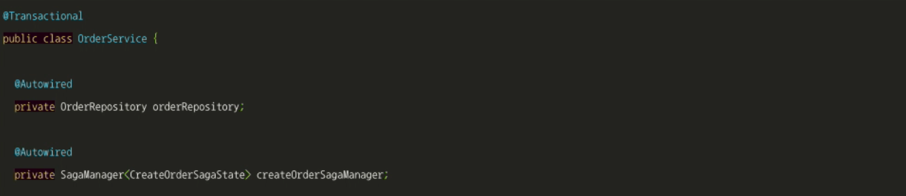
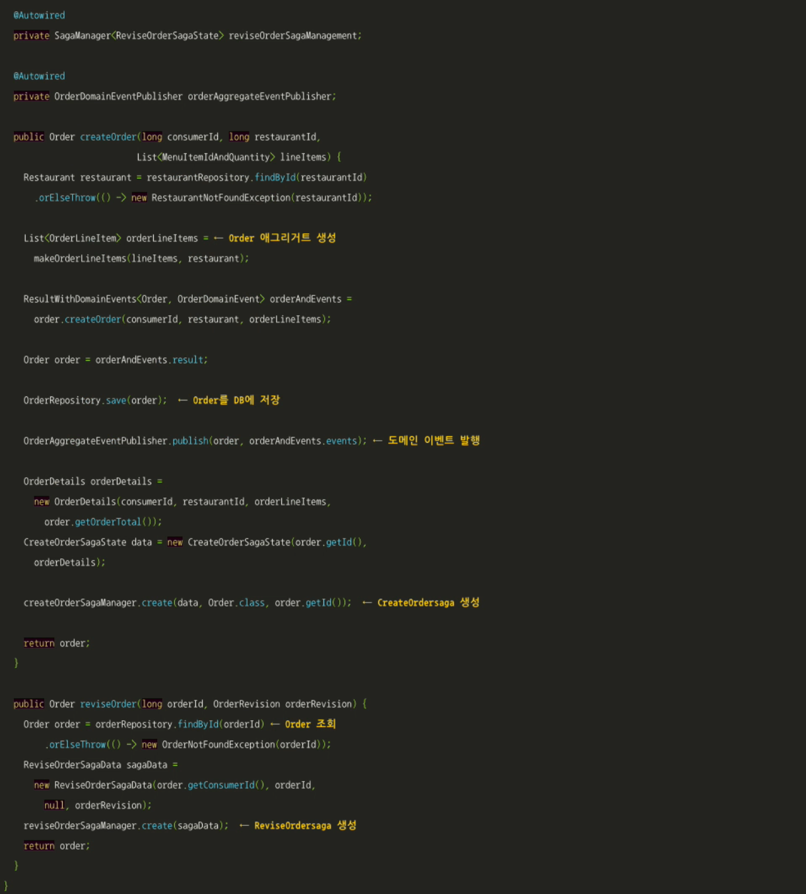

# 5.5 주문 서비스 비즈니스 로직

주문 서비스는 주문을 생성, 수정, 취소하는 API를 제공하는 서비스입니다.

이런 API는 커슈머가 주로 호출합니다.

다음은 주문 서비스의 인바운드 어댑터입니다.

* REST API : 컨슈머가 사용하는 UI가 호출하는 REST API. OrderService를 호출하여 Order를 생성/수정합니다.
* OrderEventConsumer : 음식점 서비스가 발행한 이벤트를 구독합니다. OrderService를 호출하여 Restaurant 레플리카를 생성/수정합니다.
* OrderCommandHandler : 사가가 호출하는 비동기 요청/응답 기반의 API. OrderService를 호출하여 Order를 수정합니다.
* SagaReplyAdapter : 사가 응답 채널을 구독하고 사가를 호출합니다.

아웃바운드 어댑터도 몇 개 있습니다.

* DB 어댑터 : OrderRepository 인터페이스를 구현하여 주문 서비스 DB에 접근합니다.
* DomainEventPublishingAdapter : DomainEventPublisher 인터페이스를 구현하여 Order 도메인 이벤트를 발행합니다.
* OutboundCommandMessageAdapter : CommandPublisher 인터페이스를 구현한 클래스입니다. 커맨드 메세지를 사가 참여자에게 보냅니다.

 

## 5.5.1 Order Aggregate

Order Aggregate는 소비자가 한 주문을 나타냅니다.

### Order Aggregate 구조

Order 클래스는 여러 OrderLineItem을 갖고 있습니다.

Consumer와 Restaurant은 상이한 Aggregate라서 기본키 값으로 상호 참조합니다.

고객이 원하는 배달 주소/시간이 기록된 DeliveryInfo와 지불 정보가 담긴 PaymentInfo 클래스가 있습니다.

 

### Order Aggregate 상태 기계

주문을 생성/수정하려면 OrderService는 반드시 다른 서비스와 사가로 협동해야 합니다.

OrderService또는 사가 첫 번째 단계, 둘 중 하나는 Order 메서드를 호출해서 수행 가능한 작업인지 확인한 후 해당 주문을 APPROVAL_PENDING 상태로 변경해야 합니다.

이처럼 중간에 pending 상태를 두는 것은 시맨틱 락 대책을 적용한 것입니다.

이로써 여러 사가를 확실히 격리할 수 있습니다.

 

### Order Aggregate 메서드

Order 클래스에는 각각 하나의 사가에 대응되는 메서드 그룹이 있습니다.

각 그룹마다 사가가 시작될 때 어느 한 메서드가 호출되고 사가가 끝날 때 다른 메서드가 호출됩니다.

주문 생성 과정에서 호출되는 메서드들입니다.

 

createOrder() 외에도 Order 클래스를 업데이트하는 메서드가 여럿 있습니다.

가령 주문 변경 사가는 먼저 revise()를 호출하여 주문 변경이 가능할 경우 confirmRevised()를 호출합니다.

 

## 5.5.2 OrderService 클래스

OrderService 클래스는 비즈니스 로직의 진입점입니다.

