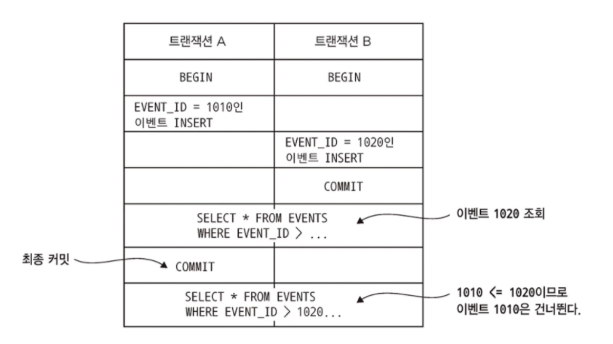

# 6.1 이벤트 소싱 응용 비즈니스 로직 개발

이벤트 소싱은 비즈니스 로직을 구성하고 aggregate를 저장하는 또 다른 방법입니다.

aggregate를 일련의 이벤트 형태로 저장합니다.

이벤트는 각 aggregate의 상태 변화를 나타냅니다.

장점 : aggregate 이력이 보존되므로 감사/통제 용도로도 가치가 있고 도메인 이벤트를 확실하게 발행할 수 있어서 MSA에 특히 유용합니다.

단점 : 비즈니스 로직 작성 방법이 특이해서 학습시간이 필요하고 CQRS 패턴을 적용해야합니다. 


## 6.1.1 기존 영속화의 문제점

기존 영속화 방식은 아래와 같이 매핑합니다.

클래스 - DB 테이블

클래스 필드 - 테이블 컬럼

클래스 인스턴스 - 테이블 각 로우

이는 아래와 같은 단점 및 한계가 있습니다.

### 객체-관계 임피던스 부정합 

https://coco-log.tistory.com/155


### aggregate 이력이 없습니다

기존 영속화 매커니즘은 현재 aggregate의 상태만 저장합니다.


### 감사 로깅을 구현하기가 번거롭고 에러가 잘 납니다

감사 로깅 코드 및 비즈니스 로직이 계속 분화하기 때문에 버그가 날 가능성이 높습니다.


### 이벤트 발행 로직이 비즈니스 로직에 추가됩니다

기존 영속화는 도메인 이벤트 발행을 지원하지 않습니다.


# 6.1.2 이벤트 소싱 개요

이벤트 소싱은 이벤트를 위주로 비즈니스 로직을 구현하고 aggregate를 DB에 일련의 이벤트로 저장하는 기법입니다.

각 이벤트는 aggregate의 상태 변화를 나타냅니다.

### 이벤트를 이용하여 aggregate를 저장

이벤트 소싱은 도메인 이벤트 개념에 기반한 전혀 새로운 방식, 즉 aggregate를 DB에 있는 이벤트 저장소에 일련의 이벤트로 저장합니다.

예를 들어 Order aggregate를 이벤트 소싱으로 저장한다면 Order를 ORDER 테이블에 로우 단위로 저장하는 것이 아니라, Order aggregate를 EVENTS 테이블의 여러 로우로 저장합니다.

각 로우가 바로 주문생성됨, 주문승인됨, 주문배달됨 등의 도메인 이벤트입니다.


aggregate 생성/수정 시 app은 aggregate가 발생시킨 이벤트를 EVENTS 테이블에 삽입합니다.

그리고 aggregate를 로드할 때 이벤트 저장소애서 이벤트를 가져와 재연을 하는데, 구체적으로 이 작업은 다음 3단계로 구성됩니다.

* aggregate의 이벤트를 로드합니다.
* 기본 생성자를 호출하여 aggregate 인스턴스를 생성합니다.
* 이벤트를 하나씩 순회하며 apply()를 호출합니다.


### 이벤트는 곧 상태 변화

도메인 이벤트는 aggregate의 변경을 구독자에게 알리는 장치로, 이벤트는 aggregate ID 같은 최소한의 필수 데이터만 넣거나 컨슈머에 유용한 데이터까지 포함시켜 강화할 수 있습니다.


### aggregate 메서드의 관심사는 오직 이벤트

비즈니스 로직은 aggregate의 업데이트 요청을 aggregate 루트에 있는 커맨드 메서드를 호출하여 처리합니다.

aggregate는 다음 순서대로 생성됩니다. 

1. 기본 생성자로 aggregate 루트를 초기화합니다.
2. process()를 호출하여 새 이벤트를 발생시킵니다.
3. 새 이벤트를 하나씩 순회하면서 apply()를 호출하여  aggregate를 업데이트합니다.
4. 이벤트 저장소에 새 이벤트를 저장합니다.

aggregate는 다음 순서대로 업데이트됩니다.

1. 이벤트 저장소에서 aggregate 이벤트를 로드합니다.
2. 기본 생성자로 aggregate 루트를 초기화합니다.
3. 가져온 이벤트를 하나씩 순회하며 aggregate 루트의 apply()를 호출합니다.
4. process()를 호출하여 새 이벤트를 발생시킵니다.
5. 새 이벤트를 순회하면서 apply()를 호출하여 aggregate를 업데이트합니다.
6. 이벤트 저장소에 새 이벤트를 저장합니다.


## 6.1.3 동시 업데이트: 낙관적 잠금

```sql
UPDATE AGGREGATE_ROOT_TABLE
SET VERSION = VERSION + 1
WHERE VERSION = <원본 버전>
```


## 6.1.4 이벤트 소싱과 이벤트 발행

저장된 모든 이벤트를 관심있는 컨슈머에 어떻게 전달하면 좋을까요?

### 이벤트 발행: 폴링

이벤트를 EVENTS 테이블에 저장한다고 가정하면, 이벤트 발행기는 SELECT문으로 새 이벤트를 계속 폴링하면서 메세지 브로커에 발행합니다.

이 때 문제는 어느 이벤트가 새 이벤트인지 분간하는 일입니다.

만약 EVENT_ID가 단순히 1만큼 증가하면, 이벤트 발행기가 자신이 처리한 EVENT_ID를 기록하면 될 것 같습니다.

그러나 트랜잭션이 이벤트를 발생시키는 순서와 다르게 커밋할 수 있다는 점이 문제입니다.



이런 문제를 해결하는 한 가지 방법은 EVENTS 테이블에 이벤트 발행 여부를 추적할 수 있는 칼럼을 추가하는 것입니다.

즉, 이벤트 발행기가 다음과 같이 처리하면 이벤트를 건너뛸 일은 없습니다.

1. SELECT * FROM EVENTS WHERE PULISHED  = 0 ORDER BY EVENT_ID ASC 쿼리로 미발행 이벤트를 검색합니다.
2. 메세지 브로커에 이벤트를 발행합니다.
3. UPDATE EVENTS SET PUBLISHED = 1 WHERE EVENT_ID = ? 쿼리로 이벤트가 발생된 것으로 표시합니다.


### 이벤트 발행: 트랜잭션 로그 테일링

트랜잭션 로그 테일링은 좀 더 정교한 방법입니다. 

이벤트 발행을 확실히 보장하면서도 성능/확장성이 우수합니다.

자세한 내용은 6.2


## 6.1.5 스냅샷으로 성능 개선

Order aggregate는 상태 전이가 별로 없는 편이라 이벤트가 많지 않습니다.

이런 이벤트는 이벤트 저장소를 쿼리해서 Order aggregate를 재구성하는 것이 효율적입니다.

하지만 Account aggregate처럼 수명이 긴 aggregate는 이벤트 수가 꽤 많아서 일일이 로드/폴드하기가 만만찮습니다.

그래서 주기적으로 aggregate 상태의 스냅샷을 저장합니다.

가장 최근에 뜬 스냅샷과 그 이후 발생한 이벤트만 가져오는 식으로 aggregate상태를 복원하는 것입니다.


## 6.1.6 멱등한 메세지 처리

서비스는 대부분 다른 애플리케이션 또는 서비스로부터 받은 메세지를 소비합니다.

메세지 컨슈머가 동일한 메세지를 여러 번 호출해도 안전하다면 멱등한 것입니다.

### RDBMS 이벤트 저장소 사용

RDBMS 기반의 이벤트 저장소를 사용한다면 메세지 ID는 PROCESSED_MESSAGES 테이블에, 이벤트는 EVENTS 테이블에 삽입하는 트랜잭션의 일부로 삽입하면 됩니다.

### NoSQL 이벤트 저장소 사용

NoSQL 기반의 이벤트 저장소는 다른 수단을 강구해야 합니다.

메세지 컨슈머는 이벤트를 저장하고 메세지 ID를 기록하는 작업을 어느 정도 원자적으로 처리해야 합니다.

메세지 컨슈머가 메세지 처리 도중 생성된 메세지 ID를 저장하는 것입니다.

해당 메세지 ID가 aggregate의 이벤트에 있는지 확인하면 중복 메세지 여부를 알 수 있습니다.


## 6.1.7 도메인 이벤트 발전시키기

이벤트 소싱은 적어도 개념적으로는 이벤트를 영구 저장하지만 사실 이것은 양날의 검과 같습니다.

정확성을 담보로 변경 감사 로그를 제공하여 애플리케이션이 aggregate 상태를 온전히 재구성할 수 있는 반면, 이벤트 구조는 시간이 흐름에 따라 계속 달라지기 때문에 새로운 문제가 생기기 마련입니다.


## 6.1.8 이벤트 소싱의 장점

이벤트 소싱도 장단점이 고루 있습니다. 먼저 장점입니다.

* 도메인 이벤트를 확실하게 발행합니다.
* aggregate 이력이 보존됩니다.
* O/R 임피던스 불일치 문제를 대부분 방지할 수 있습니다.
* 개발자에게 타임머신을 제공합니다.


## 6.1.9 이벤트 소싱의 단점

* 새로운 프로그래밍 모델을 배우는데 시간이 걸립니다.
* 메세징 기반 애플리케이션은 복잡합니다.
* 이벤트를 개량하기가 까다로운 편입니다.
* 데이터를 삭제하기가 어렵습니다.
* 이벤트 저장소를 쿼리하기가 만만찮습니다.
